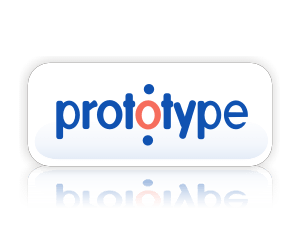
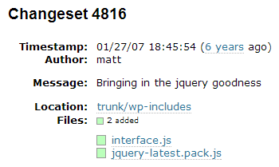

# Writing Apps with JavaScript, Backbone and WordPress

WordCamp Chicago, June 2013

K.Adam White &bull; [@kadamwhite](https://twitter.com/kadamwhite)

JS engineer at [Bocoup](http://bocoup.com/)


*At any time, hit "escape" to get an overview of all slides. This is a two-dimensional slide deck; Many slides have code examples available if you press "down."*


[BostonWP](http://www.bostonwp.org) Co-Organizer


I was on your side during the Bruins/'Hawks finals!


## So. Who Are You Folks?


## WordPress & JavaScript


## A Bit of History


## In the beginning...




* Did a lot of what jQuery does (even uses `$`)
* Works by modifying native JS prototypes (messy)
* Wasn't a perfect solution for WP


## jQuery: @since 2.2.0



<small>*jQuery [added to WordPress](http://core.trac.wordpress.org/changeset/4816/) in January '07 by Matt Mullenweg*</small>


## The Whole Family

Prototype is still there (script-loader.php L108):
```php
// WordPress no longer uses or bundles Prototype or
// script.aculo.us. These are now pulled from an external source.
$scripts->add( 'prototype',
  '//ajax.googleapis.com/[...]prototype.js',
  array(), '1.7.1'
);
```
Of the 134 scripts defined in script-loader.php,<br />
87 scripts (over **60%**) relate to jQuery


## Why was jQuery So Awesome?


## Focus

Designed to [do specific things really well](http://jquery.com/#home-content):

* HTML document traversal
* Event handling
* Ajax interaction
* Animation


## Really good at this problem:


# BUT


jQuery files can get unwieldy


## jQuery does not enforce code
## structure in large applications


### (WordPress is getting pretty large)


## JS Needs within WordPress
## Are Changing


## Eventing: Pub/Sub Pattern

Like WP's actions, but on the front-end


> **Why not use custom jQuery events?**
>
> ...Triggering plain events on the body element (or any other hidden element) is not performant — every jQuery event normalizes a DOM Event object, which we then completely ignore.

<small>*~ [@koop](http://twitter.com/koop), discussing [Ticket 21170: JavaScript Actions &amp; Filters](http://core.trac.wordpress.org/ticket/21170)*</small>


## Where's that ticket at, anyway?

Per [azaozz](http://core.trac.wordpress.org/ticket/21170#comment:52) in trac, even Backbone doesn't quite let us replicate the way `add_action()`, `add_filter()`, `do_action()` etc, because you can't set priority.

A custom solution will be needed.


## DOM-Vision

jQuery eventing for pub/sub works just fine for many apps, but jQuery is tied to the DOM (and that comes at a cost)


## "Make a jQuery Plugin"
#### is not the solution to everything


## New tools are needed


# Beyond jQuery


## Evolution, Not Revolution:


## Where does WordPress come in?


## WordPress 3.5's Media Re-Write

> ...Backbone's models, collections, and views are pretty much exactly what we need to be able to make media work as awesome as we're aiming for
>
> <small>~ nacin, [WordPress dev chat, 8/22/12](https://irclogs.wordpress.org/chanlog.php?channel=wordpress-dev&day=2012-08-22&sort=asc#m442360), relating to [Ticket 21390: Upload/Insert media revamp](http://core.trac.wordpress.org/ticket/21390)</small>


Thanks to 3.5, Backbone and Underscore<br />are now **shipped in Core** along with WordPress' other JavaScript dependencies


## What is in core, may be enqueue'd


## So let's put these new libraries through their paces


## What Is Underscore?

> Underscore is a **utility-belt library** for JavaScript that provides functional programming support without extending any of the built-in JavaScript objects.
>
> <small>*~ Adapted from [underscorejs.org](http://underscorejs.org)*</small>


> ... It's the tie to go along with jQuery's tux, and Backbone.js's suspenders.


## Collection Methods

You've got an array or an object of objects, and want to transform it, investigate it or do something to each item?

<br />`_.each`, `_.map`, `_.reduce`, `_.some`,

`_.filter`, `_.every`, `_.min`, `_.max` ...

<br/>*No problem!*


## Functional programming style

Transform objects and collections to make new ones,

rather than altering existing values


## Function Functions

Function binding (forcing `this` to do what you want), throttling or debouncing functions, partial application and currying, making a function that can only fire once...

<br />More at [Underscorejs.org](http://underscorejs.org/#functions)


## Object Utilities

Check to see if an object `_.isNumber`, `_.isArray`, `_.isUndefined`, or `_.isFinite`;

Determine if an object `_.has` a given key...

<br />More at [Underscorejs.org](http://underscorejs.org/#objects)


## Other Utilities

Escaping/Unescaping strings, generating Unique IDs or random numbers, chaining `_.` methods &ldquo;jQuery-style&rdquo;:

Underscore [does all this, too](http://underscorejs.org/#utility)


## And then there's _.template


We'll revisit this in a moment, but JavaScript templating is the best way to build HTML within your scripts


## Markup, the JavaScript Way

Write the template's markup in an easy-to-use, PHP-tag-like syntax, then compile it with `_.template` into something JavaScript interpreters can understand and optimize


```html
<div><%= mainContent %></div>
<a href="<%= link.url %>" title="<%- link.title %>">
  <%= link.text %>
</a>
```
*this* &uparrow; becomes *that* &downarrow;
```javascript
function(obj) {obj || (obj = {}); var __t, __p = '', __e = _.escape;
with (obj) { __p += '<div>' +((__t = ( mainContent )) == null ?
'' : __t) + '</div>\n<a href="' +((__t = ( link.url )) == null ?
'' : __t) + '" title="' +__e( link.title ) +'">\n  ' +
((__t = ( link.text )) == null ? '' : __t) +'\n</a>\n'; }
return __p};
```


**MUCH** faster than building DOM nodes with jQuery

*(And easier to read, too!)*


## That's one fine utility belt


## (Underscore is the
## backbone of Backbone.js)


# SO


## What is Backbone?

> Backbone.js gives structure to web applications by providing **models** with key-value binding and custom events, **collections** [to group and manipulate those models], **views** with declarative event handling...
>
> <small>*~ Adapted from [backbonejs.org](http://backbonejs.org); emphasis added*</small>


## Separate Rendering from Logic

**Models** hold your data

**Views** render it on the page & handle user input


## Models

```javascript
var MyModelConstructor = Backbone.Model.extend({});

var modelInstance = new MyModelConstructor({
  prop1: 'some data',
  prop2: 'you want to store in a structured way'
});

console.log( modelInstance.get('prop1') ); // 'some data'
```


## That's a lot of boilerplate...

If you're used to "plain ol' JavaScript",
```javascript
var myData = {
  prop1: 'some data',
  prop2: 'you want to store in a *less* structured way'
};

console.log( myData.prop1 ); // 'some data'
```
Backbone's definitely "more code"


# But It's Worth It
### (trust me)


## For Example:

By using Backbone's Model constructors, your data is augmented with some really useful stuff.
```javascript
model.set({
  prop1: 'new value'
}); // Any `set` triggers a change event on the model
```
The corresponding View can listen for the model's change event, and re-render automatically


## Your Data,


<small>*Image by [JopaoxD](http://jopaoxd.deviantart.com/art/Harder-Better-Faster-Stronger-304045878)*</small>


## Views

```javascript
var MyViewConstructor = Backbone.View.extend({
  el: '.my-view-container',
  render: function() {
    this.$el.html([
      this.model.get('prop1'), this.model.get('prop2')
    ].join(''));
    return this;
  },
  initialize: function() {
    this.listenTo( this.model, 'change', this.render );
  }
});
var viewInstance = new MyViewConstructor({ model: modelInstance });
viewInstance.render();
// .my-view-container displays "some data that you want to
//                              store in a structured way"
```
Take that data, give it form


*Definitely* more code than "the jQuery way":
```javascript
$('.my-view-container').html( myData.prop1 + ' ' + myData.prop2 );
```


## But jQuery can't (as easily) do this:
```javascript
modelInstance.set({
  'prop1': 'some NEW data'
});

// view automatically re-renders: .my-view-container now reads
// "some NEW data that you want to store in a structured way"
```


## A little More Work Up Front
## ===
## Less Work Down the Road

The more structured your code is,

the easier it is to fix or modify


# Demo Time

We're going to take a small theme feature

and re-factor it to be awesome


### Demo Technology Colophon


with 10up's [grunt-wp-theme](https://github.com/10up/grunt-wp-theme) template


## Homepage Image Gallery


[Gallery Code](https://github.com/kadamwhite/wcchi-demo/commit/330093256e7efccbf315cf76d062bae2aa033b5f)


# Step 1

Get the hidden Div's out of that DOM


[Code for Step 1](https://github.com/kadamwhite/wcchi-demo/pull/1)


# Step 2

Get the rendering markup out of that jQuery


[Code for Step 2](https://github.com/kadamwhite/wcchi-demo/pull/1)


# Step 3

Get the JavaScript template out of that PHP and use Grunt to pre-compile it


[Code for Step 3](https://github.com/kadamwhite/wcchi-demo/pull/3)


# Step 4

Structure our featured image code with Backbone


[Code for Step 4](https://github.com/kadamwhite/wcchi-demo/pull/4)


# Step 5

Reorganize our .js files for sanity and profit


[Code for Step 5](https://github.com/kadamwhite/wcchi-demo/pull/5)


# Step 6

Use Backbone for all the things!


[Code for Step 6](https://github.com/kadamwhite/wcchi-demo/pull/6)


The code for this demo is [available on Github](https://github.com/kadamwhite/wcchi-demo)


## Add Backbone to taste

Backbone is a useful way to structure JS code&mdash;

and you can use as little as you want


Or, you can go a bit crazy :)


## What Is Backbone?, Continued

> Backbone.js gives structure to web applications... and connects it all to your existing API over a **RESTful JSON interface**.


## Who saw Ben's talk on External APIs?

(If you missed it, [check out his slides here](http://ben.lobaugh.net/blog/49651/i-am-speaking-at-wordcamp-chicago-2013-on-interacting-with-external-apis))


## This is that, just in reverse


# Get Your Data
# from WP to JS


## WordPress as an API

WordPress serves your data

Backbone fetches that data, does stuff with it


## .fetch()

```javascript
var Posts = Backbone.Collection.extend({
  model: Post, // constructor to use for items in this collection
  parse: function( response ) {
    return response.posts;
  }
});

var blogPosts = new Posts([], {
  url: '/api/get_recent_posts/'
});
```
Fetch posts from your blog (using the [JSON API](http://wordpress.org/plugins/json-api/) plugin)


## JSON API plugin

[wordpress.org/plugins/json-api/](http://wordpress.org/plugins/json-api/)
```javascript
{
  "status": "ok",
  "count": 1,
  "count_total": 1,
  "pages": 1,
  "posts": [
    {
      "id": 1,
      "type": "post",
      "slug": "hello-world",
      "url": "http:\/\/localhost\/wordpress\/?p=1",
      "title": "Hello world!",
      "title_plain": "Hello world!",
      "content": "<p>Welcome to WordPress. This is your first post. Edit or delete it, then start blogging!<\/p>\n",
      "excerpt": "Welcome to WordPress. This is your first post. Edit or delete it, then start blogging!\n",
      "date": "2009-11-11 12:50:19",
      "modified": "2009-11-11 12:50:19",
      "categories": [],
      "tags": [],
      "author": {
        "id": 1,
        "slug": "admin",
        "name": "admin",
        "first_name": "",
        "last_name": "",
        "nickname": "",
        "url": "",
        "description": ""
      },
      "comments": [
        {
          "id": 1,
          "name": "Mr WordPress",
          "url": "http:\/\/wordpress.org\/",
          "date": "2009-11-11 12:50:19",
          "content": "<p>Hi, this is a comment.<br \/>To delete a comment, just log in and view the post's comments. There you will have the option to edit or delete them.<\/p>\n",
          "parent": 0
        }
      ],
      "comment_count": 1,
      "comment_status": "open"
    }
  ]
}
```
*(Finally updated this month! Yay! &hearts;!)*


## Demo: Theming
# Without the Loop

#### <br />*Mad Science for fun and profit*


## Jetpack JSON API


Access your blog using the WordPress.com REST API


## (provides a LOT more information)

```javascript
{
    "found": 2,
    "posts": [
        {
            "ID": 10,
            "author": {
                "ID": 275903,
                "email": false,
                "name": "K.Adam",
                "URL": "http:\/\/www.kadamwhite.com",
                "avatar_URL": "http:\/\/0.gravatar.com\/avatar\/6cd1cf6de05952505a165425efaf06b4?s=96&d=identicon&r=G",
                "profile_URL": "http:\/\/en.gravatar.com\/kadamwhite"
            },
            "date": "2012-08-27T20:06:06+00:00",
            "modified": "2012-08-27T20:06:06+00:00",
            "title": "The Cost of Privacy",
            "URL": "http:\/\/kadamwhite.wordpress.com\/2012\/08\/27\/the-cost-of-privacy\/",
            "short_URL": "http:\/\/wp.me\/p2GX8E-a",
            "content": "<p>Back in January, James Coglan wrote <a href=\"http:\/\/blog.jcoglan.com\/2012\/01\/19\/the-cost-of-privacy\/\">a great article about the drawbacks of private variables in JavaScript<\/a>. The hidden costs of encapsulating privately-scoped variables is explained with examples of some of the potential performance and maintenance drawbacks.<\/p>\n<blockquote><p>Encapsulation is something you get by deliberately designing interfaces and architectures, by communicating with your team\/users, and through documentation and tests. Trying to enforce it in code shows a level of paranoia that isn\u2019t necessary in most situations, and this code style has plenty of costs that grossly offset the minimal encapsulation benefit it provides.<\/p><\/blockquote>\n<p>(Link via <a href=\"http:\/\/rmurphey.com\/\">Rebecca Murphey<\/a>)<\/p>\n",
            "excerpt": "<p>Back in January, James Coglan wrote a great article about the drawbacks of private variables in JavaScript. The hidden costs of encapsulating privately-scoped variables is explained with examples of some of the potential performance and maintenance drawbacks. Encapsulation is something you get by deliberately designing interfaces and architectures, by communicating with your team\/users, and through [&hellip;]<\/p>\n",
            "slug": "the-cost-of-privacy",
            "status": "publish",
            "password": "",
            "parent": false,
            "type": "post",
            "comments_open": true,
            "pings_open": true,
            "comment_count": 0,
            "like_count": 0,
            "i_like": 0,
            "is_reblogged": 0,
            "is_following": 0,
            "featured_image": "",
            "format": "standard",
            "geo": false,
            "publicize_URLs": [

            ],
            "tags": {
                "Design Patterns": {
                    "name": "Design Patterns",
                    "slug": "design-patterns",
                    "description": "",
                    "post_count": 1,
                    "meta": {
                        "links": {
                            "self": "http:\/\/public-api.wordpress.com\/rest\/v1\/sites\/39789780\/tags\/slug:design-patterns",
                            "help": "http:\/\/public-api.wordpress.com\/rest\/v1\/sites\/39789780\/tags\/slug:design-patterns\/help",
                            "site": "http:\/\/public-api.wordpress.com\/rest\/v1\/sites\/39789780"
                        }
                    }
                },
                "Front-End Architecture": {
                    "name": "Front-End Architecture",
                    "slug": "front-end-architecture",
                    "description": "",
                    "post_count": 2,
                    "meta": {
                        "links": {
                            "self": "http:\/\/public-api.wordpress.com\/rest\/v1\/sites\/39789780\/tags\/slug:front-end-architecture",
                            "help": "http:\/\/public-api.wordpress.com\/rest\/v1\/sites\/39789780\/tags\/slug:front-end-architecture\/help",
                            "site": "http:\/\/public-api.wordpress.com\/rest\/v1\/sites\/39789780"
                        }
                    }
                },
                "JavaScript": {
                    "name": "JavaScript",
                    "slug": "javascript",
                    "description": "",
                    "post_count": 2,
                    "meta": {
                        "links": {
                            "self": "http:\/\/public-api.wordpress.com\/rest\/v1\/sites\/39789780\/tags\/slug:javascript",
                            "help": "http:\/\/public-api.wordpress.com\/rest\/v1\/sites\/39789780\/tags\/slug:javascript\/help",
                            "site": "http:\/\/public-api.wordpress.com\/rest\/v1\/sites\/39789780"
                        }
                    }
                },
                "Scope": {
                    "name": "Scope",
                    "slug": "scope",
                    "description": "",
                    "post_count": 1,
                    "meta": {
                        "links": {
                            "self": "http:\/\/public-api.wordpress.com\/rest\/v1\/sites\/39789780\/tags\/slug:scope",
                            "help": "http:\/\/public-api.wordpress.com\/rest\/v1\/sites\/39789780\/tags\/slug:scope\/help",
                            "site": "http:\/\/public-api.wordpress.com\/rest\/v1\/sites\/39789780"
                        }
                    }
                }
            },
            "categories": {
                "JavaScript": {
                    "name": "JavaScript",
                    "slug": "javascript",
                    "description": "",
                    "post_count": 2,
                    "parent": 0,
                    "meta": {
                        "links": {
                            "self": "http:\/\/public-api.wordpress.com\/rest\/v1\/sites\/39789780\/categories\/slug:javascript",
                            "help": "http:\/\/public-api.wordpress.com\/rest\/v1\/sites\/39789780\/categories\/slug:javascript\/help",
                            "site": "http:\/\/public-api.wordpress.com\/rest\/v1\/sites\/39789780"
                        }
                    }
                }
            },
            "attachments": {

            },
            "metadata": false,
            "meta": {
                "links": {
                    "self": "http:\/\/public-api.wordpress.com\/rest\/v1\/sites\/39789780\/posts\/10",
                    "help": "http:\/\/public-api.wordpress.com\/rest\/v1\/sites\/39789780\/posts\/10\/help",
                    "site": "http:\/\/public-api.wordpress.com\/rest\/v1\/sites\/39789780",
                    "replies": "http:\/\/public-api.wordpress.com\/rest\/v1\/sites\/39789780\/posts\/10\/replies\/",
                    "likes": "http:\/\/public-api.wordpress.com\/rest\/v1\/sites\/39789780\/posts\/10\/likes\/"
                }
            }
        }
    ]
}
```


## Demo:
# Blog Viewer


### We are going to build this with
# BUZZWORDS


## BOOTSTRAP

*and*

## BACKBONE

*and*

## STRANGELY ABSENT VOWELS


## Where do we go from here?

> I think [WordPress 3.5] actually signifies a shift from PHP land to JavaScript land for pretty much everything we’re going to do in the future
>
> <small>Andrew Nacin to WPCandy, [February 2013](http://wpcandy.com/reports/a-shift-from-php-land-to-javascript-land)</small>


# Experiment!


# Thank You

<br />

Slides: [kadamwhite.github.io/talks/2013/wcchi/](http://kadamwhite.github.io/talks/2013/wcchi)

Code: [github.com/kadamwhite/wordbone-pressback/](https://github.com/kadamwhite/wordbone-pressback/#readme)

<br />

*Artwork by [Emily Garfield](http://www.emilygarfield.com) and [Judith Klausner](http://jgklausner.com/)*

<hr />

<small>Technology: [Reveal.js](http://lab.hakim.se/reveal-js/) &bull; [Grunt](http://gruntjs.com/) &bull; [Grunt-WP-Theme](https://github.com/10up/grunt-wp-theme)</small>

<small>*PS: I have Backbone, Grunt, JS, and Bocoup stickers!*</small>


## Resources & Further Reading

* [WP Tuts+ tutorial on Backbone and WordPress](http://wp.tutsplus.com/tutorials/creative-coding/using-backbone-within-the-wordpress-admin-the-back-end/)
* TODO: Add more resources!
