# Git Going: Version Your Code Like It's 2013

Boston WordPress Meetup, April 2013

K. Adam White &bull; [@kadamwhite](https://twitter.com/kadamwhite)

Developer at [Bocoup](http://www.bocoup.com/)

[BostonWP](http://www.bostonwp.org) Co-Organizer

## Git

## Who Are You?

## Version Control

* A system for tracking changes to software (code) over time
* A system for integrating the work of multiple developers into one codebase

> Software tools for revision control are essential for the organization of multi-developer projects.

&ndash; [Revision Control](http://en.wikipedia.org/wiki/Revision_control) on Wikipedia

## Traditional Version Control Systems (VCS)

* Centralized repository
* "Check Out" specific parts of code
* Make your changes to those parts of the codebase
* "Check In" your changes to the central repo

## Traditional VCS

"Client - Server" approach to version control

CVS, SVN

## Distributed Version Control System

* Everybody has their own copy of the repository
* Every copy is a "working copy"
* No enforced central repository
* Each local copy contains all the code

## DVCS

"Peer-to-Peer" approach to version control

Bitkeeper, Mercurial, Git

## Git

* Designed by Linus Torvalds to help develop the Linux kernel
* Launched in April 2005
* Built for high performance on large codebases

## Who Uses Git?

*Basically* everyone

# Using Git

## Create a Repo

    $ cd project/
    $ git init
    Initialized empty Git repository in /Users/kadam/project/.git/

## Add Some Files

    $ git add .

## Commit Your Changes

    $ git commit -m "Initial Commit"

## See What's Changed

    $ git status
    # On branch master
    # Changes not staged for commit:
    #   (use "git add <file>..." to update what will be committed)
    #   (use "git checkout -- <file>..." to discard changes in working directory)
    #
    #   modified:   index.html
    no changes added to commit (use "git add" and/or "git commit -a")

## View The Project's History

`git log`

    $ git log --graph --oneline -8
    * 1be44d2 enforce single quotes
    * 57effe2 use .jshintrc file instead for editor support
    * 695632b better fizzbuzz instructions
    * 090ba5d linting with grunt
    *   5c0c5fe Merge pull request #54 from dsbonev/curry-function
    |\  
    | * 3952c0d change 'curry function' test case to return single-arg...
    | * d15c3b6 add function test case "you should be able to create a...
    |/  
    * 96cd09a upgrade to require 2.1.2
<small>*Commit examples are from Rebecca Murphey's [js-assessment](https://github.com/rmurphey/js-assessment)*</small>

## So... Command Line, you say?

> "The command line isn't scary. Photoshop has over 300 buttons—THAT'S scary!"

&ndash; Lots of people last year

## Yeah, but at least in Photoshop

there's a button to do *exactly what you want*

## It's OK to be scared

of the command line. There is a better* way

&nbsp;

<em><small>* more populist, user-friendly, democratic</small></em>

## Git GUI Tools

* [GitHub for Mac](http://mac.github.com/) (Mac, Free)
* [GitHub for Windows](http://windows.github.com/) (Windows, Free)
* [SourceTree](http://www.sourcetreeapp.com/) (Mac, Free)
* [Git Extensions](http://code.google.com/p/gitextensions/) (Windows, Free)
* [GitX (L)](http://gitx.laullon.com/) (Mac, Free)
* [SmartGit](http://www.syntevo.com/smartgit/index.html) (Windows/Mac/Linux, Paid)
* [Tower](http://www.git-tower.com/) (Mac, Paid)
* [Gitbox](http://www.gitboxapp.com/) (Mac, Paid)
* [git-cola](http://git-cola.github.com/) (Windows/Mac/Linux, Free)

&nbsp;
[Git GUI Clients](http://git-scm.com/downloads/guis) page

## Command Line

## &darr;

## Advanced Stuff

## Pro Git

Definitive Guide to Git, available for free

[http://git-scm.com/book](http://git-scm.com/book)

## Submodules

Include one Git repo within another

    $ git submodule add git://github.com/hakimel/reveal.js.git reveal
    Cloning into 'reveal'...
    remote: Counting objects: 3293, done.
    remote: Compressing objects: 100% (1507/1507), done.
    remote: Total 3293 (delta 1886), reused 3025 (delta 1681)
    Receiving objects: 100% (3293/3293), 1.05 MiB | 577 KiB/s, done.
    Resolving deltas: 100% (1886/1886), done.

## Rebasing

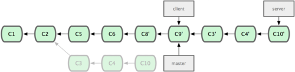

Change commits in the past: *time travel!*

## Rebasing

Rebasing can help keep your in-progress changes separate from the work you're pulling down:

    $ git pull --rebase

You can also "squash" commits together to make a cleaner history before you push a change

## Rebasing

When taken to the extreme rebasing can make it *harder* to know what you changed, so use with caution:

> Rebasing doesn't result in cleaner history. It just results in incorrect history that looks simpler.

&ndash; Linus Torvalds

## Bisecting

* Move through past commits using a binary search
* Designed to quickly find the origin of a bug
* Bisecting makes you "feel like a wizard"
* Read more on [Debugging with Git](http://git-scm.com/book/en/Git-Tools-Debugging-with-Git)

## And lots of other stuff we won't talk about here

## What do most of these have in common?

*Basically* everyone

## GitHub

## GitHub != Git

## GitHub

* Code Hosting
* Collaboration Tools
* Integrated Project Management
* Wikis
* *plus Gists, Slideshare and more*

## GitHub

is the most popular code hosting site in the world

## GitHub

hosts projects in your favorite language:

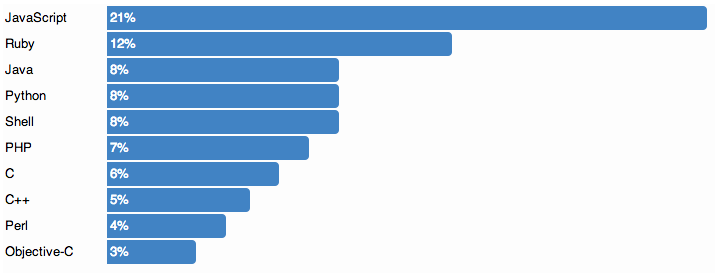

## TODO: Add a "The Hub" joke here

# Using GitHub

## Collaboration

GitHub Organizations

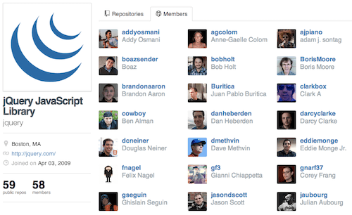

Blog Post: [Introducing GitHub Organizations](https://github.com/blog/674-introducing-organizations)

## Wikis

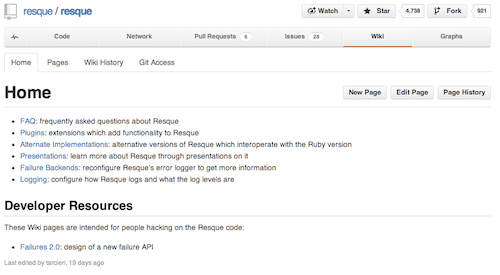

Each GitHub repo may have its own linked wiki

## GitHub Wikis

* Powered by [gollum](https://github.com/gollum/gollum), a wiki platform built on top of Git
* Edit in Markdown, Textile, or other markup formats
* Each Wiki is its own Git repo:

    $ git clone git://github.com/resque/resque.wiki.git

## Issue Tracking

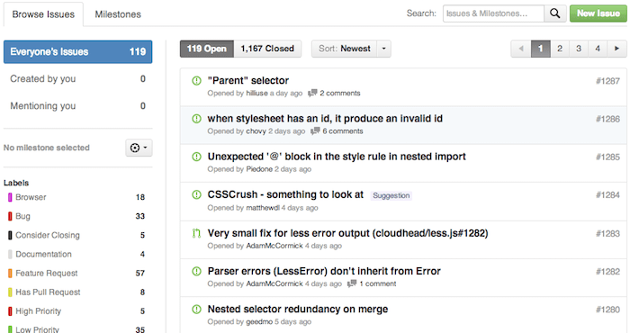

## Issue Assignment

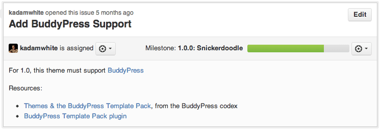

## Milestones

## Issue Labels

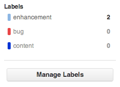
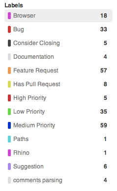

## Reference Issues From Commits

Issues integrate with your Git repository

You can even [close commits from a commit message](https://github.com/blog/1386-closing-issues-via-commit-messages)

    $ git commit -m "Upgrade Underscore.js to latest: Fixes #23"

## Code Review

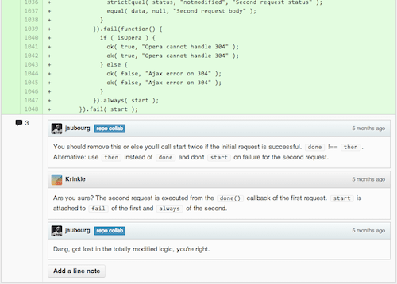

Pull Requests + Code Comments = <3

## Pull Requests

Like a patch upload within a WP trac ticket

> I have made changes to this code, please let's review and discuss

## Pull Requests

Like a trac ticket for a new feature

> Let's discuss what this should look like, even if we haven't written any code yet

[How We Use Pull Requests To Build GitHub](https://github.com/blog/1124-how-we-use-pull-requests-to-build-github)

## Pull Requests

Not unique to GitHub anymore:

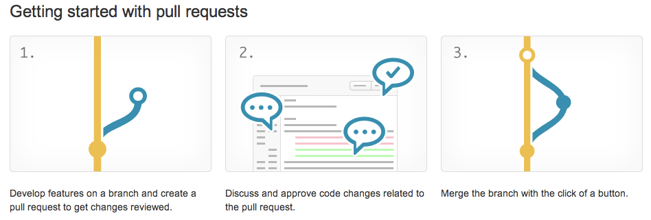

Bitbucket, Gitorious and other Git-oriented code hosts support similar features

## Open-Source GitHub Workflow

1. "Fork" a repository (make a copy under your own account)
2. Read & understand that project's contribution guidelines
3. Make changes to that repo to fix a bug or add a feature
4. Submit a Pull Request
5. Discuss changes/push up more commits
6. Repo maintainer merges your PR

## Setting Up Your Own Projects

1. [Create a new repository](https://github.com/new)
2. Add that repository to your local repo as a "remote"
3. Push your changes: `git push -u origin master`

## [Demo]

## GitHub Pages

Host your project's homepage directly from GitHub, for free:

[pages.github.com](http://pages.github.com/)

## GitHub Pages

* Serve a static site of your own design
* Use one of GitHub's pre-built themes
* Build your site using Jekyll

&nbsp;

Anything pushed to your *gh-pages* branch will be available at `https://youraccount.github.io/repo-name`

## [Demo]

## Gists

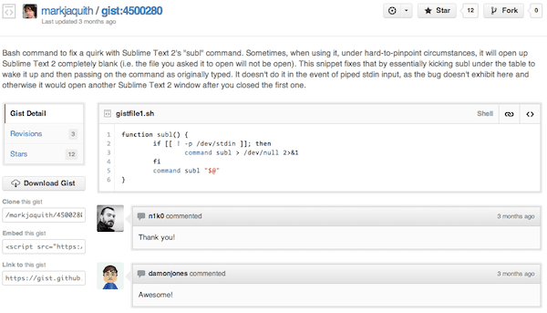

Pastebin-style code snippet hosting

## Gists are good for

* Sending code to other developers
* Saving useful scripts or code snippets
* Taking notes using Markdown
* Whatever you like!

# Best Practices

# Branching

## Branch Early, Branch Often

## One Method:

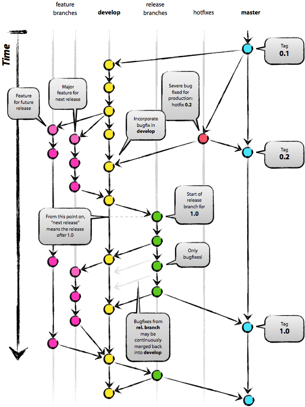

[A Successful Git Branching Model](http://nvie.com/posts/a-successful-git-branching-model/), by Vincent Driessen

## Even Branching Models Get Forked

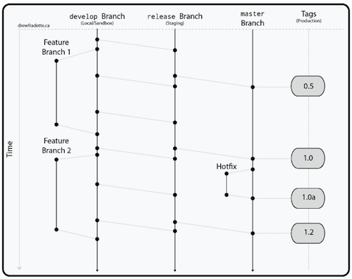

[A (Simpler) Successful Git Branching Model](http://drewfradette.ca/a-simpler-successful-git-branching-model/), by Drew Fradette

## What Pro Git Has To Say

> [Git is designed to] encourage developers to create and use branches often

The [Git Branching](http://git-scm.com/book/en/Git-Branching) chapter in Pro Git is good stuff

## Merge Conflicts

You'll still have to clean things up manually sometimes

## Merge Tools

A GUI merge tool is like your text editor:

Find one that works for you, and stick to it like glue

* Beyond Compare
* KDiff
* FileMerge
* *tons of others*

## Branching Guidelines

Branch often: New Feature? New Branch!

## Branching Guidelines

Clean up after yourself: Delete fully-merged branches

    $ git branch -l --merged
    * master
    * these/other-fully-merged
    * non-master-branches-can
    * probably/be-deleted

## Branching Guidelines

Use a naming convention that reflects your issue tracker

&nbsp;

* bug/312-login-broken-for-recognized-users
* feature/289-add-right-to-left-text-support
* feature/144-make-design-responsive

# Commit Messages

## Good, consistent commit messages

are really helpful when trying to find the origin of a problem

## Example 1

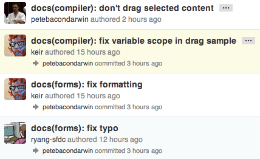

[AngularJS Commit Message Conventions](https://docs.google.com/document/d/1QrDFcIiPjSLDn3EL15IJygNPiHORgU1_OOAqWjiDU5Y)

## Example 2

> Structure your commit message like this:
> 
>     One line summary (less than 50 characters)
>    
>     Longer description (wrap at 72 characters)

[Commit Message guidelines](https://github.com/basho/rebar#writing-commit-messages) for Basho's "Rebar" project

## These are both pretty extreme

## What to avoid:

            $ git log --oneline
            3bb2d9d Finally %#^@!!$ Works!!
            1eddff2 Dammit
            18ee80c Fixed it
            a95b200 Added feature, but it broke again
            3a936a5 Gah

## Keep it short

* Aim for about 50 characters for the first line
* Verbose descriptions are OK (encouraged, even) *below* that first line

&nbsp;

This is to support terminal width limitations

    $ git log
    commit 3952c0d15723e7f3457b148963d06603b4f0e978
    Author: Dimitar Bonev <dsbonev@gmail.com>
    Date:   Sun Dec 30 15:16:17 2012 +0200
        change 'curry function' test case to return single-argument function
    commit d15c3b628fdc9af464f46a428cb0ad1784301015
    Author: Dimitar Bonev <dsbonev@gmail.com>
    Date:   Sun Dec 30 13:18:05 2012 +0200
        add function test case "you should be able to create a 'partial' fun

## Keep it meaningful

* Will somebody know what you were doing from
  * The first line of the commit message?
  * The rest of the description?

* That "somebody" is probably going to be *you*

# Tags

## Tag your releases

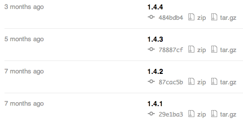

# README.MD

## Make a README file using Markdown

* Use [Markdown](https://help.github.com/articles/github-flavored-markdown)
* Explain what the project is
* Explain how to use it (build steps, dependencies)
* Explain how people can get involved, if appropriate
* Link to further documentation (Wiki, API docs, project website)

## jQuery's Is Awesome

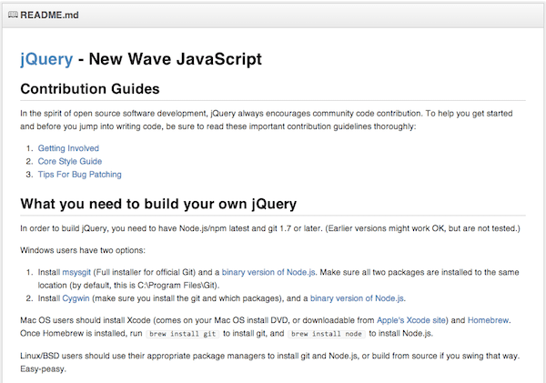

# What To Version

## What Should Go In Your Repo:

* Source Code
* Configuration Files
* Scripts
* Sprites and structural images
* Code dependencies (possibly w/ Submodules)

## What (probably) Shouldn't:

* User Media & other large binary files
* Databases
* Your entire web root

## Why?

* Binary files can't be diff'ed by Git
* Non-text diffs mean larger repositories
* The larger the repo, the slower it goes

## .gitignore

`.gitignore` file lets you specify file types to ignore

            .htaccess
            *.log
            wp-config.php
            wp-content/uploads/
            wp-content/upgrade/
            wp-content/cache/

GitHub maintains a list of `.gitignore` boilerplates, including [WordPress.gitignore](https://github.com/github/gitignore/blob/master/WordPress.gitignore)

# Further Reading

## GitHub Help

A great place to get started: [help.github.com](https://help.github.com/)

## GitHub Training

[http://training.github.com/](http://training.github.com/)

Tons of awesome [video tutorials](http://training.github.com/resources/videos/) on using Git and GitHub

## Other Talks About GitHub

* [GitHub for Designers Webcast](http://oreillynet.com/pub/e/2635?imm_mid=0a6425&cmp=em-npa-webcasts-pr-april22)
  * Free Webcast at 1pm ET, May 7, 2013
  * Taught by Julie Horvath, a designer and developer at GitHub
* [How GitHub Uses GitHub to Build GitHub](http://zachholman.com/talk/how-github-uses-github-to-build-github/)
* [How GitHub Works](http://zachholman.com/posts/how-github-works/)

## WordPress and Git

* [Developing Plugins with a Distributed Team](http://wp.tutsplus.com/articles/general/developing-plugins-with-a-distributed-team/)
  * Tom McFarlin on WP Tuts+, April 2013
* [Using Git for Sane WP Development](http://teleogistic.net/2012/06/wcnyc-slides-using-git-for-sane-wordpress-development/)
  * Boone Gorges at WordCamp NYC, June 2012
* [Managing WP Deployments with Git](http://mattbanks.me/wordpress-deployments-with-git/)
  * Matt Banks, July 2012

&nbsp;

And tons, tons more on WP Tuts+, WordCamp.tv, and myriad blogs across the vastness of the internet

# Thank You

K. Adam White &bull; [@kadamwhite](https://twitter.com/kadamwhite)

Slides: [http://kadamwhite.github.io/talks/2013/git-going/](http://kadamwhite.github.io/talks/2013/git-going/)

&nbsp;

## Now: Questions!
