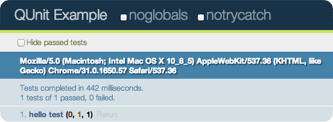

# JavaScript Unit Testing

WP Sessions, November 2013

K.Adam White &bull; [@kadamwhite](https://twitter.com/kadamwhite)

Open Web Engineer at [Bocoup](http://bocoup.com/)

<hr />

<small>Slides: [talks.kadamwhite.com/wpsessions-testing](http://kadamwhite.github.io/talks/2013/javascript-unit-testing)</small>


Core contributor, and a huge fan


# So.
## JS Unit Testing, eh?


## A Unit's a Unit

JavaScript code benefits from testing as much (or more) than any other programming language


## What's the PHPUnit of JavaScript?


### [  ](http://jsunit.berlios.de/)


### JSUnit Exists...
## but there are better options


## Testing & Assertion Libraries

   

* [QUnit](http://qunitjs.com/)
* [Jasmine](http://pivotal.github.io/jasmine/)
* [Mocha](http://visionmedia.github.io/mocha/) with [Chai](http://chaijs.com/guide/installation/)
* [should.js](https://github.com/visionmedia/should.js), [expect.js](https://github.com/LearnBoost/expect.js)...


## Pick Your Style


## Less Verbose

Terse, to-the-point descriptions of conditions that should be met within your code

```
// QUnit example
module( 'basic test' );
test( 'hello test', function() {
  ok( 1 == '1', 'Passed!' );
  strictEqual( '1', 1, 'Would not pass :(' )
});
```


## More Verbose

Verbose, more natural language-style descriptions

```javascript
// Jasmine example
describe( 'a test block', function() {
  it( 'should make some assertions', function() {
    expect( true ).toBe( true );
    expect( false ).not.toBe( true );
  });
});
```


## Functions all the way down

```
it('should define a test BDD-style', function() { /* ... */ });
```
vs
```
test('or assertion-style', function() { /* ... */ });
```

No matter which style you use, you're writing methods that set up assertions to verify the expected end state


## Let's Look at QUnit

* Created as part of jQuery
* Separate & standalone since 2009
* Follows (and influenced) the [CommonJS Unit Testing](http://wiki.commonjs.org/wiki/Unit_Testing/1.0) specification
* Used by many projects, including jQuery and WordPress Core


## Available Assertions

(These should look familiar from [PHPUnit](http://phpunit.de/manual/3.7/en/writing-tests-for-phpunit.html#writing-tests-for-phpunit.assertions))


### ok( state, message )

```
test( 'ok test', function() {
  ok( true, 'true succeeds' );
  ok( 'non-empty', 'non-empty string succeeds' );

  ok( false, 'false fails' );
  ok( 0, '0 fails' );
  ok( NaN, 'NaN fails' );
  ok( '', 'empty string fails' );
  ok( null, 'null fails' );
  ok( undefined, 'undefined fails' );
});
```
Pass based on the truthiness of the first argument


### equal( actual, expected, message )
```
test( 'equal test', function() {
  equal( 0, 0, 'Zero; equal succeeds' );
  equal( '', 0, 'Empty, Zero; equal succeeds' );
  equal( '', '', 'Empty, Empty; equal succeeds' );
  equal( 0, 0, 'Zero, Zero; equal succeeds' );
 
  equal( 'three', 3, 'Three, 3; equal fails' );
  equal( null, false, 'null, false; equal fails' );
});
```
Non-strict equality comparison between two arguments.

`notEqual()` does the opposite.


### strictEqual( actual, expected, message )
```
test( 'strictEqual test', function() {
  strictEqual( 1, 1, '1 and 1 are the same value and type' );
});
```
Compare values and types with `===`.

`notStrictEqual()` does the opposite.


### deepEqual( actual, expected, message )
```
test( 'deepEqual test', function() {
  var obj = { foo: 'bar' };
 
  deepEqual( obj, { foo: 'bar' }, 'Two objects can be the same in value' );
});
```
Compare objects by recursively comparing object properties.
`notDeepEqual()`, of course, does the opposite.


### throws( block, expected, message )
```
test( 'throws', function() {
  function callback() {
    throw 'error message';
  }
  throws( callback, 'error message',
    'throws a generic error with the message "error message"'
  );
});
```
Verify that a callback throws an exception when run


Note: These examples are all adapted from the [QUnit Documentation](http://api.qunitjs.com/category/assert/), which is worth a read

The [QUnit Cookbook](http://qunitjs.com/cookbook/) is also excellent.


## So how do I
# actually run
## these tests?


## Just load an HTML document

    <!DOCTYPE html>
    <html>
    <head>
      <meta charset="utf-8">
      <title>QUnit basic example</title>
      <link rel="stylesheet" href="/resources/qunit.css">
    </head>
    <body>
      <div id="qunit"></div>
      <div id="qunit-fixture"></div>
      <script src="/resources/qunit.js"></ script>
      <script>
        test( "a basic test example", function() {
          var value = "hello";
          equal( value, "hello", "We expect value to be hello" );
        });
      </ script>
    </body>
    </html>


Include the QUnit CSS & JS, and QUnit will do the rest




## Demo: Test QUnit with QUnit


# Common Issues
# in JS Testing


## AJAX

How can you test functionality that depends on content coming back from a server?


## Side-Effects

How can you test a piece of atomic functionality without triggering unwanted side-effects?

How can you test jQuery code designed to manipulate content within the document?


## Asynchronicity

How do you test that a callback or a timeout worked?


## Demo: Testing a WordPress plugin


Twenty Fourteen's Keyboard Image Navigation


```javascript
( function( $ ) {
  $( document ).on( 'keydown.twentyfourteen', function( e ) {
    var url = false;

    // Left arrow key code.
    if ( e.which === 37 ) {
      url = $( '.previous-image a' ).attr( 'href' );

    // Right arrow key code.
    } else if ( e.which === 39 ) {
      url = $( '.entry-attachment a' ).attr( 'href' );
    }

    if ( url && ( !$( 'textarea, input' ).is( ':focus' ) ) ) {
      window.location = url;
    }
  } );
} )( jQuery );
```


## Issue: Undesireable side-effects.

`window.location` redirection will break our tests


## One more tool: Sinon.JS

Spies, stubs, and mocks for JavaScript

(Lean more at [sinonjs.org](http://sinonjs.org/))


## Stubs

A [stub](http://sinonjs.org/docs/#stubs) is an override for an existing function. *e.g.*,
```javascript
window.myFunction = function() { alert( 'foo' ) };

sinon.stub( window, 'myFunction' ); // "stub out" myFunction()

myFunction(); // Nothing happens

myFunction.restore(); // Reset myFunction to its pre-stub state
```


## Stubs & Spies

Stubs records when and how the function was called, but won't trigger the original logic.

Use `sinon.spy` if you want the function to be called through.


But because `window.location` works by assignment there's no method for us to stub out, and we can't inject our own mock `window` object without heavy refactoring.
```
window.location = url;
```
We'll we need to wrap that in a function in order to stub it.


We create a `navigate` method
```javascript
// Wrapper for URL redirection, for use in tests
TwentyFourteen.navigate = function( url ) {
  window.location = url;
};
```
and we expose it to our tests by putting `navigate` onto a newly-created global `TwentyFourteen` namespace.


## Wait, a GLOBAL?!

I thought those were bad!


## Aside: globals & modularity

If we were using a module system like AMD (RequireJS) or a full-on JS framework designed for modularity like Angular, we could inject our own mock version of `window` or get access to `navigate` without needing `TwentyFourteen`.


**You can't test code if it doesn't have a public interface.**

Since we're working in a pretty bare-bones environment, the global namespace (while not the best approach) is the fastest way to get access to the method we need from inside the tests.


## Our Tests

1. Left key navigates to previous image
2. Right key navigates to next image
3. No navigation occurs if textarea or input have focus

[See this code (and commentary) as a PR on Github](https://github.com/kadamwhite/2014-image-nav/pull/1)


## Setup

* Stub out the `navigate` function
* Create a jQuery event to trigger the event handler

```javascript
module( 'Basic Keyboard Navigation', {
  // Run before each test
  setup: function () {
    // Re-usable jQuery reference to the document object
    $document = $( document );

    // Observe TwentyFourteen.navigate, but do not call through
    sinon.stub( TwentyFourteen, 'navigate' );

    // Create a mock event to trigger navigation
    mockEvent = $.Event( 'keydown.twentyfourteen' );
  },
  // Run after each test
  teardown: function() {
    // Restore the original TwentyFourteen.navigate method
    TwentyFourteen.navigate.restore();
  }
});
```


## Add some HTML to our QUnit Fixture

Any markup in the `#qunit-fixture` element will be reset to its original state before each test runs. This avoids situations where one test could interfere with another.

    <div id="qunit-fixture">
      <!-- Fixtures for prev/next image links -->
      <div class="previous-image">
        <a href="prev-image-link.html">Prev</a>
      </div>
      <div class="entry-attachment">
        <a href="next-image-link.html">Next</a>
      </div>
    </div>


## Test the left keypress event
```javascript
test( 'Left key navigates to previous image', function() {
  // Set event to be the left arrow key code
  mockEvent.which = 37;

  // Trigger event
  $document.trigger( mockEvent );

  // Expect location to have been called with the URL from the fixture
  ok( TwentyFourteen.navigate.calledWith( 'prev-image-link.html' ),
    'Navigation called with the URL for the previous page' );
});
```


## Test the right keypress event
```javascript
test( 'Right key navigates to next image', function() {
  // Set event to be the left arrow key code
  mockEvent.which = 39;

  // Trigger event
  $document.trigger( mockEvent );

  // Expect location to have been called with the URL from the fixture
  ok( TwentyFourteen.navigate.calledWith( 'next-image-link.html' ),
    'Navigation called with the URL for the next page' );
});
```


## Test that no navigation occurs when an input is focused
```javascript
test( 'No navigation occurs if textarea or input have focus', function() {
  // Force $( 'textarea, input' ).is( ':focus' ) to return "true"
  sinon.stub( $.fn, 'is', function() {
    return true;
  });

  // Trigger a left-arrow event
  mockEvent.which = 37;
  $document.trigger( mockEvent );

  // Nothing should have happened
  ok( ! TwentyFourteen.navigate.called,
    'No navigation should occur when an input element is focused' );

  // Restore jQuery.fn.is
  $.fn.is.restore();
});
```


## Testing AJAX Functionality

Let's re-write our plugin to load the requested image content right into the current page, without a full reload

([See this as a PR on Github](https://github.com/kadamwhite/2014-image-nav/pull/3))


## Out with window.location,
## in with $.fn.load
```diff
  TwentyFourteen.navigate = function( url ) {
-     window.location = url;
+     // Replace #primary #content with the requested page
+     $( '#content' ).load( url + ' #content > *' );
  };
```


## sinon.useFakeXMLHttpRequest()

Sinon can also help mock out server requests
```javascript
module( 'Async content loading', {
  setup: function() {
    // Mock out a server backend to test the async content loading
    this.xhr = sinon.useFakeXMLHttpRequest();
    var requests = this.requests = [];

    // Every time a fake XMLHttpRequest is created, add it to requests
    this.xhr.onCreate = function( xhr ) {
      requests.push( xhr );
    };
  }
});
```
[Docs for Sinon.JS mockXHR](http://sinonjs.org/docs/#server)


## Spoof server request,
## verify content is injected
```javascript
test( 'Requested content is loaded into the #content container', 2, function() {
  // Double-check that #content starts out empty
  strictEqual( $( '#content' ).html(), '',
    'Container is empty at start of test' );

  // Trigger an ajax request and respond with dummy content
  TwentyFourteen.navigate( 'some/url/' );
  this.requests[0].respond( 200, { 'Content-Type': 'text/html' },
    '<div id="content"><h2>Subtitle</h2></div>'
  );

  // Expect the server response to have been loaded into the container
  strictEqual( $( '#content' ).html().toLowerCase(),
    '<h2>subtitle</h2>',
    'Contents of retrieved page are injected into #content' );
});
```


## That's the gist of it


## Next step: Update the document's title

([View as a PR on Github](https://github.com/kadamwhite/2014-image-nav/pull/4))


## TDD, JavaScript-style!
```javascript
test( 'Content requests update the document <title>', function() {
  TwentyFourteen.navigate( 'some/url/' );
  this.requests[0].respond( 200, {
    'Content-Type': 'text/html'
  }, '<title>New Title</title>' );

  strictEqual( document.title, 'New Title',
    'Page title is updated based on retrieved content' );
});
```
We know the end-state we want


## Then implement the functionality
```
var updateTitle = function( responseText ) {
  // Parse the response as raw text to find a title tag
  var titleRegEx = /<title>([^<]*)<\/title>/i,
    titleMatch = responseText.match( titleRegEx ),
    // If regex hits a match, titleMatch will not be null
    title = titleMatch !== null ? titleMatch[1] : false;

  // If we find a match, update the document's title attribute
  if ( title ) {
    document.title = title;
  }
};
```


## As with the title, so with the URL

([PR on Github](https://github.com/kadamwhite/2014-image-nav/pull/5))
```javascript
var updateURL = function( url ) {
  if ( url && window.history ) {
    // history API is available
    window.history.replaceState( {}, '', url );
  }
}
```


## Handling callbacks
```javascript
test( 'Content requests update the browser history', function() {
  // We put this assertion inside the stub so that we'll have direct
  // access to the URL argument that gets passed in.
  sinon.stub( window.history, 'replaceState', function( stateObj, title, url ) {
    strictEqual( url, '/some/url/' );
  });

  TwentyFourteen.navigate( '/some/url/' );

  this.requests[0].respond( 200, {
    'Content-Type': 'text/html'
  }, '<div/>' );

  window.history.replaceState.restore();
});
```
Understand the control flow of your methods & tests to find the best place to put the assertions: Here, it's within the stub.


## Recap

**AJAX**: Mock the backend

**Suppressing Side-Effects**: Stubs and spies

**Asynchronicity**: Avoid when you can by using stubs and mocks, or else use QUnit's [`stop()` and `start()`](http://qunitjs.com/cookbook/#asynchronous-callbacks).


## On to the cool stuff!


[  ](http://gruntjs.com)


## [Grunt](http://gruntjs.com)

Powerful JS automation tool created by

Bocoup's Ben Alman, aka [@cowboy](http://twitter.com/cowboy)


## Grunt-Contrib-QUnit

By installing Grunt and the [grunt-contrib-qunit](https://github.com/gruntjs/grunt-contrib-qunit) plugin, we can run our tests directly from the command line:

```
[12:29:01] $ grunt qunit

Running "qunit:code" (qunit) task
Testing tests/qunit-tests.html ......OK
>> 7 assertions passed (43ms)

```


[See the Gruntfile implementation for this repo on Github](https://github.com/kadamwhite/2014-image-nav/pull/6/files)
```javascript
module.exports = function(grunt) {
  grunt.initConfig({
    qunit: {
      // Run the qunit-tests.html file from the command line
      code: ['tests/qunit-tests.html']
    }
  });

  grunt.loadNpmTasks( 'grunt-contrib-qunit' );

  grunt.registerTask( 'default', ['qunit'] );
};
```


## Further Reading: Resources

* [Intro to Unit Testing](http://qunitjs.com/intro/) from QUnitJS.com
  * The official QUnit site walks through what a Unit Test is, and shows how to refactor a function for testability
* [Introduction to JavaScript Unit Testing](http://coding.smashingmagazine.com/2012/06/27/introduction-to-javascript-unit-testing/) by Jörn Zaefferer on Smashing Magazine
* [Reducing the complexity of a function](http://training.bocoup.com/screencasts/reducing-complexity-function/) from Bocoup On Air
  * Bocouper-emeritus Rebecca Murphey breaks down an overly-complex function into smaller functions that encapsulate pieces of functionality.
* [Unit Testing with QUnit](http://benalman.com/talks/unit-testing-qunit.html), by Ben Alman
* [Testing your JS using mocha, chai, and sinon](https://nicolas.perriault.net/code/2013/testing-frontend-javascript-code-using-mocha-chai-and-sinon/), by Nicolas Perriault, with a follow-up on [code coverage](https://nicolas.perriault.net/code/2013/get-your-frontend-javascript-code-covered/)
* [JS Testing with QUnit](http://javascriptplayground.com/blog/2012/04/javascript-testing-qunit-1/) by Jack Franklin on JavaScript Playground


## Further Reading: Tools

* [QUnit](http://qunitjs.com/)
* [Jasmine](http://pivotal.github.io/jasmine/)
* [Mocha](http://visionmedia.github.io/mocha/) & [Chai](http://chaijs.com/)
* [Karma](http://karma-runner.github.io/) test runner
* [Istanbul](https://github.com/yahoo/istanbul) code coverage tool (works with Karma)
* [Squire.js](https://github.com/iammerrick/Squire.js/) dependency injection for RequireJS


# Thank You

<br />

Slides: [talks.kadamwhite.com/wpsessions-testing](http://kadamwhite.github.io/talks/2013/javascript-unit-testing)

Code: [github.com/kadamwhite/2014-image-nav](https://github.com/kadamwhite/2014-image-nav/#readme)

<hr />

[@kadamwhite](http://twitter.com/kadamwhite) &bull; [kadamwhite.com](http://www.kadamwhite.com) &bull; [@bocoup](http://twitter.com/bocoup)

<hr />

<small>Technology: [Reveal.js](http://lab.hakim.se/reveal-js/) &bull; [Grunt](http://gruntjs.com/)


# Q & A

<br />

<hr />

Slides: [talks.kadamwhite.com/wpsessions-testing](http://kadamwhite.github.io/talks/2013/javascript-unit-testing)

Code: [github.com/kadamwhite/2014-image-nav](https://github.com/kadamwhite/2014-image-nav/#readme)

<hr />

[@kadamwhite](http://twitter.com/kadamwhite) &bull; [kadamwhite.com](http://www.kadamwhite.com) &bull; [@bocoup](http://twitter.com/bocoup)
