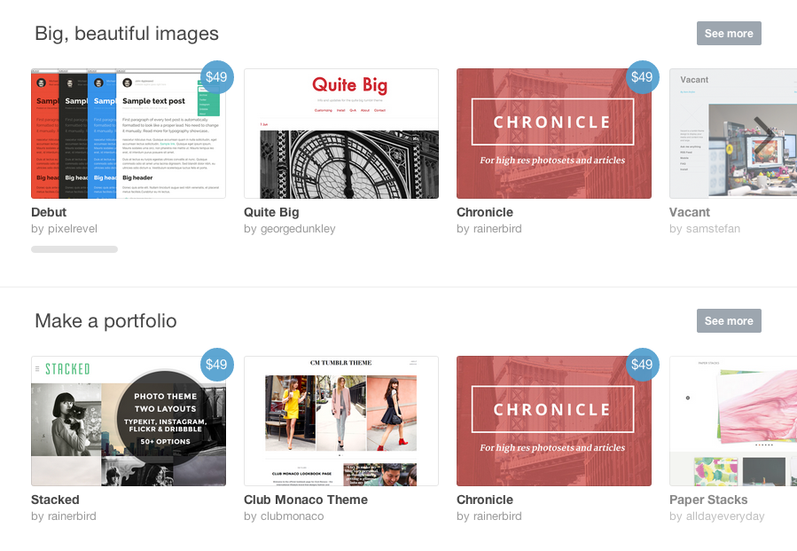

# Making your
# Artist Website

*March 2014 &bull; Somerville Open Studios*

K.Adam White &bull; [@kadamwhite](https://twitter.com/kadamwhite)

## Introductions

## Why have a website?

# Get Exposure

Note: More people can see your work online than could ever visit your studio during SOS

# Build a Following

Note: Give your fans a central place to see your existing work and to check back for new work

# Curate yourself

Note: Put your best foot forward

# What Makes a Good
# Artist's Website?

## The Basics:

* Something to Look At
* Something to Read
* Focused Content
* Updated Frequently!

# Something to Look At

## High-Quality Images

Your work is only as good as the  
scan or photo that you upload

## Small Image Files

Smaller image files make your site load faster!

Use Photoshop's "Save for Web" or equivalent <!-- .element: class="fragment" -->

Avoid uploading images larger than ~1000px on a side <!-- .element: class="fragment" -->

## Video: Optimizing Your Images

<iframe width="560" height="315" src="//www.youtube.com/embed/sfEjC92jABo" frameborder="0" allowfullscreen></iframe>

# Something to Read

## Artist's statement

## Biography

## Descriptions of the work

Note: Shapes how other people talk about you, and can help with search engines

## Explain your process

## Other commentary&mdash;be yourself!

# Focused Content

## You are an editor

## Ask yourself:

*Does this content complement my work,*

*or distract from it?*

# Updated Frequently

## Add New Work

## Re-Curate the Old

<!-- .slide: data-background="#666457" -->
<!-- .slide: class="dark" -->
# Kinds of
# Art Websites

## Galleries vs Blogs

Do you just want to showcase  
your best work,

or to engage readers  
in your process?

## Gallery Sites

* Less frequent, larger updates
* More static/highly-curated content
* Less work per website page
* Work divided up by medium or theme
* Supported by artist's statement, CV, etc

## A Common Gallery Site

## Click through to larger images

## Supports text as well

## Blog-Style Sites

* More frequent, smaller updates
* More work per website page
* Types of work may be more intermixed
* Work can be interspersed with other content

## You can do both in one site!

Structure your site's content with  
menus, tags and categories:

Part of your site can be gallery-  
style, and part of it can be a blog

## There is no right answer

Layout doesn't change the content: pick  
the layout style that feels best for you!

## General Wisdom

"Busy" designs can overwhelm content.

*e.g.*, Don't Do This:

Consider how your theme/layout represents your art

<!-- .slide: data-background="#666457" -->
<!-- .slide: class="dark" -->
# Making Your Site

# Tumblr

Community-Oriented Blogging Platform

http://tumblr.com

## Social First

Follow, Like, and "re-blog"

## Built-In Reader

## Customized Appearance

Tumblr [Theme Garden](http://www.tumblr.com/themes)

hasaportfolio

## More free themes:

* [Discover](http://olleotathemes.tumblr.com/theme/discover), Olle Ota Themes
* [Theme Guide](http://themeguide.tumblr.com/) showcases good tumblr themes
* [Best Themes for Artists](http://bestpracticesforartists.tumblr.com/bestthemes), a curated list

## General Tumblr Tips

[bestpracticesforartists.tumblr.com](http://bestpracticesforartists.tumblr.com/)

# WordPress

Open-Source blogging software

http://wordpress.org

## Video: Installing WordPress

"[How to build an artist website in 10 minutes with WordPress"](http://theabundantartist.com/how-to-build-an-artist-website-in-10-minutes-with-wordpress/), by Cory Huff of <a href="http://theabundantartist.com/tools-resources/">The Abundant Artist</a>

## Why WordPress?

Ecosystem: Thousands of themes and plugins

Proven software

Simple, but powerful!

## WordPress
## *vs*
## WordPress.com

How much do you want to customize your site?

How technical are you?

## WordPress is software,
## WordPress.com is a service

## WordPress.com

Host your blog or website on  
[WordPress.com](http://wordpress.com) for free, with
social  
capabilities similar to Tumblr's

## Installing WordPress yourself
### lets you fully customize your site,
### and use *any* themes or plugins

## WordPress.com is the fastest way
### to get a WordPress site up & running

# Demo:
## Get a WordPress.com site

# Customize!

# Themes

Change the look & feel of your site

WordPress.com [Theme Directory](http://theme.wordpress.com/)

(press "down" for recommended themes)

## Other Themes

[Free Art-Oriented themes on WordPress.com](http://theme.wordpress.com/themes/features/art/?sort=free)

[Recommended WordPress Themes](http://theabundantartist.com/wordpress-themes-for-artist-websites/) from theabundantartist.com

(scroll down for others)

## Look for photo themes

Most themes designed for photographers can  
be used as-is by artists in *any* medium

## All themes may require
## some adjustments!

Categories, menus, widgets and featured images are  
often handled slightly differently per theme, so it may  
take some time to "settle in" to your chosen theme.

## Need Help?

The [Boston WordPress](http://bostonwp.org) meetup group meets every  
month at Microsoft's Kendall Square building

# Other Options

## [Pinterest](http://www.pinterest.com/), [SquareSpace](http://www.squarespace.com/), [Blogger](www.blogger.com),
## [Carbonmade](http://carbonmade.com/), [Flickr](http://flickr.com), [500px](http://500px.com/), [Facebook](http://facebook.com),
## [html5up.net](html5up.net), complete DIY...

# Selling Your
# Work Online

## [Etsy](http://www.etsy.com/), [Turning Art](http://turningart.com/),
## [Society6](http://society6.com/), [500px](http://500px.com)...

# Questions?

&nbsp;

Slides: [talks.kadamwhite.com/art-website](http://kadamwhite.github.io/talks/2014/artists-website)

Me: [kadamwhite.com](http://kadamwhite.com) &bull; [@kadamwhite](http://twitter.com/kadamwhite)

&nbsp;

## *Thank You!*

