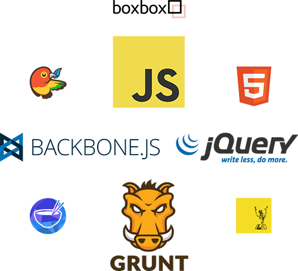
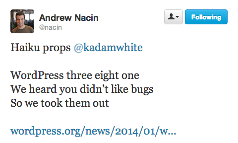
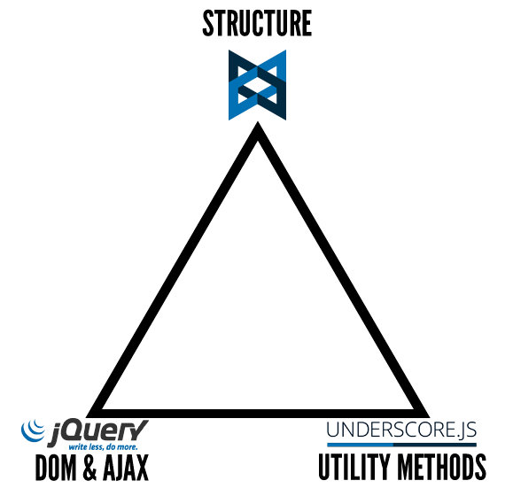
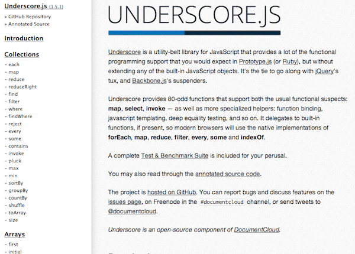
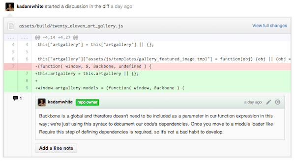
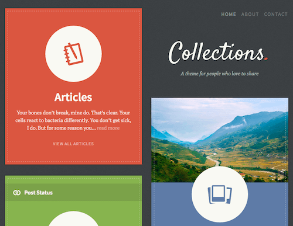
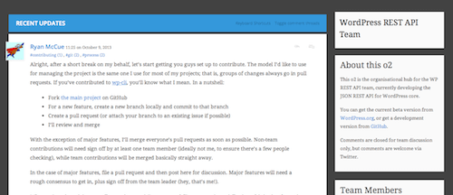
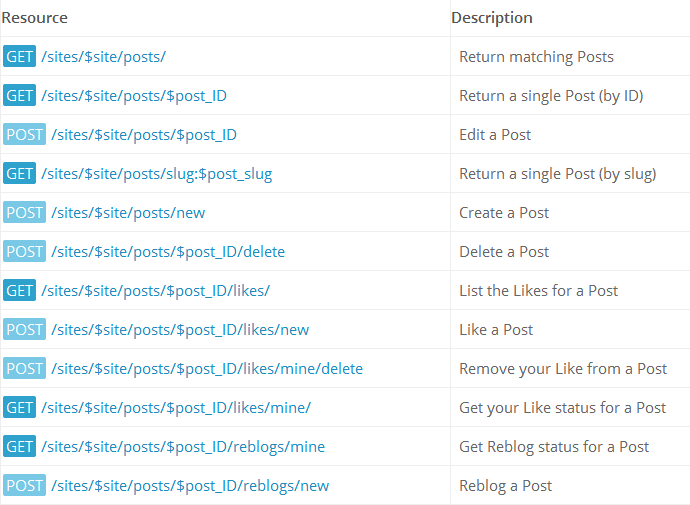
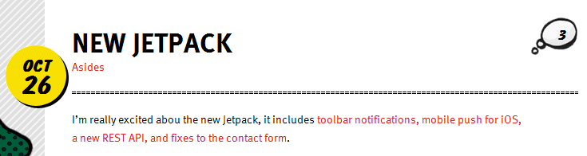
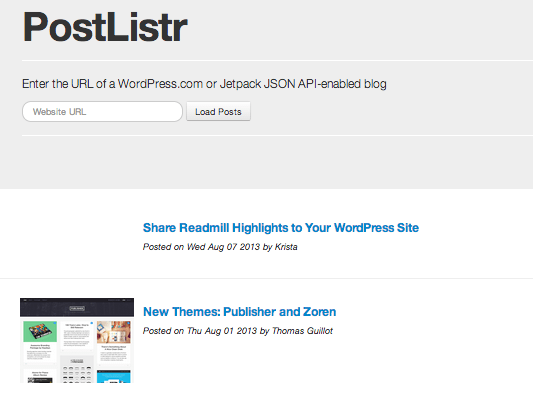

# Backbone.js for WordPress Developers

WPSessions, January 2014

K. Adam White &bull; [@kadamwhite](https://twitter.com/kadamwhite)

Engineer at [Bocoup](http://bocoup.com/)

Slides: [talks.kadamwhite.com/wpsessions-bb](http://kadamwhite.github.io/talks/2014/backbone-wordpress-wpsessions)





WordPress Core Contributor




[BostonWP](http://www.bostonwp.org) Co-Organizer


## I can't see you
### So I'm going to make a lot of assumptions
*(Please leave questions or messages in the chat!)*


## WordPress & JavaScript


## Evolving your JavaScript with Backbone.js

[WordCamp Providence 2013](http://wordpress.tv/2013/09/05/k-adam-white-evolving-your-javascript-with-backbone-js/)

[WordCamp Boston 2013](http://www.youtube.com/watch?v=7DjIJPUS7fA)

See those videos for more of a step-by-step look  
at some of the demos in this session


## Spot the Similarity

3.3: Distraction-Free Writing

3.4: Theme Customizer

3.5: Media Manager

3.6: Revisions


## JS Needs within WordPress
## Have Changed


***&nbsp;&nbsp;&nbsp;Beyond***





## Why is jQuery insufficient?


# Architecture


Wikipedia, on [Software Architecture](http://en.wikipedia.org/wiki/Software_architecture):

> **the high level structures of a software system**... which comprise the software elements, the relations between them, and the properties of both elements and relations

<small>*(emphasis added)*</small>


> Engineers tend to be concerned with physical things in and of themselves. Architects are more directly concerned with the human interface with physical things.

<small>~ Matthew Frederick, [*101 Things I Learned in Architecture School*](http://mitpress.mit.edu/books/101-things-i-learned-architecture-school)</small>


## Relationships? Interfaces?

1. Divide code into logical pieces

2. Define the relationships between those pieces


### Well-Architected code is more

* readable
* bug-free (hopefully!)
* testable
* *maintainable*


## The User Experience of Code

> Writing code is building a user experience, where the user is the developer who is reading the code.

[Nikolay Bachiyski: Writing Code as User Experience Design](http://wordpress.tv/2013/08/15/nikolay-bachiyski-writing-code-as-user-experience-design/)


## What Is Underscore?

> Underscore is a **utility-belt library** for JavaScript that provides functional programming support without extending any of the built-in JavaScript objects.
>
> <small>*~ Adapted from [underscorejs.org](http://underscorejs.org)*</small>


## `_` is One Fine Utility Belt:

```markdown
        Collections            Arrays               Functions
        
        - each                 - first              - bind
        - map                  - initial            - bindAll
        - reduce               - last               - partial
        - reduceRight          - rest               - memoize
        - find                 - compact            - delay
        - filter               - flatten            - defer
        - where                - without            - throttle
        - findWhere            - union              - debounce
        - reject               - intersection       - once
        - every                - difference         - after
        - some                 - uniq               - wrap
        - contains             - zip                - compose
        - invoke               - object
        - pluck                - indexOf            Objects
        - max                  - lastIndexOf
        - min                  - sortedIndex        - keys
        - sortBy               - range              - values
        - groupBy                                   - pairs
        - indexBy              Utility              - invert
        - countBy                                   - functions
        - shuffle              - noConflict         - extend
        - sample               - identity           - pick
        - toArray              - times              - omit
        - size                 - random             - defaults
                               - mixin              - clone
        Chaining               - uniqueId           - tap
                               - escape             - has
        - chain                - unescape           - isEqual
        - value                - result             - isEmpty
                               - template           - isElement
                                                    - isArray
                                                    - isObject
                                                    - isArguments
                                                    - isFunction
                                                    - isString
                                                    - isNumber
                                                    - isFinite
                                                    - isBoolean
                                                    - isDate
                                                    - isRegExp
                                                    - isNaN
                                                    - isNull
                                                    - isUndefined
```




**More at [Underscorejs.org](http://underscorejs.org/#objects)**


* Do things to groups of data
* Functional programming in JS
* General utilities


## Underscore is the
## backbone of Backbone.js


## So, What is Backbone?

> Backbone.js gives structure to web applications by providing **models** with key-value binding and custom events, **collections** [to group and manipulate those models], **views** with declarative event handling...
>
> <small>*~ Adapted from [backbonejs.org](http://backbonejs.org); emphasis added*</small>


## Separate Rendering from Logic

**Models** hold your data

**Views** render it on the page & handle user input


## Models

```javascript
var MyModelConstructor = Backbone.Model.extend({});

var modelInstance = new MyModelConstructor({
  prop1: 'some data',
  prop2: 'you want to store in a structured way'
});

console.log( modelInstance.get('prop1') ); // 'some data'
```


## Views

```javascript
var MyViewConstructor = Backbone.View.extend({
  el: '.my-view-container',
  render: function() {
    this.$el.html(
      this.model.get('prop1') + ' ' + this.model.get('prop2')
    );
    return this;
  }
});
var viewInstance = new MyViewConstructor({ model: modelInstance });
viewInstance.render();
// .my-view-container displays "some data that you want to
//                              store in a structured way"
```
Take that data, give it form


### That extra boilerplate gives you wings:
```javascript
var MyViewConstructor = Backbone.View.extend({
  render: function() { /* ... */ },
  initialize: function() {
    // Re-render whenever the model changes!
    this.listenTo( this.model, 'change', this.render );
  }
});

// Other code...

modelInstance.set({
  'prop1': 'some NEW data'
});

// View now reads
// "some NEW data that you want to store in a structured way"
```
Your views can listen for changes in models,<br />
and *automatically* update themselves


### The more considered your code structures are,

the easier it is to fix or modify your code:  
better **architecture** and better  
**developer user experience**.


## Add Backbone to taste

Backbone is a useful way to structure JS code&mdash;

and you can use as little (or as much) as you want


# The Bare Minimum


### Group related event handlers

With Backbone's events hash


## Structuring jQuery events

```javascript
var UserInfoForm = Backbone.View.extend({
  events: {
    'keyup .password':       'updatePasswordStrength',
    'mouseover .required':   'showRequiredTooltip'
  },
  updatePasswordStrength: function( evt ) {
    var pwd = this.$('.password').val(),
        strength = getPwdStrength( pwd );
    this.$('.password-strength').html( strength );
  },
  showRequiredTooltip: function( evt ) { /* ... */ }
});

var formInstance = new UserInputForm({
  el: '#user-input-form'
});
```


## Delegation

By using the events hash, you also  
automatically get *event delegation*


## One piece at a time


## this.el

Set 'el' when defining or instantiating a view

```javascript
var MyView = Backbone.View.extend({
  el: '.some-selector'
});

// vs

var myViewInstance = new MyView({
  el: '.some-selector'
});
```

The view is bound to that element


## this.$el

this.$el is a jQuery-wrapped version of the view's element:

```javascript
var MyView = Backbone.View.extend({
  el: '#user-info-form',
  render: function() {
    this.$el.html('My View Content');
  }
});
```


## this.$

`this.$` is equivalent to `this.$el.find`

```javascript
var pwd = this.$('.password').val();
```

(More efficient than calling the top-level jQuery all the time)


## Initializing a View

The View's `.initialize()` function gets automatically  
called when the view is instantiated

```javascript
var UserInfoForm = new Backbone.View.extend({
  el: '#user-info-form',
  initialize: function() {
    // Set up form validation when view is initialized
    this.$el.validate();
  }
});
```
```javascript
var infoForm = new UserInfoForm();
// Validation plugin has now been invoked
```


## this.tagName

Your view doesn't have to reference an existing DOM node

```javascript
var Tooltip = Backbone.View.extend({
  tagName: 'div',
  className: 'tooltip',
  render: function() {
    // Insert the newly-created .tooltip div into the document
    return this;
  }
});
var passwordTooltip = new Tooltip();
passwordTooltip.render();
```


## Render?

`this.render()`` lets Backbone update the HTML within a view

```javascript
var DocumentRow = Backbone.View.extend({
  // ...
  initialize: function() {
    // Backbone has built-in events, just like the DOM
    this.listenTo( this.model, 'change', this.render );
  },
  // ...
});
```

Render can be called in response to changes within a model


## Demo: Homepage Image Gallery


[Gallery Code](https://github.com/kadamwhite/backbone-wordpress-demo)


# Define our Main Structures


## One Model

`var Artwork = Backbone.Model.extend({});`


## One View
```javascript
var FeaturedArtwork = Backbone.View.extend({
    el: '.artwork-featured',

    template: window.artgallery['assets/js/templates/gallery_featured_image.tmpl'],

    render: function() {
      this.$el.html( this.template( this.model.attributes ) );
      // Always return `this`, to enable chaining
      return this;
    },

    show: function() {
      this.$el.slideDown();
    },

    initialize: function( options ) {
      this.listenTo( this.model, 'change', this.render );
      this.listenToOnce( this.model, 'change', this.show );
    }
  });
```


## Link them together
```javascript
var artwork = new Artwork();
var featuredArtwork = new FeaturedArtwork({
    model: artwork
});
```


## Call `set` and view
# Renders Itself!

`artwork.set( data );`

<br>No longer need to directly call "render" in your event handler


# Organization


## More files === Less code per file

* **models.js**: declare model constructors
* **views.js**: declare view constructors
* **gallery.js**: instantiate models & bind events


## main.js should be tiny!
```javascript
  var artwork, featuredArtwork, banner, thumbnails;

  artwork = new models.Artwork();

  featuredArtwork = new views.FeaturedArtwork({
    model: artwork
  });

  banner = new views.Banner({
    el: '#branding > a',
    model: artwork
  });

  thumbnails = new views.Thumbnails({
    el: '.artwork-thumbnails',
    model: artwork
  });

```


The code for this demo is [available on Github](https://github.com/kadamwhite/backbone-wordpress-demo)



(and video from Providence is<br>
[online at WordPress.tv](http://wordpress.tv/2013/09/05/k-adam-white-evolving-your-javascript-with-backbone-js/))


## What Is Backbone?, Continued

> Backbone.js gives structure to web applications... and connects it all to your existing API over a **RESTful JSON interface**.


## WordPress as an API

WordPress serves your data

Backbone fetches that data, does stuff with it


## JSON API plugin

[wordpress.org/plugins/json-api/](http://wordpress.org/plugins/json-api/)

-------

Older plugin, by the MoMA team

Useful [*implicit mode*](http://wordpress.org/plugins/json-api/other_notes/#1.1.-Requests)


```javascript
{
  "status": "ok",
  "count": 1,
  "count_total": 1,
  "pages": 1,
  "posts": [
    {
      "id": 1,
      "type": "post",
      "slug": "hello-world",
      "url": "http:\/\/localhost\/wordpress\/?p=1",
      "title": "Hello world!",
      "title_plain": "Hello world!",
      "content": "<p>Welcome to WordPress. This is your first post. Edit or delete it, then start blogging!<\/p>\n",
      "excerpt": "Welcome to WordPress. This is your first post. Edit or delete it, then start blogging!\n",
      "date": "2009-11-11 12:50:19",
      "modified": "2009-11-11 12:50:19",
      "categories": [],
      "tags": [],
      "author": {
        "id": 1,
        "slug": "admin",
        "name": "admin",
        "first_name": "",
        "last_name": "",
        "nickname": "",
        "url": "",
        "description": ""
      },
      "comments": [
        {
          "id": 1,
          "name": "Mr WordPress",
          "url": "http:\/\/wordpress.org\/",
          "date": "2009-11-11 12:50:19",
          "content": "<p>Hi, this is a comment.<br \/>To delete a comment, just log in and view the post's comments. There you will have the option to edit or delete them.<\/p>\n",
          "parent": 0
        }
      ],
      "comment_count": 1,
      "comment_status": "open"
    }
  ]
}
```


## JSON REST API

[wordpress.org/plugins/json-rest-api](http://wordpress.org/plugins/json-rest-api/)

-------

Began as a Google Summer of Code project by Ryan McCue

Works as a plugin, or as a core drop-in

May be a candidate for WordPress Core: EXTREMELY exciting possibility!

https://github.com/WP-API/WP-API


```javascript
{
    "post": {
        "name": "Posts",
        "slug": "post",
        "description": "",
        "labels": {
            "name": "Posts",
            "singular_name": "Post",
            "add_new": "Add New",
            "add_new_item": "Add New Post",
            "edit_item": "Edit Post",
            "new_item": "New Post",
            "view_item": "View Post",
            "search_items": "Search Posts",
            "not_found": "No posts found.",
            "not_found_in_trash": "No posts found in Trash.",
            "parent_item_colon": null,
            "all_items": "All Posts",
            "menu_name": "Posts",
            "name_admin_bar": "Post"
        },
        "queryable": true,
        "searchable": true,
        "hierarchical": false,
        "meta": {
            "links": {
                "self": "http:\/\/example.com\/wp-json.php\/posts\/types\/post",
                "archives": "http:\/\/example.com\/wp-json.php\/posts"
            }
        }
    },
    "page": {
        "name": "Pages",
        "slug": "page",
        "description": "",
        "labels": {
            "name": "Pages",
            "singular_name": "Page",
            "add_new": "Add New",
            "add_new_item": "Add New Page",
            "edit_item": "Edit Page",
            "new_item": "New Page",
            "view_item": "View Page",
            "search_items": "Search Pages",
            "not_found": "No pages found.",
            "not_found_in_trash": "No pages found in Trash.",
            "parent_item_colon": "Parent Page:",
            "all_items": "All Pages",
            "menu_name": "Pages",
            "name_admin_bar": "Page"
        },
        "queryable": false,
        "searchable": true,
        "hierarchical": true,
        "meta": {
            "links": {
                "self": "http:\/\/example.com\/wp-json.php\/posts\/types\/page"
            }
        }
    },
    "attachment": {
        "name": "Media",
        "slug": "attachment",
        "description": "",
        "labels": {
            "name": "Media",
            "singular_name": "Media",
            "add_new": "Add New",
            "add_new_item": "Add New Post",
            "edit_item": "Edit Media",
            "new_item": "New Post",
            "view_item": "View Attachment Page",
            "search_items": "Search Posts",
            "not_found": "No posts found.",
            "not_found_in_trash": "No posts found in Trash.",
            "parent_item_colon": null,
            "all_items": "Media",
            "menu_name": "Media",
            "name_admin_bar": "Media"
        },
        "queryable": true,
        "searchable": true,
        "hierarchical": false,
        "meta": {
            "links": {
                "self": "http:\/\/example.com\/wp-json.php\/posts\/types\/attachment",
                "archives": "http:\/\/example.com\/wp-json.php\/posts?type=attachment"
            }
        }
    }
}
```


# ...Backbone fetches it


## .fetch()

```javascript
var Posts = Backbone.Collection.extend({
  model: Post, // constructor to use for items in this collection
  parse: function( response ) {
    return response.posts;
  }
});

var blogPosts = new Posts([], {
  url: '/api/get_recent_posts/'
});
```
Fetch posts from your blog (using the [JSON API](http://wordpress.org/plugins/json-api/) plugin)


### WordPress as an API in the
# Real World


## Collections



by [The Theme Foundry](http://thethemefoundry.com/wordpress/collections/)

(Theme Foundry's own [Zack Tollman](http://thethemefoundry.com/blog/meet-zack-tollman/) is up next!)


## o2



The successor to P2, by [Automattic](http://geto2.com/)<br />
<small>(not yet released, see geto2.com)</small>

Follow the discussions of the aforementioned WP API team on their project o2, at [wpapiteam.wordpress.com](http://wpapiteam.wordpress.com/)


## Why stop at
## themes and plugins?


## Soundcloud &bull; Pandora &bull; AirBnB

## USA Today &bull; Khan Academy &bull; Rdio

## Newsblur &bull; Quarts &bull; Hulu &bull; Gawker

Backbone drives both website components<br />
and full-on web applications


You don't need to be *on* a webpage

to *use* data from that site


Access your blog using the WordPress.com REST API




## Jetpack JSON API



Use the WP.com API on self-hosted WordPress sites


## (provides a LOT more information)

```javascript
{
    "found": 2,
    "posts": [
        {
            "ID": 10,
            "author": {
                "ID": 275903,
                "email": false,
                "name": "K.Adam",
                "URL": "http:\/\/www.kadamwhite.com",
                "avatar_URL": "http:\/\/0.gravatar.com\/avatar\/6cd1cf6de05952505a165425efaf06b4?s=96&d=identicon&r=G",
                "profile_URL": "http:\/\/en.gravatar.com\/kadamwhite"
            },
            "date": "2012-08-27T20:06:06+00:00",
            "modified": "2012-08-27T20:06:06+00:00",
            "title": "The Cost of Privacy",
            "URL": "http:\/\/kadamwhite.wordpress.com\/2012\/08\/27\/the-cost-of-privacy\/",
            "short_URL": "http:\/\/wp.me\/p2GX8E-a",
            "content": "<p>Back in January, James Coglan wrote <a href=\"http:\/\/blog.jcoglan.com\/2012\/01\/19\/the-cost-of-privacy\/\">a great article about the drawbacks of private variables in JavaScript<\/a>. The hidden costs of encapsulating privately-scoped variables is explained with examples of some of the potential performance and maintenance drawbacks.<\/p>\n<blockquote><p>Encapsulation is something you get by deliberately designing interfaces and architectures, by communicating with your team\/users, and through documentation and tests. Trying to enforce it in code shows a level of paranoia that isn\u2019t necessary in most situations, and this code style has plenty of costs that grossly offset the minimal encapsulation benefit it provides.<\/p><\/blockquote>\n<p>(Link via <a href=\"http:\/\/rmurphey.com\/\">Rebecca Murphey<\/a>)<\/p>\n",
            "excerpt": "<p>Back in January, James Coglan wrote a great article about the drawbacks of private variables in JavaScript. The hidden costs of encapsulating privately-scoped variables is explained with examples of some of the potential performance and maintenance drawbacks. Encapsulation is something you get by deliberately designing interfaces and architectures, by communicating with your team\/users, and through [&hellip;]<\/p>\n",
            "slug": "the-cost-of-privacy",
            "status": "publish",
            "password": "",
            "parent": false,
            "type": "post",
            "comments_open": true,
            "pings_open": true,
            "comment_count": 0,
            "like_count": 0,
            "i_like": 0,
            "is_reblogged": 0,
            "is_following": 0,
            "featured_image": "",
            "format": "standard",
            "geo": false,
            "publicize_URLs": [

            ],
            "tags": {
                "Design Patterns": {
                    "name": "Design Patterns",
                    "slug": "design-patterns",
                    "description": "",
                    "post_count": 1,
                    "meta": {
                        "links": {
                            "self": "http:\/\/public-api.wordpress.com\/rest\/v1\/sites\/39789780\/tags\/slug:design-patterns",
                            "help": "http:\/\/public-api.wordpress.com\/rest\/v1\/sites\/39789780\/tags\/slug:design-patterns\/help",
                            "site": "http:\/\/public-api.wordpress.com\/rest\/v1\/sites\/39789780"
                        }
                    }
                },
                "Front-End Architecture": {
                    "name": "Front-End Architecture",
                    "slug": "front-end-architecture",
                    "description": "",
                    "post_count": 2,
                    "meta": {
                        "links": {
                            "self": "http:\/\/public-api.wordpress.com\/rest\/v1\/sites\/39789780\/tags\/slug:front-end-architecture",
                            "help": "http:\/\/public-api.wordpress.com\/rest\/v1\/sites\/39789780\/tags\/slug:front-end-architecture\/help",
                            "site": "http:\/\/public-api.wordpress.com\/rest\/v1\/sites\/39789780"
                        }
                    }
                },
                "JavaScript": {
                    "name": "JavaScript",
                    "slug": "javascript",
                    "description": "",
                    "post_count": 2,
                    "meta": {
                        "links": {
                            "self": "http:\/\/public-api.wordpress.com\/rest\/v1\/sites\/39789780\/tags\/slug:javascript",
                            "help": "http:\/\/public-api.wordpress.com\/rest\/v1\/sites\/39789780\/tags\/slug:javascript\/help",
                            "site": "http:\/\/public-api.wordpress.com\/rest\/v1\/sites\/39789780"
                        }
                    }
                },
                "Scope": {
                    "name": "Scope",
                    "slug": "scope",
                    "description": "",
                    "post_count": 1,
                    "meta": {
                        "links": {
                            "self": "http:\/\/public-api.wordpress.com\/rest\/v1\/sites\/39789780\/tags\/slug:scope",
                            "help": "http:\/\/public-api.wordpress.com\/rest\/v1\/sites\/39789780\/tags\/slug:scope\/help",
                            "site": "http:\/\/public-api.wordpress.com\/rest\/v1\/sites\/39789780"
                        }
                    }
                }
            },
            "categories": {
                "JavaScript": {
                    "name": "JavaScript",
                    "slug": "javascript",
                    "description": "",
                    "post_count": 2,
                    "parent": 0,
                    "meta": {
                        "links": {
                            "self": "http:\/\/public-api.wordpress.com\/rest\/v1\/sites\/39789780\/categories\/slug:javascript",
                            "help": "http:\/\/public-api.wordpress.com\/rest\/v1\/sites\/39789780\/categories\/slug:javascript\/help",
                            "site": "http:\/\/public-api.wordpress.com\/rest\/v1\/sites\/39789780"
                        }
                    }
                }
            },
            "attachments": {

            },
            "metadata": false,
            "meta": {
                "links": {
                    "self": "http:\/\/public-api.wordpress.com\/rest\/v1\/sites\/39789780\/posts\/10",
                    "help": "http:\/\/public-api.wordpress.com\/rest\/v1\/sites\/39789780\/posts\/10\/help",
                    "site": "http:\/\/public-api.wordpress.com\/rest\/v1\/sites\/39789780",
                    "replies": "http:\/\/public-api.wordpress.com\/rest\/v1\/sites\/39789780\/posts\/10\/replies\/",
                    "likes": "http:\/\/public-api.wordpress.com\/rest\/v1\/sites\/39789780\/posts\/10\/likes\/"
                }
            }
        }
    ]
}
```


## Demo:
# Blog Viewer

A stand-alone JS app to view recent

headlines for a WordPress blog




[code](https://github.com/kadamwhite/wordbone-pressback/tree/master/PostListr#postlistr) & [live application](http://kadamwhite.github.io/wordbone-pressback/)


## Where do we go from here?


### Write better websites

Embrace Backbone to add better structure and more dynamic interaction to your website interfaces


### Write Apps

Build awesome tools that use WP as a backend


### Enhance Core

The relationship between WordPress and Backbone is only getting stronger


### Thanks to core, we have
# WP-specific
### tools & Backbone extensions


## wp-backbone.js

Backbone, with WP-specific view handling & utilities

<small>*See the [trac ticket for adding wp-backbone.js](http://core.trac.wordpress.org/ticket/24424)*</small>


**wp.Backbone.Subviews**

Manage nested views


**wp.Backbone.View**

```javascript
revisions.view.Frame = wp.Backbone.View.extend({
    className: 'revisions',
    template: wp.template('revisions-frame'),
    // ...
});
```
Self-rendering & Subview-aware Views


**wp.template()**

Lazy-load inline'd templates from the page,  
with WP-compatible delimiter settings

<small>*See more about wp.template on [trac](http://core.trac.wordpress.org/ticket/23263)*</small>


### One final issue to address...


## The Competition

AngularJS &bull; Ember.js &bull; Knockout &bull; Agility.js &bull; CanJS &bull; Spine &bull; Maria &bull; ExtJS &bull; Sammy.js &bull; Stapes.js &bull; Epitome &bull; soma.js &bull; PastronJS &bull; rAppid.js &bull; Serenade.js &bull; THE LIST GOES ON


Many of these frameworks are great, but
## Backbone's not going anywhere


## "More Than One Way To Do It"

> It's common for folks just getting started to treat the examples listed on this page as some sort of gospel truth. In fact, Backbone.js is intended to be fairly agnostic about many common patterns in client-side code.
>
> <small>~ [Backbonejs.org](http://backbonejs.org/#FAQ-tim-toady)</small>


## Backbone is a good
## choice for WordPress


### It's not scary


### It's flexible


### It's easy to get started


# Experiment!


# Thank You

<br />

Slides: [talks.kadamwhite.com/wpsessions-bb](http://kadamwhite.github.io/talks/2014/backbone-wordpress-wpsessions)

Code: [github.com/kadamwhite/wordbone-pressback/](https://github.com/kadamwhite/wordbone-pressback/#readme)

Me: [@kadamwhite](http://twitter.com/kadamwhite) &bull; [kadamwhite.com](http://www.kadamwhite.com)

<br />

*Artwork by [Emily Garfield](http://www.emilygarfield.com)*

<hr />

<small>Technology: [Reveal.js](http://lab.hakim.se/reveal-js/) &bull; [Grunt](http://gruntjs.com/) &bull; [Grunt-WP-Theme](https://github.com/10up/grunt-wp-theme)</small>


## Resources & Further Reading

* Highly Recommended:
  * [Backbone.js Website](http://backbonejs.org/) and [annotated source code](http://backbonejs.org/docs/backbone.html)
  * [Backbone.js Deconstructed](http://tech.pro/tutorial/1367/part-1-backbonejs-deconstructed) on tech.pro
  * [Bocoup Training](http://training.bocoup.com/)
  * [Step by Step from jQuery to Backbone](https://github.com/kjbekkelund/writings/blob/master/published/understanding-backbone.md) on Github
* Also potentially Useful:
  * [WP Tuts+ tutorial on Backbone and WordPress](http://wp.tutsplus.com/tutorials/creative-coding/using-backbone-within-the-wordpress-admin-the-back-end/)
  * Function Programming/Currying: [Functional Programming in 5 Minutes](http://slid.es/gsklee/functional-programming-in-5-minutes)
