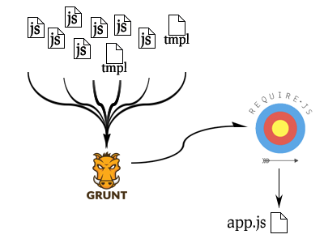

# Modular
# JavaScript

*September 2014 &bull; WordCamp Providence*

K.Adam White &bull; [@kadamwhite](https://twitter.com/kadamwhite)


## Introductions


<small>*[Andrew Magill, "Money"](https://www.flickr.com/photos/amagill/3366720659)*</small>


<small>*[TaxCredits.net, "Money"](https://www.flickr.com/photos/76657755@N04/7408506410)*</small>


`media-views.js`

Note: There are over 400 functions defined in media-views.js, and over 50 different views. Finding the code you want takes a lot of scrolling!


# Modules


> A self-contained piece of code defining a set of related functionality


## The Most Basic JS Module System


<pre><code>
&#60;script type="text/javascript" src="lib/jquery.min.js">&#60;/script>
&#60;script type="text/javascript" src="lib/plugin.js">&#60;/script>
&#60;script type="text/javascript" src="lib/horrible-image-slider.js">&#60;/script>
&#60;script type="text/javascript" src="my-app.js">&#60;/script>

</code></pre>


## We're Done!


## :(


No Dependencies


## We've all been here

<pre><code>
&#60;script type="text/javascript" src="my-app.js">&#60;/script>
&#60;script type="text/javascript" src="lib/jquery.min.js">&#60;/script>

</code></pre>


Bad Granularity

Note: We're still trying to buy a coke with a $50


## What is a Module?, v2
> A self-contained piece of code defining a set of related functionality **and any required dependencies**


## The WordPress JS Module System


## Dependencies!
```php
wp_register_script(
    'my-plugin-script',
    plugin_dir_url( __FILE__ ) . 'js/awesome-plugin.js',
    array( 'jquery' ),
    '9000.0.1',
    true
);
```


## File size... not so much
<br>
`wp_enqueue_script` &rarr; `<script/>`


## Code in JS, deps in PHP? :(
<br>
```php
wp_enqueue_script( /*...*/, array( 'jquery' ), /*...*/);
```
<br>
> [A Module is] a **self-contained piece of code**...


We need to be able to
## Author modules
as separate files, then
## release modules
as enqueue'able, built scripts


# Module Systems


## AMD vs CommonJS


# CommonJS
## (Node is a variant)


## Node's require() &amp; module.exports
```javascript
var globule = require('globule');
var findup = require('findup-sync');
var resolve = require('resolve').sync;
var stackTrace = require('stack-trace');
var path = require('path');

// export object
var matchdep = module.exports = {};
```
<small>*from [node-matchdep](https://github.com/tkellen/node-matchdep), by Tyler Kellen*</small>


# AMD


## require()
```javascript
require([ 'cart', 'store', 'store/util' ],
function(  cart,   store,   util ) {
    //use the modules as usual.
});
```
<small>*from the Require.js [API docs](http://requirejs.org/docs/api.html#jsfiles)*</small>


## define()
```javascript
define([
    './cart',
    './inventory'
], function( cart, inventory ) {
    // return an object to define the module
    return {
        color: 'blue',
        size: 'large',
        addToCart: function() {/* ... */}
    }
});
```


*Simplified CommonJS Wrapper*
```javascript
define(function( require, exports, module ) {
  'use strict';

  var Grammar = require( './grammar' );
  var Tokenizer = require( './tokenizer' );
  var Tree = require( './tree' );
  var Compiler = require( './compiler' );
  // ...
  module.exports = Combyne;
});
```
<small>*from [Combyne.js](https://github.com/tbranyen/combyne), by Tim Branyen*</small>


## A brief glimpse of
# the future


## ES6 Modules

The next version of JavaScript will have native modules!


```javascript
    //------ lib.js ------
    export const sqrt = Math.sqrt;
    export function square(x) {
        return x * x;
    }
    export function diag(x, y) {
        return sqrt(square(x) + square(y));
    }

    //------ main.js ------
    import { square, diag } from 'lib';
    console.log(square(11)); // 121
    console.log(diag(4, 3)); // 5
```

[ES6 Modules: The Final Syntax](http://www.2ality.com/2014/09/es6-modules-final.html)


...but they won't be in browsers for a while yet.


## We're going to focus on AMD

because it's designed for the browser


Choose Your Own Granularity


## AMD Structure in jQuery

jQuery's main `jquery.js` file:
```javascript
define([
    "./core",
    "./selector",
    "./traversing",
    "./callbacks",
    "./deferred",
    "./core/ready",
    "./data",
    "./queue",
    "./queue/delay",
    "./attributes",
    "./event",
    "./event/alias",
    "./manipulation",
    "./manipulation/_evalUrl",
    "./wrap",
    "./css",
    "./css/hiddenVisibleSelectors",
    "./serialize",
    "./ajax",
    "./ajax/xhr",
    "./ajax/script",
    "./ajax/jsonp",
    "./ajax/load",
    "./event/ajax",
    "./effects",
    "./effects/animatedSelector",
    "./offset",
    "./dimensions",
    "./deprecated",
    "./exports/amd",
    "./exports/global"
], function( jQuery ) {

return jQuery;

});
```


## "./core",
First dependency creates jQuery object,  
adds core functionality, returns `jQuery`
```javascript
define([
    "./var/arr",
    "./var/slice",
    "./var/concat",
    "./var/push",
    "./var/indexOf",
    "./var/class2type",
    "./var/toString",
    "./var/hasOwn",
    "./var/support"
], function( arr, slice, concat, push, indexOf, class2type, toString, hasOwn, support ) {

var
    // Use the correct document accordingly with window argument (sandbox)
    document = window.document,

    version = "@VERSION",

    // Define a local copy of jQuery
    jQuery = function( selector, context ) {
        // The jQuery object is actually just the init constructor 'enhanced'
        // Need init if jQuery is called (just allow error to be thrown if not included)
        return new jQuery.fn.init( selector, context );
    },

    // ...Define jQuery.fn, jQuery.extend, etcetera
    // ...
    // ...

return jQuery;
});
```


## "./data"
Require core, extend it with data methods
```javascript
define([
    "./core",
    "./var/rnotwhite",
    "./core/access",
    "./data/var/data_priv",
    "./data/var/data_user"
], function( jQuery, rnotwhite, access, data_priv, data_user ) {

var rbrace = /^(?:\{[\w\W]*\}|\[[\w\W]*\])$/,
    rmultiDash = /([A-Z])/g;

function dataAttr( elem, key, data ) { /* ... */ },

jQuery.extend({
    hasData: function( elem ) { /* ... */ },

    data: function( elem, name, data ) { /* ... */ },

    removeData: function( elem, name ) { /* ... */ },

    // ...
});

jQuery.fn.extend({
    data: function( key, value ) { /* ... */ },

    removeData: function( key ) { /* ... */ },
});

return jQuery;
});
```


## Loading AMD modules with Require.js

<pre><code>
&#60;!doctype html&#62;
&#60;html&#62;
&#60;head&#62;
  &#60;title&#62;jQuery via AMD&#60;/title&#62;
  &#60;script type="text/javascript"
          data-main="./jquery/src/jquery"
          src="require.js"&#62;
  &#60;/script&#62;
  &#60;script type="text/javascript"&#62;
    requirejs.config({
      paths: {
        sizzle: "../../sizzle/src/sizzle"
      }
    });
  &#60;/script&#62;
&#60;/head&#62;
&#60;body&#62;
  &#60;!-- This will get rendered via JS --&#62;
  &#60;h1 id="title"&#62;&#60;/h1&#62;

  &#60;script type="text/javascript"&#62;
    require(["jQuery"], function($) {
      $('#title').text('Title!');
    });
  &#60;/script&#62;
&#60;/body&#62;
&#60;/html&#62;
</code></pre>


## Why would you do that?

(Adds a ton of HTTP overhead)


*If You Build It...*


## AMD > Concatenation


## Hierarchy

* jquery
* app config
* app init
* module 1
* dependency util for module 2
* module 2


## Hierarchy with AMD

* amd config
    - app
        + module 1
            * submodule a
            * submodule b
                - jquery
            * common utility 1
        + module 2
            * jquery
            * common utility 1
        + common utility 2


AMD hierarchy means
## Obvious Relationships

* Which modules are needed by which other?
* Which modules are commonly used across the app?
* Are poorly-structured relationships?

Note: This knowledge of your system can easily be lost with a traditional, linear/concat-based module inclusion model


### good for
# Testability


## Why care about Modules in tests?

> [module systems] makes dependencies explicit, and unit tests benefit from this property just as much as any application code.

[Effective Unit Testing with AMD](http://bocoup.com/weblog/effective-unit-testing-with-amd/), by Mike Pennisi


# AMD &amp; WP


### WP has an existing
# plugin/script ecosystem


AMD *cannot* be the be-all and end-all


## Internal <small>vs</small> External
# Dependencies


### Registered Scripts
WordPress already contains a lot of built-in scripts:
```php
    // jQuery
    $scripts->add( 'jquery', false, array( 'jquery-core', 'jquery-migrate' ), '1.11.1' );
    $scripts->add( 'jquery-core', '/wp-includes/js/jquery/jquery.js', array(), '1.11.1' );
    $scripts->add( 'jquery-migrate', "/wp-includes/js/jquery/jquery-migrate$suffix.js", array(), '1.2.1' );

    // full jQuery UI
    $scripts->add( 'jquery-ui-core', '/wp-includes/js/jquery/ui/jquery.ui.core.min.js', array('jquery'), '1.10.4', 1 );
    $scripts->add( 'jquery-effects-core', '/wp-includes/js/jquery/ui/jquery.ui.effect.min.js', array('jquery'), '1.10.4', 1 );

    $scripts->add( 'jquery-effects-blind', '/wp-includes/js/jquery/ui/jquery.ui.effect-blind.min.js', array('jquery-effects-core'), '1.10.4', 1 );
    $scripts->add( 'jquery-effects-bounce', '/wp-includes/js/jquery/ui/jquery.ui.effect-bounce.min.js', array('jquery-effects-core'), '1.10.4', 1 );
    $scripts->add( 'jquery-effects-clip', '/wp-includes/js/jquery/ui/jquery.ui.effect-clip.min.js', array('jquery-effects-core'), '1.10.4', 1 );
    $scripts->add( 'jquery-effects-drop', '/wp-includes/js/jquery/ui/jquery.ui.effect-drop.min.js', array('jquery-effects-core'), '1.10.4', 1 );
    $scripts->add( 'jquery-effects-explode', '/wp-includes/js/jquery/ui/jquery.ui.effect-explode.min.js', array('jquery-effects-core'), '1.10.4', 1 );
    // And so on... you get the idea
```


### Do Not Touch,

or stuff will break


## WordPress

should be used to enqueue built-in scripts,

and non-AMD/UMD dependencies


## Your module system

should pull in your own plugins, libraries,

utilities, wrappers, templates, *etc*


## How This Can Work:
# AMD WP Plugin Boilerplate

[View on Github](https://github.com/kadamwhite/js-plugin-boilerplate)

*use for learning, not production*


# Demo


```php
// plugin.php
// ----------
wp_register_script(
    'require',
    $plugin_path . 'js/require.js',
    array()
);

wp_register_script(
    'js-plugin-boilerplate',
    $plugin_path . 'js/require-config.js',
    array(
        'jquery',
        'require'
    )
);
```


```javascript
// require-config.js
// -----------------
require.config({
    baseUrl: REQUIRE_CONFIGURATION.baseUrl
});

// Load the application
require(['app']);
```
```php
// plugin.php
// ----------
wp_localize_script( 'js-plugin-boilerplate',
    'REQUIRE_CONFIGURATION',
    array( 'baseUrl' => $plugin_path . 'js/src' )
);
```


```javascript
// app.js
// ------
define([
    'jquery',
    'module1',
    'module2'
], function( $, module1, module2 ) {
    'use strict';

    module1.init();

    console.log( '%s loaded', module2.name );

    $('.entry-title').text('Demo Loaded!');
});

```


## Pitfalls


### Require likes to run the show

and will not play nice with some libraries


## Backbone, for example...


Further Reading: [Universal Module Definition (UMD)](https://github.com/umdjs/umd)


### From the Require docs:

> Be sure to load all scripts that call define() via the RequireJS API. Do not manually code script tags in HTML to load scripts that have define() calls in them.


## AMD?
# No Can Do.

*It breaks WordPress.*


## But if you build it...


## RequireJS for Authoring,
## Single file for Deployment




# Modular Code
### without side effects


Modules &rarr; Require.js optimizer &rarr; AMDClean &rarr; App.js


## Demo, continued


## What is a
# Module?


<small>*[AJ Schuster, "Desperation"](https://www.flickr.com/photos/ajschu/2581316304)*</small>


## Resources

- [RequireJS: A JavaScript Module Loader](http://gregfranko.com/requirejs-talk/), by Greg Franko
- [Using RequireJS In WordPress](http://kaidez.com/requirejs-wordpress/), by Kai Gittens
- [Writing Modular JavaScript](http://addyosmani.com/writing-modular-js/), by Addy Osmani
- [Understanding Require.js](http://www.sitepoint.com/understanding-requirejs-for-effective-javascript-module-loading/), on SitePoint
- The official [Require.js API documentation](http://requirejs.org/docs/api.html)
- [Browserify](http://http://browserify.org/)
- [es6-module-transpiler](https://github.com/square/es6-module-transpiler)

*Books:*

- JavaScript Patterns, a book by Stoyan Stefanov
- [JavaScript Design Patterns](http://addyosmani.com/resources/essentialjsdesignpatterns/book/#modulepatternjavascript), a free book by Addy Osmani


# Questions?

&nbsp;

Slides: [talks.kadamwhite.com/modular-js-pvd](http://kadamwhite.github.io/talks/2014/modular-javascript-pvd)

Me: [kadamwhite.com](http://kadamwhite.com) &bull; [@kadamwhite](http://twitter.com/kadamwhite)

Us: [Bocoup](http://bocoup.com) &bull; [@bocoup](http://twitter.com/bocoup)

&nbsp;

## *Thank You!*

