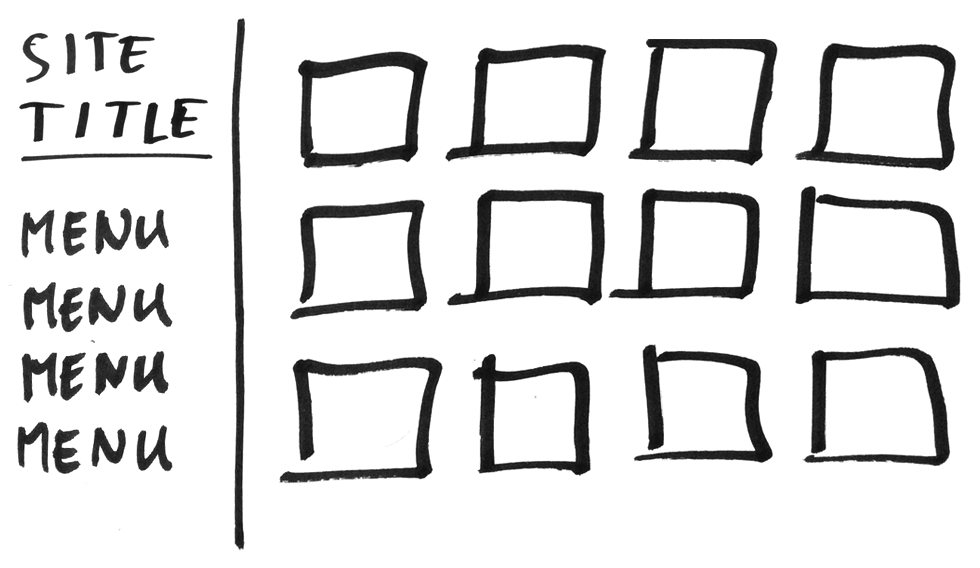
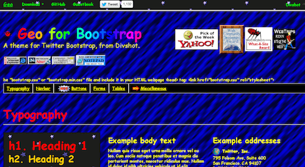
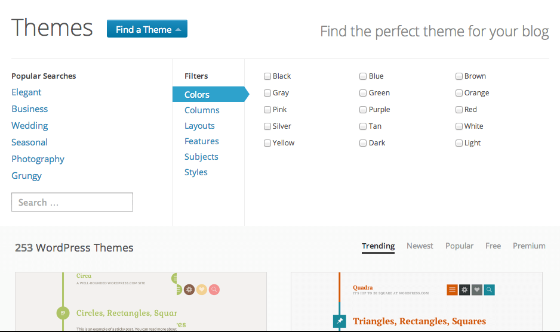
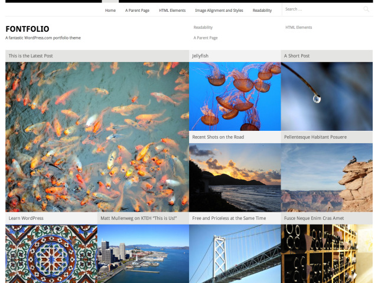
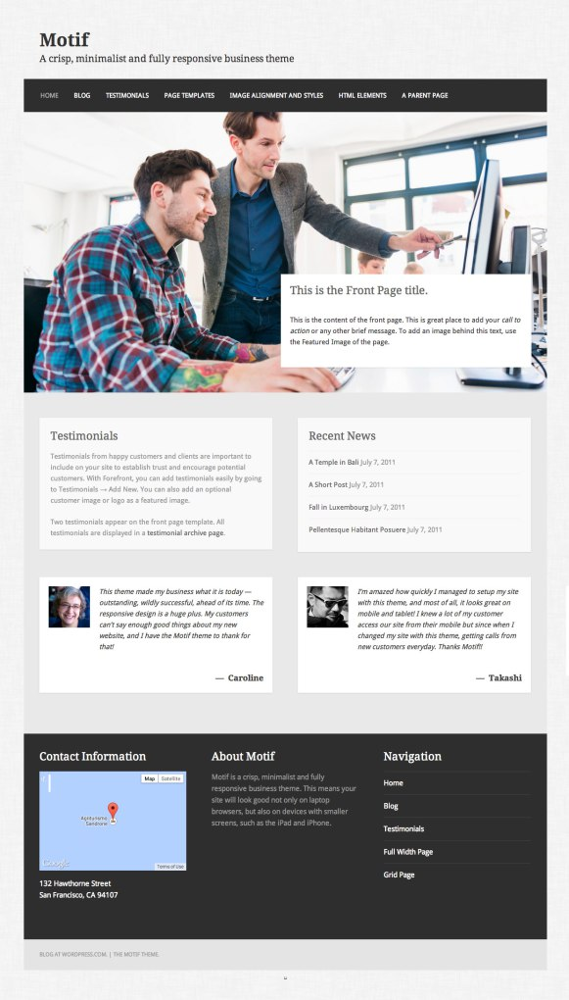
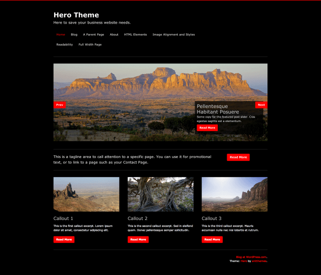
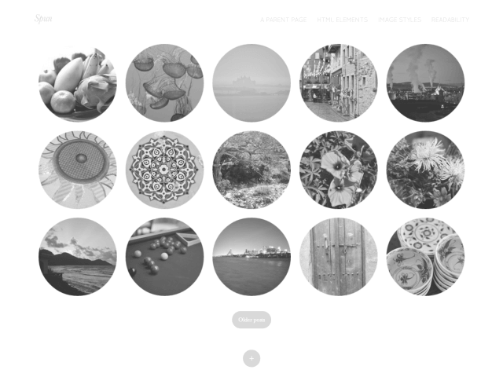
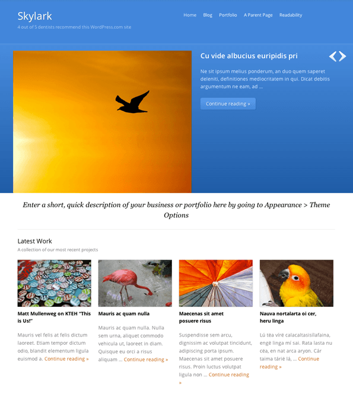

# Making your
# Artist Website

*March 2014 &bull; Boston WordPress Meetup*

K.Adam White &bull; [@kadamwhite](https://twitter.com/kadamwhite)

---

This talk was designed for Somerville Open Studios

---

<!-- .slide: data-background="#503D39" -->
<!-- .slide: class="dark" -->
# Why have a website?

---

## Get Exposure

More people can see your work online than could ever visit your studio during an open-studio weekend

---

## Build a Following

Give your fans a central place to see your existing work and to check back for new work

---

## Curate yourself

Put your best foot forward

---

<!-- .slide: data-background="#503D39" -->
<!-- .slide: class="dark" -->
# What Makes a Good
# Artist's Website?

There are 4 things all art websites (imo) should have

---

# Something to Look At

---

## High-Quality Images

Your work is only as good as the  
scan or photo that you upload

---

# Something to Read

---

## Artist's statement

---

## Biography

---

## Descriptions of the work

- Shapes how other people talk about you
- Can help with search engines

---

## Explain your process

---

## Be yourself!

---

# Focused Content

---

## You are an editor

---

## Ask yourself:

*Does this content complement my work,*

*or distract from it?*

---

# Frequent Updates

---

## Add New Work

---

## Re-Curate the Old

---

<!-- .slide: data-background="#503D39" -->
<!-- .slide: class="dark" -->
# Kinds of
# Art Websites

---

## The Most Common Gallery Site

---

## Click through to larger images

---

## Statement, Bio or Article

---

Do you just want to showcase  
your best work,

---

or to engage readers  
in your process?

---

## Galleries vs Blogs

---

## Gallery Sites

* Less frequent, larger updates
* More static/highly-curated content
* Less work per website page
* Work divided up by medium or theme
* Supported by artist's statement, CV, etc

---

## Blog-Style Sites

* More frequent, smaller updates
* More work per website page
* Types of work may be more intermixed
* Work can be interspersed with other content

---

## You can do both!

---

## What does the user see first?

---

## Structure your site
### with menus, tags & categories:

Part of your site can be gallery-  
style, and part of it can be a blog

---

## There is no right answer

Structure your site the way that feels best for you!

---

<!-- .slide: data-background="#503D39" -->
<!-- .slide: class="dark" -->
# Making Your Site

---

## [WordPress](https://wordpress.org), [Tumblr](https://tumblr.com),
## [Pinterest](https://www.pinterest.com/), [Blogger](https://www.blogger.com), [SquareSpace](https://www.squarespace.com/),
## [Wix](https://www.wix.com/), [Carbonmade](https://carbonmade.com/), [Flickr](http://flickr.com),
## [500px](https://500px.com/), [Facebook](https://facebook.com), [html5up.net](https://html5up.net),
## complete DIY...

---

_(This talk was created for a WordPress meetup,_

_so that is our primary example here)_

---

## Why Use WordPress?

Ecosystem: Thousands of themes and plugins

Proven software

Simple, but powerful!

---

## WordPress (Software)
## *vs*
## WordPress.com (Service)

---

How much do you want to customize your site?

How technical are you?

---

## WordPress.com

Host your blog or website on  
[WordPress.com](http://wordpress.com) for free, with
social  
capabilities similar to Tumblr's

---

## Installing WordPress yourself
### lets you fully customize your site,
### and use *any* themes or plugins

---

## WordPress.com is the fastest way
### to get a WordPress site up & running

---

## Video: Installing WordPress

"[How to build an artist website in 10 minutes with WordPress"](http://theabundantartist.com/how-to-build-an-artist-website-in-10-minutes-with-wordpress/), by Cory Huff of <a href="http://theabundantartist.com/tools-resources/">The Abundant Artist</a>

---

<!-- .slide: data-background="#503D39" -->
<!-- .slide: class="dark" -->
# Customize!

---

# Themes

Change the look & feel of your site

---

## How does your theme
## represent your art?

---

# Color & Tone

A theme can complement or accentuate your work's colors. The theme of your website is like the mat board for your online work: should it be light or dark? Should you be able to customize that per-piece?

---

# Texture & Space

Some work needs space. Do you want your site to give a crowded, high-energy, salon-style feel, or do you want to give it a "bigger mat" to let it stand on its own?

---

## General Wisdom

"Busy" designs can overwhelm content.

*i.e.*, (Don't Do This)

---

<!-- .slide: data-background="#503D39" -->
<!-- .slide: class="dark" -->
# Finding Themes

---

WordPress.com [Theme Directory](http://theme.wordpress.com/)

(press "down" for more recommended themes)

--

"Widely"

--

"Visual"

--

"Fontfolio"

--

"McKinley"

--

"Motif"

--

"Suburbia"

--

"Mixfolio"

--

"Hero"

--

"Spun"

--

"Skylark"

--

"Hatch"

---

## Other Themes

[Free Art-Oriented themes on WordPress.com](http://theme.wordpress.com/themes/features/art/?sort=free)

[Recommended WordPress Themes](http://theabundantartist.com/wordpress-themes-for-artist-websites/) from theabundantartist.com

(press down for others)

--

"ComicPress"

--

"Lensa"

--

"Kin"

--

"Capture"

--

"F8"

---

## Look for photo themes

Most themes designed for photographers can  
be used as-is by artists in *any* medium

---

## All themes may require
## some adjustments!

Categories, menus, widgets and featured images are  
often handled slightly differently per theme, so it may  
take some time to "settle in" to your chosen theme.

---

## Setting Up Your Site

---

## Option 1:
## One image per post

* Use the archive view for your "gallery"
* Separate blog content from gallery content by category

---

## Option 2:
## Gallery Pages or Posts

* Use WP's Gallery functionality to curate images within a page
* Set up a static front page to control what a user sees first
* [Exploring Gallery Types](http://en.blog.wordpress.com/2014/03/12/gallery-types/)

---

## Featured Images

Some themes use them, some don't. Know your theme!

---

## Attachment pages

Use the extra media content fields!

---

## Backgrounds & Headers

Background & Header images have to  
fit with *all* the work on your site

---

## To lightbox *or*
## not to lightbox?

---

## Should I Use a Portfolio Theme?

Some themes advertise support for "portfolio" items

---

Posts, Categories and Galleries *should* be enough

Portfolio post types lock you in to themes from that shop

---

# Best Practices

Regardless of your theme, keep some things in mind:

---

## Small Image Files

Smaller images make your site load faster!

Use Photoshop's "Save for Web" or equivalent <!-- .element: class="fragment" -->

Avoid uploading images larger than ~1000px on a side <!-- .element: class="fragment" -->

---

## Video: Optimizing Your Images

<iframe width="560" height="315" src="//www.youtube.com/embed/sfEjC92jABo" frameborder="0" allowfullscreen></iframe>

Dave Ross presented on this topic last fall

---

# Remember to update!

This is important enough to get two slides

---

## More Resources

* [learn.wordpress.com](http://learn.wordpress.com/)
* [Unbound Creativity: Art Blogs on WordPress.com](http://en.blog.wordpress.com/2013/09/20/unbound-art-blogs/)
* [Painters With Portfolios](http://en.blog.wordpress.com/2013/02/06/painters/)
* [Create a Portfolio Site](http://en.blog.wordpress.com/2013/01/16/showcase-your-creativity-with-a-portfolio-site/)

---

# Website Options

---

## [WordPress](https://wordpress.org), [Tumblr](https://tumblr.com),
## [Pinterest](https://www.pinterest.com/), [Blogger](https://www.blogger.com), [SquareSpace](https://www.squarespace.com/),
## [Wix](https://www.wix.com/), [Carbonmade](https://carbonmade.com/), [Flickr](http://flickr.com),
## [500px](https://500px.com/), [Facebook](https://facebook.com), [html5up.net](https://html5up.net),
## complete DIY...

---

Pick the solution that lets you
## focus on your Art

---

### Aside:
# Selling Your
# Work Online

---

# _Avoid DIY_

---

## Lots of Options

### [Etsy](http://www.etsy.com/), [Turning Art](http://turningart.com/),
### [Society6](http://society6.com/), [500px](http://500px.com)...

---

## A contact form
## may be enough!

If they contact you online, the   sale can still happen in-person

---

<!-- .slide: data-background="#503D39" -->
<!-- .slide: class="dark" -->
# Recap

---

* Define your goals for your website
* Structure your content
* Pick a theme to complement your work
* Keep it up to date!

---

# Questions?

&nbsp;

Slides: [talks.kadamwhite.com/wp-art-website](http://kadamwhite.github.io/talks/2014/wp-artist-website)

Me: [kadamwhite.com](http://kadamwhite.com) &bull; [@kadamwhite](http://twitter.com/kadamwhite)

&nbsp;

## *Thank You!*

