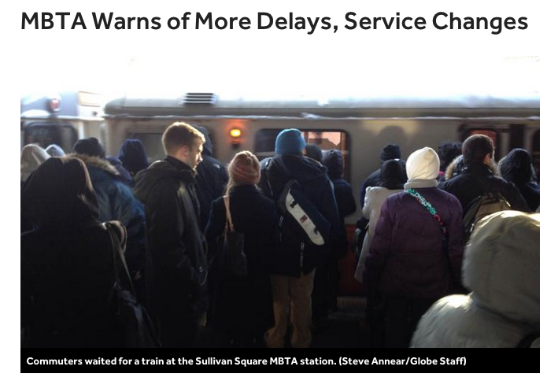

# Building
# MBTAwesome

*April 2015, Boston Node.js Meetup*

K.Adam White &bull; [@kadamwhite](https://twitter.com/kadamwhite) &bull; [@bocoup](http://bocoup.com)


## Introductions


??? I am an engineer and team lead at Bocoup, an open web technology company originally founded just down the street -- we work on open source, consulting, yada yada


<!-- .slide: data-background="url('images/bocoup-on-a-map.jpg')" -->

??? While Bocoup is a company is increasingly distributed, I live in Somerville, so I ride the T to work each morning


<!-- .slide: data-background="url('images/how-fd-is-the-t.jpg')" -->

??? My relationship with the T's data API goes back to my first employer, Joey Brunelle of Goose Rock Design, who created "How fucked is the T" back in 2011. (Disclosure: I was not involved in this project)


<!-- .slide: data-background="url('images/how-fd-is-the-t-detail.jpg')" -->

??? It was a really useful application for me at the time, as I could sit in my office down on Congress St and pick the best time to head in to the train at South Station. But--and Joey would agree with this--the code was awful, it was not mobile friendly, and it used an outdated (and clunky) version of the MBTA's API.


### But, after this winter...


??? I'd been considering rebuilding the site as a mobile-first web application for a while, but this winter made me reconsider the tone I wanted to use: the T's had a really hard time, and while I get as frustrated as anyone (who doesn't live on the Green Line, anyway), I thought they could use some cheerleading because the MBTA does a ton with terrifyingly limited resources


# MBTAwesome

??? So I decided to call my project MBTAwesome, and set about rebuilding the "How F'd is the T" concept as a SPA using a cleaner, more mobile-friendly design


## Demo

[mbtawesome.com](http://www.mbtawesome.com)


## Green Field Project
<!-- .slide: data-background="url('images/bliss-windows-xp.jpg')" -->
??? Because I was starting fresh, and working for myself, I got to pick the every technology used. One of the things I love about working at Bocoup is that I'm exposed to a spectrum of stacks, and this presented an opportunity to leverage some familiar tools and to experiment with the less-familiar


# The Tech


## Choice #1
# Node
??? It's obviously built in node, or I wouldn't be here! Node is familiar to me, and the ecosystem of modules is a great toolbox to be able to draw from.


## Choice #2
# Express
??? We (I) have a bias towards Express, again largely due to familiarity: in most cases it "just works", and there was no ramp-up needed.


## Choice #3
# Bookshelf.js & Postgresql
??? My colleague Tyler Kellen has been contributing to Tim Griesser's Bookshelf.js and Knex.js projects, and I had some experience working with them from past consulting work. They let me rapidly sketch out a familiar data backend for my application.


An MBTA "Route" as a Bookshelf model
```js
var Route = require( './base-model' ).extend({
  tableName: 'routes',
  stops: function() {
    return this.belongsToMany( require( './stop' ) );
  }
});

Route.fields = [
  /** @property {Number}  id */            'id',
  /** @property {String}  route_id */      'route_id',
  /** @property {String}  route_name */    'route_name',
  /** @property {Number}  route_type */    'route_type',
  /** @property {String}  mode_name */     'mode_name',
  /** @property {Boolean} [route_hide] */  'route_hide'
];

module.exports = Route;
```


## Choice #4
# Backbone
??? We use Ember for most of our internal projects at Bocoup, but given the scope of MBTAwesome I went with Backbone. I've been teaching Backbone for years, but hadn't actually built a complete small application with it; this gave me an opportunity to revisit an old friend, and to move quickly.

Was that a good decision? Yes, but...


## Choice #5
# Browserify
??? I decided to use Browserify for my application build, because I've grown very familiar with the Node ecosystem in the past year and wanted to see what all the fuss was about.

Verdict: I love it, but it made me jump through some hoops to use Backbone with Lodash instead of Underscore.


## Choice #6
# Nunjucks
??? Neither Express nor Backbone is super useful without a templating engine, and I chose Mozilla's Nunjucks. I've got a sort of "hate-hate" relationship with Handlebars, so this was largely in the interest of trying something new.


*A simple Nunjucks template*
```

<button class="alert-list-toggle" title="Show alert details">
  <span class="alerts-expand">
    
    <span
      class="alert-icon alert-{{ alert.severity | lower }}"
      title="{{ alert.severity }} issue">
    </span>
    
    Show {{ alerts.length }} {{ 'alert' | pluralize( alerts.length ) }}
  </span>
  <span class="alerts-minimize">
    Hide Alert Details
  </span>
</button>

```
??? The syntax itself is pretty clear, and its filters can take parameters and are chainable (a preference of mine that actually originated with Angular)


# The Verdicts?
??? In the end, though, I ended up rejecting some of those choices and reconsidering others.


## ~~3. Postgres/Bookshelf~~
# No Database
??? I threw away all of my postgres and Bookshelf work. They're great tools, but given the comparative immutability of the T's data (station lists, e.g.) I just hard-coded some of the values and keep the remainder in a short-lifespan LRU cache so that I don't overload the T's servers.


## ~~4. Backbone~~
# <span class="inline-image"></span> Ampersand.js
??? Ampersand is a fragmented adaptation of Backbone that's designed for use with Browserify out of the box, and I like some of the additional features you gain with *e.g.* Ampersand models' type-enforcing property accessors.


Code using Ampersand-Model:
```js
var Person = AmpersandModel.extend({
    props: {
        firstName: 'string',
        lastName: 'string'
    },
    derived: {
        fullName: {
            deps: ['firstName', 'lastName'],
            fn: function () {
                return this.firstName + ' ' + this.lastName;
            }
        }
    }
});
var p = new Person({ firstName: 'KAdam', lastName: 'White' });
console.log( p.fullName ); // KAdam White
```
??? Here's an example of what that looks like: The step of whitelisting and specifying the types for your properties means that Ampersand sets up getters and setters as defined properties, obviating the need to use `.get` and `.set`. Derived properties will get updated whenever any of their dependencies changes.


## ~~6. Nunjucks~~
# 
??? Nunjucks is a great templating engine, but I think I may switch to Combyne next time (by my colleague Tim Branyen); I have some aesthetic preferences that favor combyne, and it works better out-of-the-box with Browserify


## 1. Node
## 2. Express
## 5. Browserify

# 


# What's Next?


# Commuter Rail!

### *#1 most-requested feature*


# Green Line?

### *Some Day! They're working on it!*


# Questions?

&nbsp;

Slides: [talks.kadamwhite.com/nodejsboston-mbtawesome](http://kadamwhite.github.io/talks/2014/wp-artist-website)

Me: [kadamwhite.com](http://kadamwhite.com) &bull; [@kadamwhite](http://twitter.com/kadamwhite)

Us: [Bocoup.com](http://bocoup.com) &bull; [@bocoup](https://twitter.com/bocoup)

&nbsp;

## *Thank You!*

