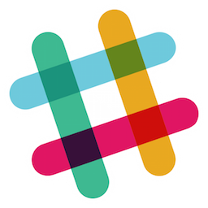

# Side Projects
## Front &amp; Center

K. Adam White &bull; [@kadamwhite](https://twitter.com/kadamwhite)

---

## What is a Side Project?

??? Most of us probably have some idea of what SPs are: they're pretty pervasive in our field. So, a moment for definition: 

---

> any self-contained project that's not your main deliverable

??? for our purposes, a SP is any self-contained project that is not part of your main, deliverable codebases or role

---
<!-- .slide: data-background="url('images/projects/aredridel-html5.png')" -->
[Aria Stewart, HTML5 parser](http://github.com/aredridel/html5) <!-- .element: class="caption" -->

??? I asked around on twitter for what sorts of projects we're working on within this community, and I got everything from a JS HTML parser..

---
<!-- .slide: data-background="url('images/projects/jessicamerz-yep-shower-works.jpg')" -->
<!-- Photo by , https://www.flickr.com/photos/jessicafm/198074980 (used under CC license) -->
<span>[John James Jacoby](http://jaco.by/), Bathroom Shower (WIP)

<br>

<small style="display:block;text-align:right;padding-right:10px;"><small>

<br>

*Photo&mdash;which is* not*John's shower&mdash;[by Jessica Merz](https://www.flickr.com/photos/jessicafm/198074980), used under a [CC Attribution 2.0 Generic](https://creativecommons.org/licenses/by/2.0/) license*</small></small>

</span> <!-- .element: class="caption" -->

??? to a home shower remodeling project. For this conversation that we're not limited to the web, or to code.

---

*et tu?*

??? let's get a show of hands if you have some sort of side project of your own: Should be most of you. Many of the speakers at this event are talking about their own side projects.

---

# Why

# How

# When

??? I'm not going to stand up here and tell you to work on side projects.

We're going to focus instead on the benefits that side projects bring us, as individuals and organizations; how we can take some basic steps to give ourselves the best chance of success in our projects; and how we can integrate regular creative exploration into our other work

---

# Why?

??? Why is it that we all have these projects kicking around? What are we trying to do when we start a side project?

---
## Fame &amp; Fortune!

??? I think I speak for most of us when I say that I'm in it mainly for the fame. And of course I'm being facetious, but after all, some of the most prevalent pieces of software in the world began as side projects!

---
<!-- .slide: data-background="url('images/wp-runs-23-pct-of-web.png')" -->

??? Start a project like WP, capture over 60% of the overall CMS market share (per [w3techs.com](http://w3techs.com/)), and 23% of the whole web&mdash;right?!

(Image from Matt Mullenweg's "State of the Word 2014" talk at WordCamp SF)

---

> My logging software hasn’t been updated for months &hellip; What to do?
> 
> b2/cafelog is GPL, which means that I could use the existing codebase to create a fork &hellip;

<small><br>*~ Matt Mullenweg, [The Blogging Software Dilemma](http://ma.tt/2003/01/the-blogging-software-dilemma/), 2003*</small>

??? but of course WP started out very simply: the maintainer of Matt Mullenweg's existing tool got busy, and he wanted to keep using it.

---

> it would be nice to have the flexibility of MovableType, the parsing of TextPattern, the hackability of b2, and the ease of setup of Blogger.
> ## Someday, right?

<small><br>*~ Matt Mullenweg, [The Blogging Software Dilemma](http://ma.tt/2003/01/the-blogging-software-dilemma/), 2003 (emphasis added)*</small>

??? You can plan for success, but it's rarely where the idea starts. At the time, what WP has become seemed like a pipe dream -- Most things start small.
---

# Side Projects are *fun!*

??? So why do we *really* work on SPs? There's a reason we call them "passion projects": we take time to work on side projects because we enjoy them. I've heard it called "scratching an itch," I've heard it described as "blowing off steam": we take on work we find interesting, that differs in some way from what we do normally.

---


??? Because there's always going to be a subset of problems actually relevant to our work, and a superset of problems that we're interested in.

---


??? Most of us won't have the opportunity to tackle VR (in the short term, at least), but that doesn't mean we didn't enjoy Rudy's talk yesterday and didn't leave wanting to try it out ourselves.

And it doesn't mean we wouldn't learn work-useful skills in doing so.

---

## `+= 'new skills'`

??? And learning is key: a lot of us start SPs specifically to learn new skills. I head this described as "me += skill" in one blog...

---
<!-- .slide: class="overlay" data-background="url('images/projects/jennschiffer-make8bitart.png')" -->

> Side projects are a good motivator to learn something new outside of your everyday job. [They] can help you delve into other realms of development.

<small><br>*~ [Jenn Schiffer](https://twitter.com/jennschiffer), describing [make8bitart.com](http://make8bitart.com)</span>*</small>

??? My colleague (and speaker at last year's EmpireJS) Jenn Schiffer, for example, made the awesome make8bitart.com to learn JS and Canvas

---
<!-- .slide: class="overlay" data-background="url('images/projects/jonchretien-shakeshack.png')" -->

## Interest + Learning Objective = Project

> I try and approach side projects by combining a new skill set I want to learn (maybe a new programming language) with one of my hobbies

<small><br>*~ [Jon Cretien](https://github.com/jonchretien), describing [Custard Cluster](http://projects.jonchretien.com/custard/) and other projects*</small>

??? John Cretien from Spotify

---

## Solidifying Skills

??? A complement to learning new skills is to reinforce the ones you have; to practice. This is a major reason I take on side projects, personally:

---
<!-- .slide: data-background="url('images/projects/kaw-mbtawesome.png')" -->

<span>K Adam White, [mbtawesome.com](http://mbtawesome.com)</span> <!-- .element: class="caption" -->

<br>
<br>

<div class="highlight">

<p>Use a combination of new and old tools,</p>

<br>

<h3>Express</h3>
<h3>Backbone</h3>
<h3>*Nunjucks*</h3>
<h3>*Browserify*</h3>

</div>

??? My Boston subway tracking application MBTAwesome let me learn some new tools, but it also gave me a chance to reevaluate the ones I'd used before:

Use a combination of new and old tools, so you can incrementally upgrade your toolset,

---
<!-- .slide: data-background="url('images/projects/kaw-mbtawesome.png')" -->

<span>K Adam White, [mbtawesome.com](http://mbtawesome.com)</span> <!-- .element: class="caption" -->

<br>
<br>

<div class="highlight">

<p>and decide which to keep for next time</p>

<br>

<h3>Express</h3>
<h3>*Ampersand*</h3>
<h3>*Combyne*</h3>
<h3>Browserify</h3>

</div>

??? for example, I learned I enjoyed using Browserify to build my application, and that's lead me to consider Ampersand for my next project. (Ampersand also has runtime type checking, which is appealing)

---

## Practice Makes Perfect?

??? The more you solve the same problem, the more practiced you are at working through it&mdash;you build muscle memory, and maybe you develop a boilerplate, or a set of configurations to re-use later.

---

## Practice reveals
# pain points

??? As you repeat a task, you often find yourself encountering the same challenges over and over and over again

---

## `millions of jQuery plugins`
# `+`
### `repetitive gruntwork to release/maintain them all`
# `= ?`

??? that can lead to a new, completely separate project designed to solve those problems: side projects as problem-solving sandbox

---
<!-- .slide: data-background="url('images/projects/benalman-gruntjs.png')" -->

<span>Ben Alman & the Grunt Team, [Grunt](http://gruntjs.com)</span> <!-- .element: class="caption" -->

??? That's the origin story of Ben Alman's "Grunt".

---

# Challenges

??? These are the reasons&mdash;from the show of hands earlier I can see that little of this so far is new. So let's look at the other side: What keeps a side project from succeeding? What are the costs?

---


> I always try to tease out what the actual problem is, but it can be emotionally exhausting to do so when people don't communicate respectfully.

<small><br>*~ [Tyler Kellen](https://github.com/tkellen)*</small>

??? Empathy's also a challenge. It can also be hard to deal with the community, especially when somebody puts their worst foot foward.

---

> If someone contributes good code to your project, give them commit access immediately. I promise you'll be amazed by how well it goes.

<small><br>*~ [Tyler Kellen](https://github.com/tkellen)*</small>

??? The antidote to this, of course, is to trust in the benevolence of the community. Tyler Kellen, from who I borrowed the previous quote, is a huge advocate of giving people the commit bit early&mdash;it almost always pays off, and it can extend your projects' life once your own interest in it fades

---

```
                  _____
               _.'_____`._
             .'.-'  12 `-.`.
            /,' 11      1 `.\
           // 10      /   2 \\               How
          ;;         /       ::                Do
          || 9  ----O      3 ||                  You
          ::                 ;;                    Make
           \\ 8           4 //                       Time?
            \`. 7       5 ,'/
             '.`-.__6__.-'.'
              ((-._____.-))
              _))       ((_
             '--'SSt    '--'
```
<small><br>*clock from [ascii.co.uk](http://ascii.co.uk/art/clock)*</small>

??? Let's also look at the *time* that these projects can take.

---

## &ldquo;When do you work?&rdquo;

> Mostly weekends. Especially Sunday afternoon &ndash; night.

<small><br>*~ Mariko Kosaka*</small>

> It started in a Saturday night at home.

<small><br>*~ Leonardo Balter*</small>

> Nights and weekends.

<small><br>*~ Too many to mention by name*</small>

??? In the responses to my survey the most common phrase was "nights and weekends," and if you look around Github I suspect you'll see a lot of late-night or Sunday-afternoon commits.

---

> Mostly nights, mostly the time I had intended to use to build the application that [prompted my side project] in the first place. I still have not finished that application now...

<small><br>*~ Calvin Spealman*</small>

> It was pretty much the only thing I did for a long, long time.

<small><br>*~ Ben Alman*</small>

??? But there's only so many nights and weekends to go around, especially if you have other things you want to use those nights and weekends to do

---

> It will never be &ldquo;done&rdquo;.

<small><br>*~ Greg Smith*</small>

>  I rarely had the time for [make8bitart]. Even today I struggle to find the time to work on it.

<small><br>*~ Jenn Schiffer*</small>

> If you do it like I did it, you pretty much lose your social life. I recommend a slightly more balanced approach&hellip;

<small><br>*~ Ben Alman*</small>

??? A quick survey of my colleagues reveals some major concerns about the time needed, and the costs of that time

Never be Done &bull; Hard to find time &bull; Can take over

---

# You \*are\* what you make time for

<small><br>*~ [@femmebot, Sep 4 2014](https://twitter.com/femmebot/status/507613717232508928)*</small>

??? These systems are important to us, because how we spend our time defines what type of company we are. Phoebe E (@femmebot) said it well in this tweet:

---
<!-- .slide: data-background="url('images/projects/femmebot-typography-1.jpg')" -->

<span>[@femmebot](https://twitter.com/femmebot), [25x52](http://25x52.com/)</span> <!-- .element: class="caption" -->

??? Her own side project effort, 25x52, is a meta-initiative to launch 25 projects in a year. (This one's a Google Fonts Typography showcase, launched last august.)

---
<!-- .slide: data-background="url('images/projects/femmebot-typography-2.jpg')" -->

> I wanted to set a timeline that was **long enough to compel a behavior change** &hellip; I needed to establish a long-term **habit** of launching projects.

<small><br>*~ [25x52 About Page](http://femmebot.github.io/about/) (emphasis added)*</small>

??? 25x52: each project should take about two weeks. The About page for the project contains two main takeaways, for us: **repetition builds habits**, and **milestones are important.**

---

# Regularity
## and
# Repetition

??? Let's look at repetition, and regularity.

---
<!-- .slide: class="overlay" data-background="url('images/emilygarfield-studio-table.jpg')" -->

<br>

## Go Into Your Studio
# Every Day
#### *even if it's just to wash your brushes.*

<small><br>*~ Jay Stuckey, artist*</small>

<small><small><br>*[Photo by Emily Garfield](http://www.emilygarfield.com/2015/new-york-mini-residency/)*</small></small>

??? My art professor in college outlined a similar rule he uses for himself: go into the studio every day. Even if all you do is wash your brushes, it builds a habit, and a practice.

---
<!-- .slide: class="overlay" data-background="url('images/jeresig-gh-contributions.png')" -->

## Write Code Every Day

<br>

> 1. I must write code every day.
> 2. It must be useful code.
> 3. All code must be written before midnight.
> 4. The code must be Open Source and up on Github.

<small><br>*~ John Resig, [Write Code Every Day, April 2014](http://ejohn.org/blog/write-code-every-day/)*</small>

??? John Resig wrote an article on this topic that really stuck with me, entitled "write code every day". He outlined a few rules for himself to keep things on track, but the title speaks for itself&mdash;as does his github contribution graph

---
<!-- .slide: class="overlay" data-background="url('images/projects/marikokosaka-knittingmachine.jpg')" -->

# Deadlines

> Submitting to conferences and meetups shaped &ldquo;just some doodling code&rdquo; to &ldquo;a project&rdquo;.

<small><br>*~ [Mariko Kosaka](https://twitter.com/kosamari)*</small>

<br>

??? Personal projects can drag on, since we're the only ones who can tell ourselves that it's "done." Imposing deadlines on yourself helps: when will you have this presentable, when will you release it, or when will you move on?

Mariko Kosaka, who spoke earlier today, shared that the deadlines she takes on by presenting her work publicly help her form up her work into something that can be "finished". Our MC Adam Sontag had the same experience when he build a Web Audio Speech demo for a QueensJS talk, "carving out just enough time" to get it presentable.

---

## Managing Project Scope

```js
function() {
  var projectScope;

  function () {
    function() {
      function() {
        function() { 'what am I even working on?'; }
      }
    }
  }
}
```

??? What does it mean to "ship"? We may not release anything -- I think of it as coming to a logical stopping point. Small increments are just as important on side projects as they are in other contexts: without a well-scoped goal, a project gets frustrating
---
<!-- .slide: class="overlay" data-background="url('images/projects/ericandrewlewis-cool-text-converter.png')" -->

<br>

> I purposefully made **minimum viable products** along the way, so I would get quick wins and not get burnt out.

<small><br>*~ [Eric Andrew Lewis](https://twitter.com/ericandrewlewis) (emphasis added)*</small>

??? Eric Lewis, a developer at the Times here in NY, built a "cool text converter" to do unicode glyph substitution on text strings, treating each new dialect he added as a new "release."

---

## Managing Project Scope
```js
function() {
  var projectScope;

  function task1() {
    projectScope.feature1 = done;
  }
  function task2() {
    projectScope.feature2 = done;
  }
  function task3(cb) {
    setTimeout(function() {
      projectScope.feature3 = cb();
    }, whenever_you_get_around_to_it );
  }
}
```

??? Especially if you're working with open source time or only working on code periodically, set well-scoped, achievable goals and the progress will be more reliable and satisfying.

---

<br>

## Work *Regularly*
## Work *Incrementally*
## Work *Towards a Deadline*

<br>

---

# Bring Your Projects to Work Day

??? I think making time for side projects is a critical part of our professional growth&mdash;and part of that growth can happen *within* our jobs, not alongside it

---

## &ldquo;X%&rdquo; Time
## Hackathons
## Project Nights
## Game James

??? There's actually a host of ways that this idea's already been embraced by companies around the world

---

## &ldquo;20% Time&rdquo;

> Google didn’t invent the idea of giving employees time to experiment with their own ideas, nor will it have the final word on how best to bestow such time.

<small><br>*~ Wired.com, ["20% Time Will Never Die", 8/21/13](http://www.wired.com/2013/08/20-percent-time-will-never-die/)*</small>

??? Google became famous for allowing engineers a percentage of their time to explore passion projects and new ideas, leading to products like Gmail. This is not a new idea,

---

## &ldquo;Bootlegging&rdquo;

> Research in which motivated individuals secretly organize the innovation process

<small><br>*~ Wikipedia, ["Bootlegging (Business)"](http://en.wikipedia.org/wiki/Bootlegging_%28business%29)*</small>

??? and it's not a Silicon Valley idea: it goes back decades, and was dubbed "bootlegging" in the late 60's (see Knight, K., 1967, *A Descriptive Model of the Intra-Firm Innovation Process*)

---
<!-- .slide: class="overlay" data-background="url('images/henrikpalm-redo-for-test.jpg')" -->

> **The 15 percent rule works** &hellip; the best-known success story is scientist Art Fry's **creation of Post-its** while trying to create bookmarks that would stay put in the church choir's hymnals.

<small><br>*~ Wired Magazine, ["The 15% Solution", 1/23/1998](http://archive.wired.com/techbiz/media/news/1998/01/9858) (emphasis added)*</small>

<small><small><br>*[Photo by Henrik Palm](https://www.flickr.com/photos/henrikpalm/5565633783), used under a [CC Attribution 2.0 Generic](https://creativecommons.org/licenses/by/2.0/) license*</small></small>

??? the post-its we use for our Scrum boards actually came out of 3M's unofficial "permitted bootlegging" policy, which evolved eventually to "15 percent time" (see http://en.wikipedia.org/wiki/Post-it_note)

---
<!-- .slide: class="overlay" data-background="url('images/tumblr-screenshot.jpg')" -->

## Rarely Official

> What [Tumblr] does have is a nonchalance about adding things

<small><br>*~ [Tim Holman](https://twitter.com/twholman)*</small>

??? The Wikipedia article on Bootletting actually says "without the official permission of the responsible management" &mdash; even at google, 20% time was never *officially* a policy, to my knowledge. But this is common.

I was talking with Tim, who spoke yesterday, and he said this: you can submit a pull request to improve something on tumblr, and you will be heard out.

---

## Hackathons

<br>

### *Community*
### *Teamwork*
### *Competition*

??? Hackathons take that idea, time-box it, and make it a group activity. What you lose in autonomy, the thinking goes, you gain in collaboration, teambuilding... they can be an easier sell than bootlegging, or a complement to independent exploration.

---

## Project Nights

<br>

### *Hardware,*
### *Art, Design*
### *You Name It*

??? hack days are implicitly at the organization level; Project Nights are a little different, in that (in my experience) they're employee-organized. One point-of-sale software company had a hack day to build vacancy indicators for their restrooms, giving software engineers and non-technical employees a chance to try soldering and to learn about the hardware side of their business&mdash;but the event organization was all ad-hoc. We've had art nights at Bocoup, just to blow off steam; they're different in their focus, but the same type of event.

---

# *Our Approach*

??? I think the way we balance these options at Bocoup is pretty effective, so I want to share how it works:

---

# Perch Time

??? This is our equivalent of bootlegging and hackathons, in a way: we're a consulting company, so in downtime between projects, my coworkers collaborate on building and maintaining the tools we use to keep Bocoup running. These projects are managed through a Tech Ops organization, and run like any other engineering project.

---
<!-- .slide: data-background="url('images/bocoupfest-artshow.jpg')" -->

# Bocoupfest

??? Bocoupfest, on the other hand, is our company week: anything goes. We've built nodebots, we've had an art show, we've learned to make spray-paint stencils; my coworker Carl lead a group to make a game for the Pebble watch last month, and Adam lead a team to make an easter egg on Bocoup.com. This is when we can "blow off steam".

---

## Open Source Time

??? Every employee gets %age of time to maintain, contribute to and explore open-source web technology (or culture).

This can be anything from building and releasing a general-purpose library, to writing a twitter bot while exploring how Node.js works.

We're a consulting company, so if we're on a project we may use that time to build part of their application in a reusable, modular way that we can then work with the client to open-source.

---

## Open Source Time

<br>

> I’ve always taken this kind of time in all the jobs I could&mdash;even when it wasn’t officially offered. When you do officially offer it, then I don’t have to feel guilty!

<small><br>*~ Jim Vallandingham*</small>

??? Supporting the web as an open platform is part of our mission, of course, but this time codifies what we know would be happening anyway, to avoid making us feel guilty or conflicted in our explorations.

Not everybody takes the time, but it helps maintain a culture of trust and freedom.

---

# Trust

??? I share these because these practices benefit us, and keep our team engaged and interested. And what we do, I think, can be generalized: none of these methods are unique to us.

Devs who have the freedom to explore, and get support for that exploration, don't leave as regularly&mdash;retention goes up, and the team self-advertises, which helps with recruiting.

---

## Another kind of
# &ldquo;Professional Development&rdquo;

??? Another productive way to sell X% time or hack days is that most companies are fine with devs going to conferences for days at a time, and they often pay for our airfare and lodging&mdash;regular open source time is arguably less impactful to a project, since it's intermittent, and can be even more valuable than a conference.

---

# Projects
## *Within Projects*

??? We're so engrained in this highly parallel, asynchronous project mentality that we use it in our consulting work, too:

---

```
  Jan         Mar                                    Oct
+-----------+--------------------------------------+-----------+
| Research  | Implementation                       | Delivery  |
+-----------+--------------------------------------+-----------+

```

??? this past year I was leading a project to build a complex web app for a client, and we had a free-wheeling research phase at the start to prove out the tools we wanted to use.

---

```
  Jan         Mar                                    Oct
+-----------+--------------------------------------+-----------+
| Research  | Implementation                       | Delivery  |
+-----------+--------------------------------------+-----------+
                  ^ new research task

```

??? When a new requirement came up after that phase, however, we wanted to find a way to find a solution without disrupting our existing work

---

```
  Jan         Mar                                    Oct
+-----------+--------------------------------------+-----------+
| Research  | Implementation                       | Delivery  |
+-----------+--------------------------------------+-----------+
                  ↓                    ↑
                  +--------------------+
                  | "Side Project" POC |
                  +--------------------+
```

??? By spinning that proof of concept, a WordPress-backed node application, out into a "side project" alongside our main repository, we kept the research from impacting our project, then rolled it all back in when we were done.

And this was all part of, and contributed directly to, the project's goals.

---
<!-- .slide: data-background="url('images/projects/kaw-wp-rest-api.png')" -->

<div class="highlight">
*Released* [wordpress-rest-api](https://www.npmjs.com/package/wordpress-rest-api) (npm package)

*and* [expresspress](https://github.com/kadamwhite/expresspress) (demo project)
</div>
??? and since the work was already extracted from the main repository, it made it easy to release the fruit of our labor as an open source package, too: we can ride this feedback cycle from project to project, getting better all the time.

---


??? These tools we build to support our "main" work can be more valuable in the long run than the projects they were built to support. How many of you recognize this logo?

---



??? How about this one?

---


??? Slack was an internal tool made by the company Tiny Speck while they were working on their MMO game "Glitch." When they abandoned Glitch, they pivoted; and have subsequently raised approximately *all* the money.

---


<small><br>*~ [Tim Holman](https://twitter.com/twholman)*</small>

??? Tim Holman built this hover-over easter egg at Tumblr, which maybe didn't win them millions in funding, but it does improve the experience on the site. (Also, he says to watch this space: that "t" has great things ahead of it.)

---

> These passion projects are essential outlets &hellip; and are **absolutely necessary** for staying happy, feeling trusted, and remaining free to experiment &hellip;

<small><br>*~ [John James Jacoby](https://twitter.com/jjj)*</small>

> It is a priority for Bocoup team members have a regular opportunity to explore

<small><br>*~ Bocoup Employee Handbook*</small>

??? As we established with the show of hands, I don't need to convince you that passion projects are important. But we feel that this meets our business goals, and that we can work in parallel to satisfy our own desire for exploration while moving our business forward.

---
<!-- .slide: data-background="url('images/emilygarfield-sketchbook-pages.jpg')" -->

<br>

<div class="highlight">

## Side Projects are not your
## portfolio, but they *can be*
# <small>a</small> sketchbook

</div>
<br>

<small><br>*Sketchbook pages by [Emily Garfield](http://www.emilygarfield.com)*</small>

??? To extend the art studio metaphore, it's almost self-evident that an artist, for example, keeps a sketchbook. It's part of their art practice. It's part of their *job*.

We work in a creative field, and it's bizarre to me that we don't make more time within our jobs to sketch, to practice, and to grow.

We can do so without compromising our "day jobs" -- and the work we do will make our companies, and our community, stronger.

---

# *Thank You!*

---

# *Thank You!*

<small>*Thank you to everybody who shared their projects for this talk*</small>

<small>
Adam J. Sontag - [Who Said It Best](http://whosaiditbest.website/) (Web Audio demo) &bull; Alec Perkins - [Active Markdown](http://activemarkdown.org/) (Markdown-based syntax for authoring reactive documents) &bull; Andrew Norcross - [WordPress Plugins](https://profiles.wordpress.org/norcross/#content-plugins) &bull; Aria Stewart - [html5 parser](http://github.com/aredridel/html5) &bull; Ben Alman - [Grunt](http://gruntjs.com/) &bull; Calvin Spealman - [PlasmidDB](http://www.ironfroggy.com/) (offline browser-side database with a synchonizing service) &bull; Eric Andrew Lewis - [Cool Text Converter](http://ericandrewlewis.github.io/cool-text-converter) & [Unicode Hacker Bench](http://ericandrewlewis.github.io/unicode-hacker-bench/) (Text decorator) &bull; [@femmebot](https://twitter.com/femmebot) - [25x52](http://25x52.com) (Meta-project), [Google Fonts Typography Project](http://femmebot.github.io/google-type/) & others &bull; Gary Pendergast - [PonyEdit](http://ponyedit.com/) &bull; Greg Smith - ["91"](http://startcontinue.com) (Role-Playing Game) &bull; Jenn Schiffer - [make8bitart.com](http://make8bitart.com/) &bull; Jim Vallandingham - [Captain Z](http://captainzbook.com/) (Children's Book) &bull; [John James Jacoby](http://twitter.com/jjj) - Bathroom shower &bull; Jon Chretien - [Visualization of Shake Shack’s monthly custard calendar](http://projects.jonchretien.com/custard/) &bull; [Kassandra Perch](https://twitter.com/nodebotanist) - LED panel, node open-pixel-control, j5-driven internet-connected dino-vest &bull; Leonardo Balter - [Goiabada](https://github.com/leobalter/goiabada) (unit tests framework written in ES6) &bull; Mariko Kosaka - [program to hack into electric knitting machine](https://github.com/kosamari), knitting, paper folding, data vis dashboards, and more &bull; Mel Choyce & Kelly Dwan - [rdrdr ("red radar") WordPress themes](https://themes.redradar.net/) &bull; [Michael Beckwith](https://twitter.com/tw2113) In-progress self-hosted Whisky tasting tracking application &bull; Stefan Judis & Marco Biedermann - [perf-tooling.today](http://perf-tooling.today/), [grunt-phantomas](https://www.npmjs.com/package/grunt-phantomas) & others &bull; Tab Atkins - [Bikeshed](https://github.com/tabatkins/bikeshed) (Spec preprocessor for the W3C) &bull; Todd Kennedy - [make your project into a custom REPL](https://github.com/toddself/repl-it) &bull; Tyler Kellen - [Endpoints](https://github.com/endpoints/endpoints) &bull; Will Duffy - [Sorta](http://www.sortalist.com/) (a site to create lists of TV shows, movies, books and rank them)
</small>
