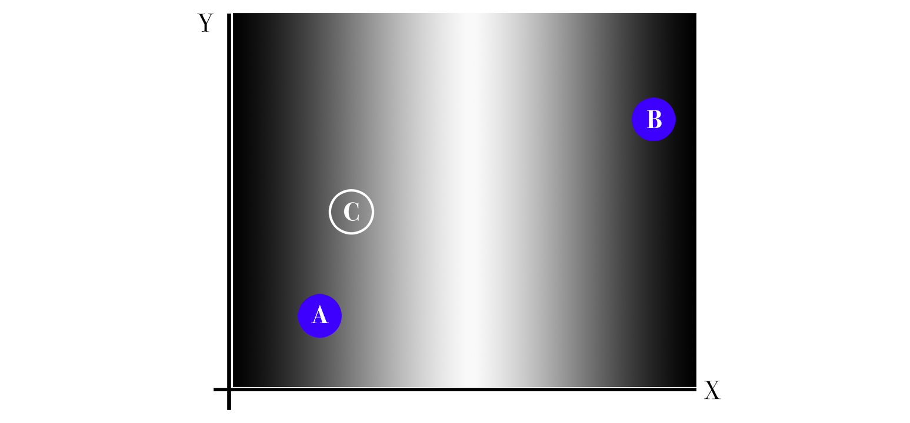

<!-- .slide: class="lurking-bob" -->

# Machine Learning
### for WP Authors

 

K. Adam White &bull; [@kadamwhite](https://twitter.com/kadamwhite) &bull; [Bocoup](https://bocoup.com)

??? My name is K Adam White, thanks for having me today

--

??? I'm a lead engineer at Bocoup, usually up here to talk about the API, etc etc.

---

http://www.theatlantic.com/technology/archive/2016/03/the-invisible-opponent/475611/

AlphaGo

??? But have been really interested lately in all the discussion about machine learning. A number of my friends are very into the board game Go, and back in March an AI from google called AlphaGo beat Lee Sedol, one of the best players in the world.

---

> Because there are so many directions any given game can move in, Go is a notoriously difficult game for computers to play. It has often been called the “Holy Grail” of artificial intelligence.

> &hellip;It was widely believed that an AI strong enough to beat a professional player was still at least a decade away

http://www.theatlantic.com/technology/archive/2016/03/the-invisible-opponent/475611/

??? This was a feat of artificial intelligence that had long been assumed to be impossible. AlphaGo combines several different kinds of machine learning, including a comparatively old method called a neural network.

---
<!-- .slide: data-background="url('./images/glados_new_body.jpg')" data-state="solid-bg" -->
<!---->

http://half-life.wikia.com/wiki/File:Glados_new_body.jpg

??? This doesn't mean that we need to decide in what manner we welcome our new machine overlords,

---
<!-- .slide: data-background="url('./images/millennialmag-artificial_intelligence.jpg')" data-state="solid-bg" -->

http://millennialmagazine.com/is-artificial-intelligence-the-right-move-for-humans/

??? because what a neural network is doing _isn't_ thinking for itself, at least not in the way we think of the word "thinking".

---

http://xkcd.com/1696/

??? And for another -- and we'll come back to this -- we're the ones training these things. With all that entails.

---
<!-- .slide: data-background="url('./images/ovc.jpg')" data-state="solid-bg" -->

??? But I didn't understand exactly what they _were_ doing -- and to be honest, still don't fully. But Bocoup runs an event called OpenVis, and we were lucky enough to have MW & FV from Google Research present the opening keynote on visualizing machine learning.

---
<iframe width="1120" height="630" src="https://www.youtube.com/embed/ugkfmHBW74Q" frameborder="0" allowfullscreen></iframe>

??? This talk helped me understand a little bit more about what a neural network is, and how they work;

---
<iframe width="1120" height="630" src="https://www.youtube.com/embed/POrPIABj2MI" frameborder="0" allowfullscreen></iframe>

??? and another talk that day by the artist Kyle McDonald, and a series of other conferences I've attended since, taught me that there's a lot of interesting artistic and poetic applications of Machine Learning.

---

### "Artificial Intelligence"
#### _as_
# Artistic
# Interface

??? Today, I hope to share what little I've learned, to hopefully inspire some of you to try your own hand at using these technologies in your own work.

---

## [`ml4a.github.io`](http://ml4a.github.io)

??? The majority of the resources I will be sharing are from a book that's being written by artist, programmer and ITP-NYU adjunct professor Gene Kogan, called "machine learning for artists".

---

## What does a
## Neural Network
# Do?

??? So let's start at the beginning: what is machine learning? What is a neural network? We've already said it's not actual intelligence; I find it easiest to describe it as a _pattern recognition_ technique.

---

## Image Classification

??? As an example, one of the most widespread applications of neural networks is classification, or categorizing a set of things into different groups. 

---
<!-- .slide: data-background="url('./images/ticketmaster-captcha.png')" data-state="solid-bg" -->

??? Think of the image captchas you have to solve to sign in to some websites, to prove you're not a robot: neural networks, specifically convolutional neural networks, are designed to solve these same problems. Ironically Google and other companies that provide these services often use our input to train or refine programs that are "learning" to do this same categorization.

---
<!-- .slide: data-background="url('./images/terrapattern.png')" data-state="solid-bg" -->

http://www.terrapattern.com/

---
<!-- .slide: data-background="url('./images/microsoft-face-api.jpg')" data-state="solid-bg" -->

??? Facial Recognition is another common type of image categorization: iPhoto and Lightroom have this built in, and companies like Microsoft provide facial recognition interfaces we can use in our software.

I was speaking with yesterday about building a WordPress theme that automatically chose thumbnail crops of your photos by detecting faces and framing around those -- I hope we start seeing more services like this in the coming months and years, because there's a lot we can do around recommending content or allowing our readers to jump between posts or images if we can make use of this technology.

---

## What _IS_ A
# Neural
# Network?

??? You don't need to know how something works to be able to use it -- this is more true with AI than almost anything else, since there's so much theory and non-linear match curled up there under the hood. But let's try to break down what a neural network is doing when it is trained to classify objects.

---

---

---

---

---

<iframe width="1120" height="630" src="https://www.youtube.com/embed/SCE-QeDfXtA" frameborder="0" allowfullscreen></iframe>

[Deep Dream](https://www.youtube.com/embed/SCE-QeDfXtA)

---

## Torch-RNN

Hallucinating Text _with_ Recurrent Neural Networks

https://github.com/jcjohnson/torch-rnn

---

### Input Text:

> KING HENRY V  
> Once more unto the breach, dear friends, once more;  
> Or close the wall up with our English dead.  
> In peace there's nothing so becomes a man  
> As modest stillness and humility:  
> But when the blast of war blows in our ears,  
> Then imitate the action of the tiger;  
> Stiffen the sinews, summon up the blood,  
> Disguise fair nature with hard-favour'd rage;

---

### Output Text:

> DUKE OF YORK:  
> Good mother, the speaks thou art stores, and to star,  
> With to my their king to be consumed,  
> And ever hath from a Tybalt thy heart.
> 
> Lord Mupier:  
> Who?
> 
> GLOUCESTER:  
> Go, madam, you may have we lady's action.

---

### Input Text:

> Pikachu
>
> When several of these Pokemon gather, their electricity could build and cause lightning storms.
> 
> It keeps its tail raised to monitor its surroundings. If you yank its tail, it will try to bite you.
> 
> Lives in forests away from people. It stores electricity in its cheeks for zapping an enemy if it is attacked.
> 
> This intelligent Pokemon roasts hard berries with electricity to make them tender enough to eat.
> 
> It raises its tail to check its surroundings. The tail is sometimes struck by lightning in this pose.
> 
> When it is angered, it immediately discharges the energy stored in the pouches in its cheeks.
> 
> Whenever Pikachu comes across something new, it blasts it with a jolt of electricity. If you come across a blackened berry, it's evidence that this Pokemon mistook the intensity of its charge.
> 
> This Pokemon has electricity-storing pouches on its cheeks. These appear to become electrically charged during the night while Pikachu sleeps. It occasionally discharges electricity when it is dozy after waking up.
> 
> It stores electricity in the electric sacs on its cheeks. When it releases pent-up energy in a burst, the electric power is equal to a lightning bolt.

---

## _Train_
the network on a text, then
## _Sample_
the network to get new text

---

https://www.tastehit.com/blog/google-deepmind-alphago-how-it-works/

??? Coming back to AlphaGo, the way that most game AIs work is by searching through possible moves, and then picking the one the system determines to be "best". Most of these judgements about what is "best" were historically informed by expert human input; Deep Blue was trained by other chess grandmasters.

AlphaGo uses a Monte Carlo tree search function, but all prior go programs using MCTS could only achieve amateur level of play, even when designed by experts.

The breakthrough with AlphaGo is to use several complementary neural networks in place of one "fitness algorithm," and train those networks

---

> “AlphaGo isn’t a mysterious beast from some distant unknown planet. AlphaGo is us,” [scholar Andy Salerno] wrote. “AlphaGo is our incessant curiosity. AlphaGo is our drive to push ourselves beyond what we thought possible.”

http://www.theatlantic.com/technology/archive/2016/03/the-invisible-opponent/475611/

??? "But it is with human hands that machines are built, at least for now. In a Reddit discussion, the computer-science scholar Andy Salerno puts it well: "

---

Who is doing the training matters

---

## *Thank You*

Slides: [**talks.kadamwhite.com/wp-as-data**](http://talks.kadamwhite.com/wp-as-data)

Me: [@kadamwhite](https://twitter.com/kadamwhite)

Us: [bocoup.com](https://bocoup.com)

API Project Home: [github.com/WP-API/**WP-API**](https://github.com/WP-API/WP-API)

[npmjs.com/package/**wordpress-rest-api**](https://npmjs.com/package/wordpress-rest-api)

[A Day of REST Boston](https://adayofrest.hm/boston-2016), 28 Oct 2016

??? And with that, I thank you for your time.
