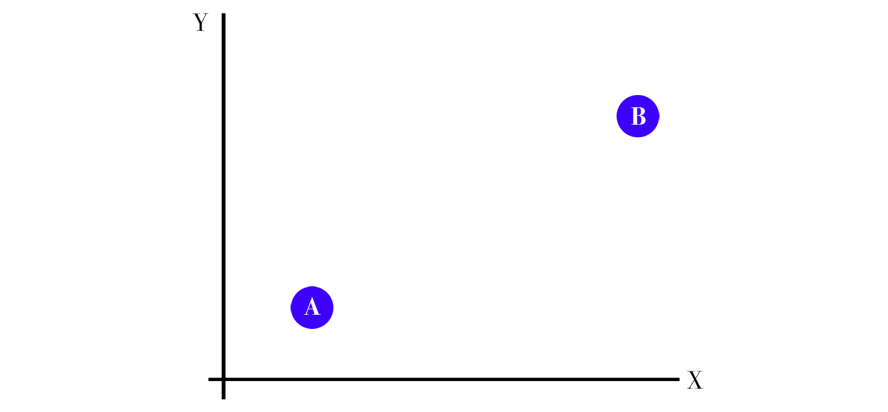

<!-- .slide: class="lurking-bob" -->

### An Introduction to
# Machine Learning

 

K. Adam White &bull; [@kadamwhite](https://twitter.com/kadamwhite) &bull; [Bocoup](https://bocoup.com)

??? My name is K Adam White, thanks for having me today

---

??? I'm a lead engineer at Bocoup, usually up here to talk about the API, etc etc.

---
Lee Sedol _vs._ AlphaGo

http://www.theatlantic.com/technology/archive/2016/03/the-invisible-opponent/475611/

AlphaGo

??? But have been really interested lately in all the discussion about machine learning. A number of my friends are very into the board game Go, and back in March an AI from google called AlphaGo beat Lee Sedol, one of the best players in the world.

---

> Because there are so many directions any given game can move in, Go is a notoriously difficult game for computers to play. It has often been called the “Holy Grail” of artificial intelligence.

> &hellip;It was widely believed that an AI strong enough to beat a professional player was still at least a decade away

[The Invisible Opponent, in _The Atlantic_](http://www.theatlantic.com/technology/archive/2016/03/the-invisible-opponent/475611/)

??? This was a feat of artificial intelligence that had long been assumed to be impossible. AlphaGo combines several different kinds of machine learning, including a comparatively old method called a neural network.

---
<!-- .slide: data-background="url('./images/glados_new_body.jpg')" data-state="solid-bg" -->
<!---->

<small>[GLaDOS, from half-life.wikia.com](http://half-life.wikia.com/wiki/File:Glados_new_body.jpg)</small>

??? This doesn't mean that we need to decide in what manner we welcome our new machine overlords,

---
<!-- .slide: data-background="url('./images/millennialmag-artificial_intelligence.jpg')" data-state="solid-bg" -->

<small>[image from millennialmagazine.com](http://millennialmagazine.com/is-artificial-intelligence-the-right-move-for-humans/)</small>

??? because what a neural network is doing _isn't_ thinking for itself, at least not in the way we think of the word "thinking".

---

http://xkcd.com/1696/

??? And for another -- and we'll come back to this -- we're the ones training these things. With all that entails.

---
<!-- .slide: data-background="url('./images/ovc.jpg')" data-state="solid-bg" -->

??? But I didn't understand exactly what they _were_ doing -- and to be honest, still don't fully. But Bocoup runs an event called OpenVis, and we were lucky enough to have MW & FV from Google Research present the opening keynote on visualizing machine learning.

---
<iframe width="1120" height="630" src="https://www.youtube.com/embed/ugkfmHBW74Q" frameborder="0" allowfullscreen></iframe>

<small>[Seeing Machines Think, Martin Wattenberg & Fernanda Viegas, OpenVis Conf 2016](https://www.youtube.com/embed/ugkfmHBW74Q)</small>

??? This talk helped me understand a little bit more about what a neural network is, and how they work;

---
<iframe width="1120" height="630" src="https://www.youtube.com/embed/POrPIABj2MI" frameborder="0" allowfullscreen></iframe>

<small>[A Return to Machine Learning, Kyle McDonald, OpenVis Conf 2016](https://www.youtube.com/embed/ugkfmHBW74Q)</small>

??? and another talk that day by the artist Kyle McDonald, and a series of other conferences I've attended since, taught me that there's a lot of interesting artistic and poetic applications of Machine Learning.

---

### "Artificial Intelligence"
#### _as_
# Artistic
# Interface

??? Today, I hope to share what little I've learned, to hopefully inspire some of you to try your own hand at using these technologies in your own work.

---

## [`ml4a.github.io`](http://ml4a.github.io)

??? The majority of the resources I will be sharing are from a book that's being written by artist, programmer and ITP-NYU adjunct professor Gene Kogan, called "machine learning for artists".

---

## What does a
## Neural Network
# Do?

??? So let's start at the beginning: what is machine learning? What is a neural network? We've already said it's not actual intelligence; I find it easiest to describe it as a _pattern recognition_ technique.

---

## Image Classification

??? As an example, one of the most widespread applications of neural networks is classification, or categorizing a set of things into different groups. 

---
<!-- .slide: data-background="url('./images/ticketmaster-captcha.png')" data-state="solid-bg" -->

??? Think of the image captchas you have to solve to sign in to some websites, to prove you're not a robot: neural networks, specifically convolutional neural networks, are designed to solve these same problems. Ironically Google and other companies that provide these services often use our input to train or refine programs that are "learning" to do this same categorization.

---
<!-- .slide: data-background="url('./images/terrapattern.png')" data-state="solid-bg" -->

http://www.terrapattern.com/

??? This is a project called Terrapattern from Golan Levin's lab at Carnegie Mellon, it's an experimental satellite image classifier. There's a lot you can learn about an environment if you can find similar features within it.

---
<!-- .slide: data-background="url('./images/terrapattern-demo.png')" data-state="solid-bg" -->

??? The tool lets you click on anything on the map, and it will use a neural network to detect similar items; this is a set of baseball diamonds in New York City.

---
<!-- .slide: data-background="url('./images/microsoft-face-api.jpg')" data-state="solid-bg" -->

??? Facial Recognition is another common type of image categorization: iPhoto and Lightroom have this built in, and companies like Microsoft provide facial recognition interfaces we can use in our software.

I was speaking with yesterday about building a WordPress theme that automatically chose thumbnail crops of your photos by detecting faces and framing around those -- I hope we start seeing more services like this in the coming months and years, because there's a lot we can do around recommending content or allowing our readers to jump between posts or images if we can make use of this technology.

---

## What _IS_ A
# Neural
# Network?

??? You don't need to know how something works to be able to use it -- this is more true with AI than almost anything else, since there's so much theory and non-linear match curled up there under the hood. But let's try to break down what a neural network is doing when it is trained to classify objects.

---

---

??? For any given point on this graph, we can determine if it's closer to A or B. As humans we can intuit this visually, or we can define a specific equation to calculate the relative distances.

---

<small>[Seeing Machines Think, Martin Wattenberg & Fernanda Viegas, OpenVis Conf 2016](https://www.youtube.com/embed/ugkfmHBW74Q)</small>

??? But what if we need to categorize more complex sets of data. If we were trying to train a computer to distinguish between red and white wine -- this example is borrowed from the OpenVis keynote on seeing machines think -- it would take us some time to come up with an optimal formula. Not a lot of time, but more. And our formula for the simple example would not be applicable.

---

??? Rather than one specific algorithm, one formula, imagine you have two more general sensors, what we term "features": one detects differences in horizontal X position,

---

??? and the other formula, the other "feature", is difference in vertical Y position.

---

<small>[Seeing Machines Think, Martin Wattenberg & Fernanda Viegas, OpenVis Conf 2016](https://www.youtube.com/embed/ugkfmHBW74Q)</small>

??? Now that we have these two simpler "feature" detectors, we can create a new feature detector that combines them. By repeatedly adjusting the combination, we can create a network of tiny, specific feature detectors -- "neurons". This is a very simple neural network.

---
[playground.tensorflow.org](http://playground.tensorflow.org)

??? The training process can be automatic; we can describe the features, then provide the training process some test data and some sample data. It will iterate until the system finds a balance of features that best describes the data.

---
[playground.tensorflow.org](http://playground.tensorflow.org)

??? A more complex graph requires a more complex neural network; by increasing the number and variety of features, and by providing more "hidden layers", we can create a network that is capable of adjusting itself to more complex problems.

---

<small>[Seeing Machines Think, Martin Wattenberg & Fernanda Viegas, OpenVis Conf 2016](https://www.youtube.com/embed/ugkfmHBW74Q)</small>

---
<!-- .slide: data-background="url('./images/rhizome-hidden-labor.png')" data-state="solid-bg" -->

[The hidden labor behind machine vision](http://rhizome.org/editorial/2016/apr/12/the-hidden-labor-behind-machine-vision/), Rhizome.org

??? The ConvNets used in image classification are trained on databases of thousands and thousands of images, hand-labeled by human beings; they learn to identify those images using a process roughly similar to this simple example.

---

# So
# What?

??? So that's a very basic overview of how a kind of neural network behaves. That's nice. What does this have to do with writing, or art?

---
<!-- .slide: data-background="url('./images/wekinator.png')" data-state="solid-bg" -->

??? There's one really cool open-source application called Wekinator, which can be used to link up different inputs and outputs, so you can e.g. train a drumpad to be controlled by your webcam: you can train it to use a kick drum when you hold your hand here, etc

---

Kadenze course: [Machine Learning for Artists & Musicians](https://www.kadenze.com/courses/machine-learning-for-musicians-and-artists/info)

<iframe id="lsembed_1469387193" src="//livestream.com/accounts/686369/events/5425708/videos/124464273/player?autoPlay=false&height=360&mute=false&width=640" width="640" height="360" frameborder="0" scrolling="no" allowfullscreen></iframe> 

[Rebecca Fiebrink on Wekinator, at Alt-AI conference](http://livestream.com/internetsociety/alt-ai/videos/124464273)

??? Wekinator is a tool by Rebecca Fiebrink, and she spoke about it at an awesome event at the School for Poetic Computation in New York called Alt-AI, organized by the aforementioned Gene Kogan.

---

## ~ Digression ~

??? To explain my favorite kind of artistic use of Neural Network, a brief digression: I am a long-time rock music fan, and I remember very specifically the day I learned about Led Zeppelin. My friend had some over to share this transcendent experience he'd had listening to his parents' Led Zeppelin records, and I was completely unimpressed.

---

## Feedback

??? I was unimpressed because he'd made the mistake of playing another record first, a record by Jimi Hendrix. And after hearing Hendrix for the first time, even Zeppelin was going to have a hard time. Here was a musician who had leashed and tamed guitar feedback, then let it loose again, in a way unlike anything I'd ever heard.

Ever since, I've loved systems built on top of feedback. Feedback can be horrible but if you tune it and leverage it properly it pushes the limits of our imaginations.

---

<iframe width="1120" height="630" src="https://www.youtube.com/embed/SCE-QeDfXtA" frameborder="0" allowfullscreen></iframe>

[Deep Dream](https://www.youtube.com/embed/SCE-QeDfXtA)

??? Last summer Google researchers made headlines with a project known as Deep Dream, which was created with feedback from a convolutional neural network. They had a network designed to classify images -- it could recognize things like babies, or puppies, or spiders. And as we've learned, the process of classification is the process of using hundreds of tiny features to categorize an image; the same way we can use features to determine whether 

---

### Style Transfer

<small>[Gene Kogan, Style Transfer, 2015](http://www.genekogan.com/works/style-transfer.html)</small>

??? If we can "enhance" random visual noise to create surreal images, we can use the same kind of convolutional neural network to make one image look like another. This is an example from Gene Kogan, the creator of the machine learning for artists website, applying everything from hieroglyphics to google maps onto the Mona Lisa.

---

### Prisma App (demo)

---

### Style Transfer

<small>[Mr. Div's disco ball restyled by Gustav Klimt's "The Kiss"](http://www.genekogan.com/works/style-transfer.html); genekogan.com</small>

??? Gene Kogan has also begun working on doing this process over video clips, in addition to still images

---

<iframe src="https://player.vimeo.com/video/139123754?portrait=0" width="1120" height="588" frameborder="0" webkitallowfullscreen mozallowfullscreen allowfullscreen></iframe>

<a href="https://vimeo.com/139123754">Why is a Raven Like a Writing Desk?</a> from <a href="https://vimeo.com/genekogan">Gene Kogan</a> on Vimeo.

??? And he has this extended sequence from Alice in Wonderland using various styles. It's trippy, and I think it's awesome.

---

## Torch-RNN

Hallucinating Text _with_ Recurrent Neural Networks

https://github.com/jcjohnson/torch-rnn

??? This can be done with other input and output than images; I promised you some applications of machine learning for writing, so here we go.

Torch-RNN is a recurrent neural network that analyzes sequences of characters, and can be trained to output text in that same style.

---

### Input Text:

> KING HENRY V  
> Once more unto the breach, dear friends, once more;  
> Or close the wall up with our English dead.  
> In peace there's nothing so becomes a man  
> As modest stillness and humility:  
> But when the blast of war blows in our ears,  
> Then imitate the action of the tiger;  
> Stiffen the sinews, summon up the blood,  
> Disguise fair nature with hard-favour'd rage;

??? So if you input shakespeare,

---

### Output Text:

> DUKE OF YORK:  
> Good mother, the speaks thou art stores, and to star,  
> With to my their king to be consumed,  
> And ever hath from a Tybalt thy heart.
> 
> Lord Mupier:  
> Who?
> 
> GLOUCESTER:  
> Go, madam, you may have we lady's action.

??? You get out something (vaguely) resembling shakespeare!

---

## _Train_
the network on a text, then
## _Sample_
the network to get new text

---

??? It requires some command line work, and I don't believe it runs on Windows yet, but it runs on OSX and on linux, and as long as you can get the software installed you only need to copy and paste the commands to be able to use this tool. If you're worried about getting started and you're local, let's grab a coffee some time and I can help you get set up.

---

Aside: Gaming PCs are great for this!

??? If you, or your child or spouse or parent, has a really powerful gaming PC, you might want to borrow it for machine learning purposes -- modern graphics cards provide the computational power that makes this sort of thing finally possible for general use, and a lot of us have computers sitting at home that I think are just waiting to be used for machine learning.

You can also use a subscription cloud service like AWS, but I accidentally racked up a huge bill doing this back in May so be careful you know what you're signing up for.

---

### Input Text:

> Pikachu
>
> When several of these Pokemon gather, their electricity could build and cause lightning storms.
> 
> It keeps its tail raised to monitor its surroundings. If you yank its tail, it will try to bite you.
> 
> Lives in forests away from people. It stores electricity in its cheeks for zapping an enemy if it is attacked.
> 
> This intelligent Pokemon roasts hard berries with electricity to make them tender enough to eat.

??? So you can vary that input text; for example, I don't know if there are any pokemon go fans in the room, but you can take the entire pokedex for all 700-odd pokemon, and train a network on that.

---

### Output Text

> When it flapping it moves around.
> 
> It is said to be underground.
> 
> It is said to live inside its enemies.
> 
> It is said to be intensely prey.
> 
> It is just into a magnet, it has enemies.
> 
> This Pokemon that is inside to startled in a the ground up of its fight,  
> Touch its body mountain and this Pokemon can screated a night.

??? And you get these delightfully nonsensical, sometimes-sinister descriptions of hypothetical pokemon. The quality of the output depends on many things, including the length of the input text; the pokedex is only about half a megabyte of text, which isn't enough, so this list was highly curated from a lot of messy output.

---

# Demo

## PostStatus.com as RNN

---

<small>[AlphaGo: How It Works](https://www.tastehit.com/blog/google-deepmind-alphago-how-it-works/)</small>

??? Coming back to AlphaGo, researchers are finding ways to combine neural networks in complementary ways to solve problems that had long been thought impossible. And simultaneously, artists are using those tools for, if not strictly productive, then at least _interesting_ purposes.

As artists and poets we've always been really good at using a good tool for the wrong purpose, and learning from or enjoying the results.

And I think that it's important to have artists taking part in, or even leading the conversation around artificial intelligence. Because Who is doing the training matters.

A facial recognition algorithm trained on photographs of Caucasians will mis-categorize a black or hispanic face. A network designed by elite researchers in Silicon Valley may not account for the realities of society in your community. I say this as an invitation to participate: the more diverse community we have around artificial intelligence, the more intelligent that AI will become.

---

## *Thank You*

Slides: [**talks.kadamwhite.com/wcbos-ML**](http://kadamwhite.github.io/talks/2016/wcbos-ml)

Me: [@kadamwhite](https://twitter.com/kadamwhite) Us: [bocoup.com](https://bocoup.com)

Machine Learning for Artists: 

Machine Learning 4 Artists (EBook): [ml4a.github.io](https://ml4a.github.io)

Wekinator: [wekinator.org](http://www.wekinator.org/)

OpenVis Conf Videos: [openvisconf.com](https://openvisconf.com/#videos)

Kadenze: [Machine Learning for Artists & Musicians](https://www.kadenze.com/courses/machine-learning-for-musicians-and-artists/info)

Kadenze: [Creative Applications of Deep Learning with Tensorflow](https://www.kadenze.com/courses/creative-applications-of-deep-learning-with-tensorflow/info)

??? And with that, I thank you for your time.
