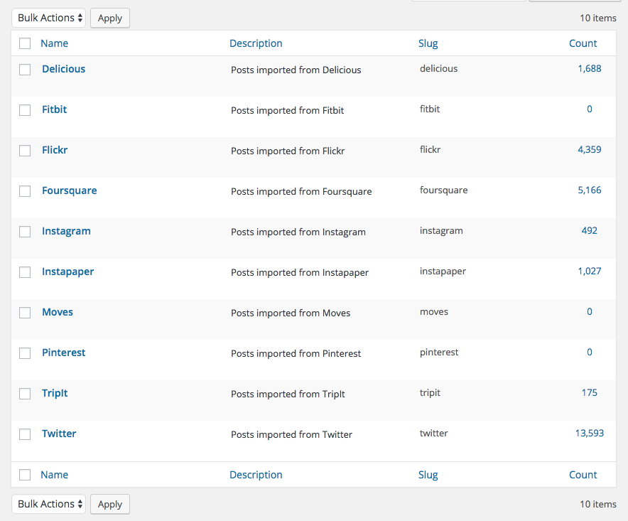
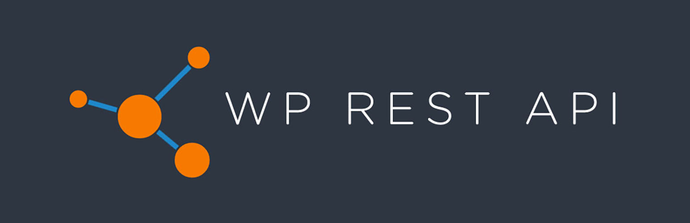

<!-- .slide: class="lurking-bob" -->

# WordPress
# As Data

<br>

K. Adam White &bull; [@kadamwhite](https://twitter.com/kadamwhite) &bull; [Bocoup](https://bocoup.com)

??? My name is K Adam White, I'm a lead engineer at Bocoup, a tech & design consultancy based over in Boston.

Excited for the rest of this event b/c we do design/datavis, but here today to share some of the work that's been going on recently to make it easier to work with WordPress data.

---


??? WP is the most widespread web content management system in the world, at last count powering about 26% of the top ten million sites (w3techs.com).

Not bad for 13 year old software!

What started as a fork of b2/cafelog intended for "personal publishing" is now used by magazines, writers, academic institutions, photographers, enterprise companies, poets, tech bloggers...

---
<!-- .slide: data-background="url('./images/wp_posts-columns.png')" data-state="solid-bg" -->

??? Most people think of WP in those terms; in terms of publishing, writing, _content_. But of course content is stored in a database for a reason, content _is_ data

That makes WP one of the most widespread storage mechanisms for data in the world, especially deliberately authored personal data meant for public consumption ("content")

---
<!-- .slide: data-background="url('./images/new-post-editor.jpg')" data-state="semi-solid-bg" class="center" -->

<h2 class="whitebg">&ldquo;Posts&rdquo;&hellip;</h2>

??? Its personal publishing origins make the "post" the default unit of granular data in WordPress, but a host of tools are available to define your own "post types" and provide more complex data structures

---



<small>[dentedreality.com.au](http://dentedreality.com.au/)</small>

??? Because WP is permissively licensed, frequently deployed upon a user's own server, and not prescriptive of what type of data it is used to store, WordPress has come to be used as an arbitrary personal data store

My friend Beau Lebens from Automattic, the parent company of WordPress.com, uses it to back up anything he publishes to other platforms and social networks; this is not a common use-case necessarily but it is not unique

---

<h2>WordPress &amp;<br>&ldquo;Developer Ergonomics&rdquo;</h2>

1. Write PHP
2. &hellip;Profit?

??? WP's success means it must be doing something right&mdash;but of course WP does not have a reputation for excellent developer experience.

It still takes a lot of effort to get data into or out of WP, which has fueled a lot of recent work around improving WP's built-in APIs

---
<!-- .slide: data-background="url('./images/xmlrpc-codex.png')" class="center" -->

<div class="whitebg">
  <h2><small>In The Beginning</small><br>
  There Was XML-RPC</h2>
</div>

??? The primary "WordPress API" currently available is the XML-RPC API, which is how the WordPress mobile app can talk to your site. But this is not a fun API to work with.

I've heard that about 40% of the code in the mobile app goes JUST to encoding/decoding XML, that's not good overhead

---
<!-- .slide: data-background="url('./images/wpdotcom-api-docs.png')" class="center" -->

<div class="whitebg">
  <h2>WordPress.com API</h2>

  [developer.wordpress.com/docs/api](https://developer.wordpress.com/docs/api/)
</div>

??? WordPress.com (WP.com and WP the software are related but separate) started providing a REST API a few years back, and you can use it with an independent WP site by installing the Jetpack plugin; but this depends on leveraging Automattic's wordpress.com infrastructure, and isn't "built in"

---
<!-- .slide: class="center" -->


[v2.wp-api.org](http://v2.wp-api.org/)

??? So I've been excitedly involved in this project; back in 2013 an Australian developer named Ryan McCue started a new API plugin through Google Summer of Code, which has since become the primary attempt to build a canonical, modern, JSON-based HTTP REST API for WordPress.

---

# &hellip;So?

### Why
## _yet another_
### API?

??? The reason this is exciting is that this plugin is being built with the intent of merging this API into WordPress core, which would give WP users unprecedented access to their content

---

`yoursite.com/wp-json`
```
{
  "name": "Your Site Title",
  "description": "Your Site Description",
  "url": "http://yoursite.com",
  "namespaces": [
    "wp/v2",
    "oembed/1.0"
  ],
  "authentication": [],
  "routes": {
    "/": {},
    "/wp/v2": {},
    "/wp/v2/posts": {},
    "/wp/v2/posts/(?P<id>[\\d]+)": {},
    "/wp/v2/posts/(?P<parent>[\\d]+)/revisions": {},
    "/wp/v2/posts/(?P<parent>[\\d]+)/revisions/(?P<id>[\\d]+)": {},
    "/wp/v2/pages": {},
    "/wp/v2/pages/(?P<id>[\\d]+)": {},
    "/wp/v2/pages/(?P<parent>[\\d]+)/revisions": {},
    "/wp/v2/pages/(?P<parent>[\\d]+)/revisions/(?P<id>[\\d]+)": {},
    "/wp/v2/media": {},
    "/wp/v2/media/(?P<id>[\\d]+)": {},
    "/wp/v2/types": {},
    "/wp/v2/types/(?P<type>[\\w-]+)": {},
    "/wp/v2/statuses": {},
    "/wp/v2/statuses/(?P<status>[\\w-]+)": {},
    "/wp/v2/taxonomies": {},
    "/wp/v2/taxonomies/(?P<taxonomy>[\\w-]+)": {},
    "/wp/v2/categories": {},
    "/wp/v2/categories/(?P<id>[\\d]+)": {},
    "/wp/v2/tags": {},
    "/wp/v2/tags/(?P<id>[\\d]+)": {},
    "/wp/v2/users": {},
    "/wp/v2/users/(?P<id>[\\d]+)": {},
    "/wp/v2/users/me": {},
    "/wp/v2/comments": {},
    "/wp/v2/comments/(?P<id>[\\d]+)": {},
    "/oembed/1.0": {},
    "/oembed/1.0/embed": {}
  },
  "_links": {}
}

```
<!-- .element: class="stretch" -->

??? It provides endpoints for most of WordPress's built-in resource types and taxonomies; this is the schema you get if you hit the root "wp-json" endpoint

---
<!-- .slide: data-background="url('./images/blog-post.jpg')" class="center" -->

`/wp-json/wp/v2/posts/2452` <!-- .element: class="whitebg" -->
```
{
  "id": 2452,
  "date": "2016-02-22T12:18:31",
  "date_gmt": "2016-02-22T12:18:31",
  "guid": {
    "rendered": "https://bocoup.com/?p=2452"
  },
  "modified": "2016-02-22T18:02:18",
  "modified_gmt": "2016-02-22T18:02:18",
  "slug": "say-hello-world-with-johnny-five-on-tessel-2",
  "type": "post",
  "link": "http://website.loc/weblog/say-hello-world-with-johnny-five-on-tessel-2",
  "title": {
    "rendered": "Say &#8220;Hello World&#8221; with Johnny-Five on Tessel 2"
  },
  "content": {
    "rendered": "<p>Back in April I wrote about Bocoup&#8217;s excitement..."
  },
  "excerpt": {
    "rendered": "Back in April I wrote about Bocoup&#8217;s excitement..."
  },
  "author": 5,
  "featured_media": 0,
  "comment_status": "open",
  "ping_status": "closed",
  "sticky": false,
  "format": "standard",
  "categories": [ 407, 243 ],
  "tags": [ 60, 456 ],
  "_links": {
    "self": [{
      "href": "http://website.loc/wp-json/wp/v2/posts/2452"
    }],
    "collection": [{
      "href": "http://website.loc/wp-json/wp/v2/posts"
    }],
    "about": [{
      "href": "http://website.loc/wp-json/wp/v2/types/post"
    }],
    "author": [{
      "embeddable": true,
      "href": "http://website.loc/wp-json/wp/v2/users/5"
    }],
    "replies": [{
      "embeddable": true,
      "href": "http://website.loc/wp-json/wp/v2/comments?post=2452"
    }],
    "version-history": [{
      "href": "http://website.loc/wp-json/wp/v2/posts/2452/revisions"
    }],
    "https://api.w.org/attachment": [{
      "href": "http://website.loc/wp-json/wp/v2/media?parent=2452"
    }],
    "https://api.w.org/term": [{
      "taxonomy": "category",
      "embeddable": true,
      "href": "http://website.loc/wp-json/wp/v2/categories?post=2452"
    }, {
      "taxonomy": "post_tag",
      "embeddable": true,
      "href": "http://website.loc/wp-json/wp/v2/tags?post=2452"
    }]
  }
}
```
<!-- .element class="stretch" -->

??? Any resource that's publicly viewable on your site may also then be accessed as JSON through the API, including media, custom post types, you name it.

---
<!-- .slide: class="center" -->

Code using the [`wordpress-rest-api` package](https://www.npmjs.com/package/wordpress-rest-api) on NPM:
```
var WP = require('wordpress-rest-api');
var site = new WP({ endpoint: 'your-site.com/wp-json' });

site.posts().get().then(function(posts) {
  posts.forEach(function(post) {
    console.log(post.content.rendered);
  });
});
```

??? I'll switch over to client code because it's easier to show than arbitrary URLs.

In the course of our consulting work I wrote a Node client for this API which works on the server or in browser; PHP, Go, Ruby, Angular.js and Backbone.js client libraries also exist

---
<!-- .slide: class="center" -->

Query Interface
```
/wp-json/wp/v2/posts?filter[author_name]=kadam
    &filter[tag]=art+digital-art
    &filter[year]=2014
    &search=Chelsea
```

```js
var query = site.posts()
    .author( 'kadam' )
    .tags([ 'art', 'digital-art' ])
    .year( 2014 )
    .search( 'Chelsea' );
```

??? If you don't know the ID of the post you want, you can query for it -- most of these clients provide an interface to simplify the process of building out the query and filter parameters

My own JS client uses a chaining syntax.

---

**Create**
```javascript
var prom = wp.posts().auth( credentials ).post({
    title: 'New Post 2501',
    content: 'Some Content'
}).then(function( createdPost ) {
    console.log( 'post created with ID ' + createdPost.id );
});
```
**Update**
```javascript
return wp.posts().auth( credentials ).id( id ).put({
    title: 'Updated Title'
});
```
**Delete**
```javascript
wp.posts().auth( credentials ).id( id ).delete();
```

??? While authentication handling is still one of the roughest edges of this plugin -- OAuth 2.0 is out for many sites since it requires SSL, while WP itself does not -- once you are authenticated you can of course create, update and delete resources as well.

---
<!-- .slide: class="center" -->

## Extending the API

[Add Custom Routes](http://v2.wp-api.org/extending/adding/) to expose new resources

(or new views of existing information),

or [define custom content types](http://v2.wp-api.org/extending/custom-content-types/) that can be accessed via the API.

??? And those resources don't have to be limited to the default WordPress types.

WordPress is still a PHP application, of course, so there's a little bit of legwork to do to create endpoints for your own custom resources -- but it's mostly boilerplate. I've linked to it here rather than going through it in depth.

---
<!-- .slide: class="center" -->

## Who Benefits?

??? So, who's this actually _for?_ I show you bespoke uses of WordPress as a data archive that are only possible for experienced developers, then share an API that clearly isn't user-facing either.

The goal here is to provide a suite of tools for developers to build amazing user-facing tools on top of or alongside WordPress.

---
<!-- .slide: data-background="url('../wp-node-feelingrestful/images/2014-project-wp-data-flow.svg')" data-state="solid-bg" -->

??? Bocoup is not a WP Agency; our first API-related project bolted WordPress on to a Node application as an editing UI.

Our clients' editorial team got the best of its battle-hardened interface, while we flowed their copy and images into the modern Node and SPA applications we were creating. No PHP templating!

Their writers and editor loved the flexibility of the WP Admin, and we spent much less time iterating on this architecture than we did on the rest of our integrations!

---
<!-- .slide: data-background="url('../wp-node-feelingrestful/images/calypso-site-screenshot.png')" class="center" -->

<div class="whitebg">

<h2>Next-Gen Editing Interfaces</h2>

</div>

??? Another example would be entirely new UIs, like the Calypso UI that Automattic launched recently for WP.com. With a standard API in place we could see an explosion of add-ons that provide tailored interfaces for different purposes; a reporter in a newsroom has different priorities than a poet, they could each have their own UI (not just skin).

The .com team have also asserted that if and when this plugin rolls into core, the WordPress.com API will be merged, reducing fragmentation across the ecosystem.

---
<!-- .slide: data-background="url('./images/csv-data-load.svg')" data-state="solid-bg" -->

## Bulk Data Load

??? Bulk Data Load also gets a lot easier: we've used the WP API as a way to bulk load data into WP. On a recent project it let us take a bucket of CSV files and get all that data into our system in an afternoon; content import used to be a fairly fraught process!

That data was visualized on dashboards running on that site: win for their team, same system. Could do the same with Analytics, text vis.

---

## Machine Learning&hellip;?

Generated from [Bocoup blog copy](https://bocoup.com/weblog) using [torch-rnn](https://github.com/jcjohnson/torch-rnn):
<blockquote class="full-width">
  <p>GitHub is pretty scripts used to make more, free when we now we can also up, we present. We can active connections, but that's the engineering test, code like hardware: CodePen. The hardware of callback!</p>
  <p>There is an incredibly exciting command.</p>
</blockquote>

??? Extrapolating further, machine learning was a theme of our OpenVis Conf event last week, so over the weekend I experimented with spidering our own company blog through the API and using that data to train a recurrent neural network:

I could imagine a world in which our sites are capable of manufacturing vacuous filler content entirely on their own, maintaining our own voice in the process

---

## Machine Learning&hellip;?

Actual WIRED Headlines:

**VW's Ousted CEO Is Probably Getting a $32 Million Pension**

**The Bizarre, Bony-Looking Future of Algorithmic Design**

**How a Pixar Vet Is Shaping the Future of VR Storytelling**

**The Science in The Martian Isn't Perfect, But That's OK**

**WIRED Binge-Watching Guide: Agents of S.H.I.E.L.D.**

**Facebook Debuts 360 Video With Immersive Star Wars Clip**

**The Muppets GIF and a Graf: Animal Tops the Power Rankings**

??? or at least our sites can make up headlines for us as writing prompts, or for us to ensure we're maintaining our voice. The way this neural network works is that you train it on a set of text; WIRED uses the wp api on their site, so I collected two years of WIRED headlines like this, as output by the API&hellip;

---

## Machine Learning&hellip;?

Generated WIRED Headlines:

**Facebook Camera Tech: Use to Bring Watch**

**Clean Apple Cars Vaunting Bees**

**This Giant Surfic Battery Could Steal War, Break Instagram**

**How the Web?**

**Star Wars Already Has Every Sand**

**Turning Great Will Drive Action Video**

**The Aircar of Netflix May Americanner With $19K**

**The Play of Thrones: Army Hackers**

??? and used those headlines to trained another RNN that can generate future headlines. Though it didn't fully learn English, and I don't know what a surfic battery is, I suspect WIRED would report on it. (Star Wars, FB)

There's a lot of data latent in a corpus like these headlines, one of my first experiments just generated a neural net that was a huge star wars fan because of the bulk of articles about that movie from the past few months. Getting our "content" in a machine readable format opens all this up.

---
<!-- .slide: data-background="url('../wp-node-feelingrestful/images/2014-project-architecture.svg')" data-state="semi-solid-bg" -->

### WP as _Component_
<!-- .element: class="whitebg" -->

??? All of this is another way of saying, with a robust, modern API WP doesn't need to be a monolithic platform, it doesn't need to be the core of our project -- it can be a component, something we use for its strengths when we need to.

From a data standpoint, it can supplement or replace other data stores, or it can be an intermediary or generator that passes its data off to another system.

---

### Remaining Hurdles:

## Authentication, Discovery

??? There's still some rough edges; I mentioned authentication, but we also have no global discovery mechanism the way we do with wordpress.com (where the API is synonymous with the directory of sites).

We can detect if a given site is providing this API, but we cannot necessarily search through all API-enabled sites, since they're so distributed. Not really a weakness, just the state of affairs.

---

## WP API Roadmap

- [v2.0 Plugin to be Released Soon](https://make.wordpress.org/core/2016/04/04/wp-rest-api-2-0-beta-13-roadmap/)
- Plugin will be proposed for core merge in late 2016

??? The API team is talking through these questions and releasing beta versions of the API plugin, which should get a stable v2 release soon.

Our current plan is to propose that this plugin be merged into core in late 2016.

There's a little debate around this, around whether the API needs to support the full breadth of WP's functionality before we merge it in; but I hope it will go in sooner because the possibilities for content consumption and manipulation are much more interesting to me than building a new monolithic interface for the whole of WP.

---

## We need your help!

What do you need for this to be useful to _you?_

Kick tires, file bugs.

??? So for us to get this thing off the ground, we need testers and implementers more than anything. Every new site I've used the API on is another opportunity to hone it, or to fix bugs in my client library; we need more people kicking these tires before we're comfortable unleashing it on a quarter of the internet!

---

### API Projects can be

## Custom & Specific,

??? The projects we build with this API may be custom and specific, like the work we do at Bocoup, or like WIRED or other large media sites, where the implementation is highly tailored to the individual client's needs and depends on custom endpoints.

---

### or API Projects can be

## Generic & Broad

??? But something like Calypso, something like a headline generator, goes the opposite direction, and can serve a broad variety of sites by utilizing solely the built-in API functionality.

Specific clients have very narrow applicability, and limitless capabilities; while generic clients have fewer capabilities, they can reach more users.

---

### Broad Applications

(may) benefit users the most.

??? Projects written against this out-of-the-box API are where we have the most opportunity to impact how WordPress users see their content and understand the data they are generating.

So I turn to you with a question: how can we educate users about the potential they have here? Can we?

---

### Personal Publishing,
## Personal API

??? The answer may be, we can't. But WP is a system first and foremost for personal publishing, and I'm excited about the notion of it becoming a personal API as well.

We may encounter FUD; there were concerns when RSS was first released: people have access to my content without my permission! Ah! We don't expose anything through the API that isn't already public, that's a tenant of this project. But again I turn to the csv,conf community for help understanding how we can educate WordPress authors about content licensing, about their rights as creators, so that those rights will be protected and respected by the tools we can build for them.

---

## *Thank You*

<hr>

Slides: [**talks.kadamwhite.com/wp-as-data**](http://talks.kadamwhite.com/wp-as-data)

Me: [@kadamwhite](https://twitter.com/kadamwhite)

Us: [bocoup.com](https://bocoup.com)

<hr>

API Project Home: [github.com/WP-API/**WP-API**](https://github.com/WP-API/WP-API)

[npmjs.com/package/**wordpress-rest-api**](https://npmjs.com/package/wordpress-rest-api)

??? And with that, I thank you for your time.
