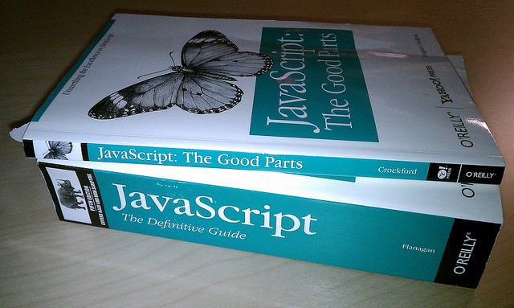
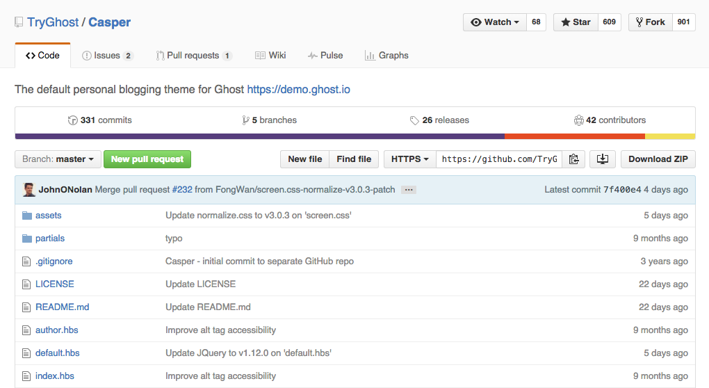
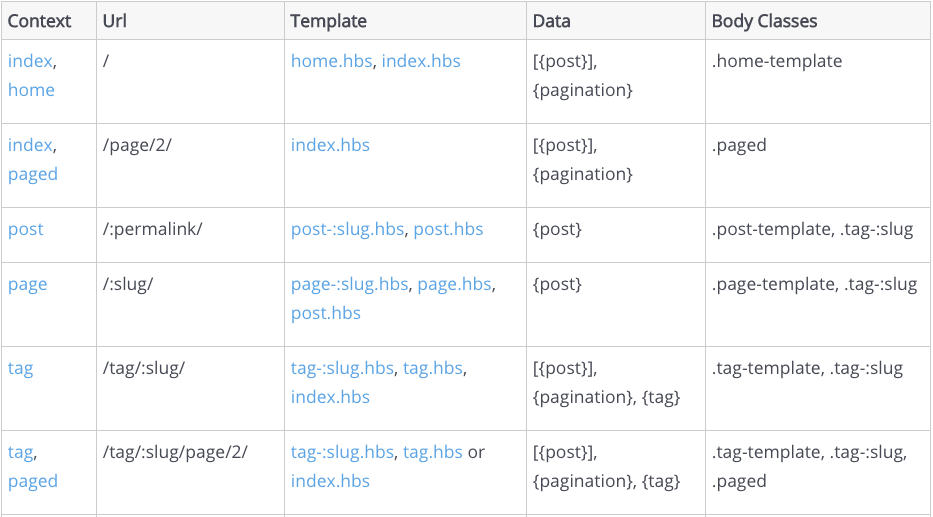
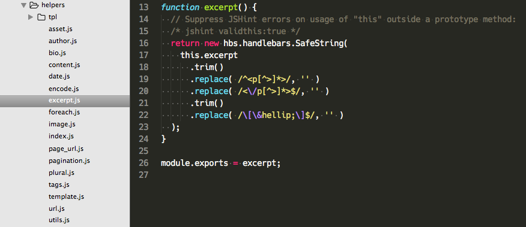
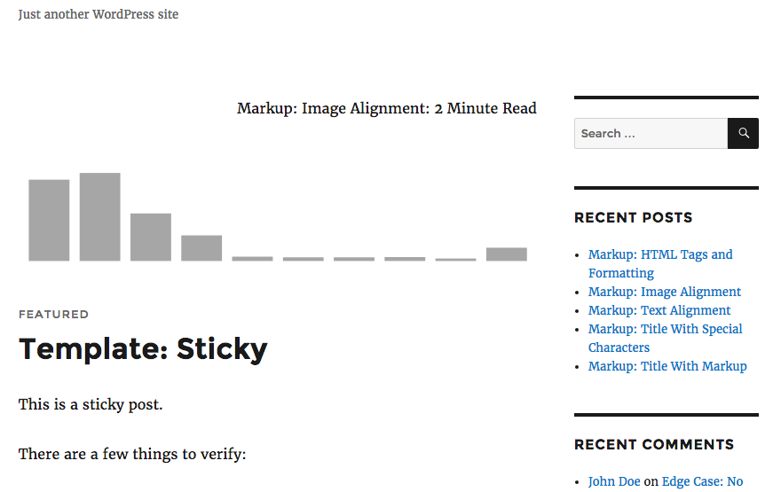

#### Pay no attention to that
# WordPress
### behind your application

<br>

K. Adam White &bull; [@kadamwhite](https://twitter.com/kadamwhite)

??? Intro!

---
[](https://www.bocoup.com)

??? I work at Bocoup. We are an

- open design & tech consultancy w/ offices in Boston & NYC
- Our mission is to develop and entrench open technologies in the markets we serve, and to do so in a way that fosters inclusivity, open access, education, and diversity.
- (We're a JS consultancy)
- Everything from audits to full implementations; front-end performance to multi-server deployment infrastructure.
- honor of working on the official JS test suite Test-262
- education/workshops/conferences

---


??? I'm here today because a few years back we encountered a challenge on a complex node project: server-rendered marketing site, multiple interrelated single page apps, and our own APIs, all tied together with a whole lot of 3rd-party services.

Unfortunately I can't share the specific details of that client, but Bocoup were responsible for the entire system, from server infrastructure to CSS, even helping them design their tech team.

---


## &ldquo;The best Node.js CMS?&rdquo;

??? We'd designed a system that satisfied most of our requirements. But the editorial control our client needed exceeded the capabilities of any Node CMS we could find (this was early 2014). We weren't about to write our own CMS; the scope was big enough as-is!

---
<!-- .slide: data-background="url('images/2014-project-architecture.svg')" data-state="solid-bg" -->

??? Bocoup hadn't historically done much with WP, but we've always been heavily involved with JS libraries like Backbone, and I'd experimented with the API when it was released in that context.

Made a PoC, it worked, and we moved forward with API (v0.9) for all editorial.

This is our infra: WP initially ran on a managed host, and our AWS infra talked to it through HTTP requests (over SSL!).

---
<!-- .slide: data-background="url('images/2014-project-wp-data-flow.svg')" data-state="solid-bg" -->

??? This let us flow editorial content into any part of our application we liked: staff profiles, blog entries, marketing copy, and media were all served from WordPress.

That data fit seamlessly into our existing site templates, and their writers and editor loved the flexibility of the WP Admin UI.

It took a little while to set up, but we spent much less time iterating on this architecture than we did on the rest of our integrations!

---

# Takeaways

<hr>

&star;

&star; _**It Worked!**_ &star;

&star;

??? I shared some takeaways from this project at WCSF '14: there were definitely some stumbling blocks, but I am very pleased with the degree to which the API let us utilize WordPress content within our own application.

---

## Takeaways

<hr>
**Cache Your Content**

*in case WP goes down*

??? It wasn't entirely a smooth process -- We ran into all the usual problems with remote data: we were only caching the retrieved content in an short-expiry LRU cache and weren't saving it to the DB on the node side, so when our managed host went through some growing pains and our WP site went down, it ripped that content out of our entire application.

We moved to AWS and strengthened our caching.

---

## Takeaways

<hr>

**Working with a v0.9 API is not easy,**

*but it's worth it to be involved*

??? The API was also in significant flux when we started, and many things were not supported yet. I do not see that as a downside; if there hadn't been sufficient functionality to execute our proof of concept, we'd have gone a different route.

Instead, it gave us an opportunity to be part of the group that felt out the limits of the 0.9 API, and identified changes we wanted to see in 1.0 and beyond.

---

## Takeaways

<hr>
**Custom Code is needed**

*on both sides of the API*

??? The project also required not just a Node client to receive the data, but also some fairly complex WP plugins to define our data types and craft our API responses (things like embedding meta into posts responses).

I'll revisit this point later.

---

## Takeaways

<hr>


**WP-Admin**

*will fight you*

??? Even as we gained unprecedented flexibility with how we used WP's data, the Admin interface -- the very thing we were using WP for -- put up a good fight.

As Jack Lenox and I have both mentioned in past talks, making the admin feel "right" in a non-WP-served site takes a lot of tedious extra legwork, because links that assume WP owns your rendering are practically everywhere in wp-admin.

---

## Takeaways

<hr>
**Reinventing Wheels**

*is all part of the process*

??? And finally by only using WordPress for its API, we did have to create

- our own router
- our own templating layer
- our own caching, media storage...

Primary benefit is _integration_: if we hadn't been using Node to begin with, what we built could have been considered duplicative or overkill.

But the API lets you use WordPress in an _additive_ way.

---

## ExpressPress

[github.com/kadamwhite/expresspress](https://github.com/kadamwhite/expresspress)

Sample Express server w/ WP Backend

??? To illustrate the fundamentals of our approach, I created a standalone repository called ExpressPress. ExpressPress runs on the v1 of the API, and I shared it as a demo at WordCamp San Francisco 2014.

---

[](http://wordpress.tv/2014/11/03/k-adam-white-wordpress-in-weird-places-content-management-for-node-using-rest/)

*"Weird" is relative*

<small><abbr title="WordCamp San Francisco">WCSF</abbr> 2014</small>

??? I shared the results at WCSF 2014 under the title "WordPress in Weird Places;" what constitutes "weird" has changed a bit over the intervening years!

While the node + wp combo is perhaps _uncommon_, as we've seen today it's definitely not unheard of.

---

> **What if** the dashboard was built on top of the WP REST API?

??? The API as a whole may not yet be a part of core, but our community's coming around to "API thinking". At WCSF I asked a lot of "what if?" questions...

---
<!-- .slide: data-background="url('images/calypso-site-screenshot.png')" -->

> [Calypso](https://developer.wordpress.com/calypso/) is the new WordPress.com front-end – a beautiful redesign of the WordPress dashboard using a single-page web application, powered by the WordPress.com REST API.
> 
> *<small>- [github.com/Automattic/wp-calypso](https://github.com/Automattic/wp-calypso)</small>*

2016

??? Now it's 2016, and we have Calypso: it uses the .com API, but as we saw in the last session these applications aren't hypothetical anymore. I both hope and anticipate that we'll see a plethora of new Admin UI applications spring up to utilize the API.

WP-Admin is great, but it's a bit long in the tooth and disruption will help us all in the long run.

---

&nbsp;

# 88.2%
## JavaScript

??? Calypso's repository is 88.2% JavaScript.

We used to talk about WP as a "platform", something to build on top of: it has become a component, something to build _with_.

I was asked here today to provide a case study, but I've already shared our takeaways from 2014. I'd like to take this time instead to look forward, to investigate the place of the API and its interfaces in this new component mentality.

---
&nbsp;

#### Application
### Programming
# Interface

??? To do so, I think it's important to dig a bit into what "API" actually means. We've talked about applications, we've talked about programming -- let's dive into what we mean by "interface." Because it's a loaded term.

We talk about "the API," and think about APIs as purely the bridge between one application than another. But every level of our interactions with software occur through interfaces.

---
<!-- .slide: data-background="url('images/books.jpg')" data-state="solid-bg" -->
<!-- Photo by K. Adam White CC BY 2.0 -->

??? By way of a metaphor, we've been talking about APIs as if they are books. A book transports information between an author's world and a reader; it's a transport mechanism. It has a defined interface. That interface is generic enough that we even have e-readers, which abstract the transport to be relevant to a large variety of data sources.

But the book is only the top level of interface that's at play.

---
<!-- .slide: data-background="url('images/grace-hopper-information-age-kurt-beyer.jpg')" data-state="solid-bg" -->
<!-- Photo by K. Adam White CC BY 2.0 -->

??? The next layer of the interface is the writing itself -- this is what makes some books "easier" than others. We talk about "difficult" or "challenging" books: _Finnegan's Wake_ isn't physically unwieldy or tries to fight its way out of your hands, it's "hard to read."

---

> English doesn't "borrow" from other languages,
> 
> English chases other languages down dark alleys and mugs them for loose vocabulary.

*<small>Paraphrased from [James Nicoll](https://en.wikipedia.org/wiki/James_Nicoll#.22The_Purity_of_the_English_Language.22)</small>*

??? Even "simple" books presuppose a familiarity with the language in which they are written. And some languages are easier than others. English is notoriously irregular; I say this as an American standing in the middle of London. Our two countries have, each in our own way, inflicted a fascinating but undeniably flawed language on far more of the world's population than really ought to have had to deal with it in the first place.

---

Sound familiar?


<!-- Link to image: https://www.flickr.com/photos/nathansmith/4704268314 -->

**Syntax** from C; **Semantics & Design** from Self & Scheme

*<small>[ES4 Language Overview](http://www.ecmascript.org/es4/spec/overview.pdf)</small>*

??? For better or worse, JavaScript is very much like English. It rose to prominence because we were told to use it, not because we chose it; it's widely derided; it uses the syntax of one language with the paradigms of others; and naming it after Java has confused corporate recruiters _for all time_.

---

## &ldquo;Bad&rdquo; APIs

XMLHttpRequest,

Document Object Model (DOM),

Node Streams,

*and lots,* lots *more :)*

??? JavaScript is capable of elegance, but most of the APIs it has historically depended upon are terrible. By terrible, I mean hard to learn, easy to mis-use... these are very powerful, and there is value in understanding how they work, but it's the equivalent of working through the language in a difficult book. The reward can be great, but the investment is high too.

---

Fetch a URL with **XMLHttpRequest**
```js
var request = new XMLHttpRequest();
request.open('GET', '/my/url', true);

request.onload = function() {
  if (request.status >= 200 && request.status < 400) {
    var data = JSON.parse(request.responseText);
    // Success!
  } else {
    // We reached our target server, but it returned an error
  }
};

request.onerror = function() { /* Error occurred */ };

request.send();
```

*<small>[youmightnotneedjquery.com](http://youmightnotneedjquery.com/)</small>*

??? Low level APIs give you lots of control, at the expense of having to do more yourself. This is an example of how to make an HTTP request with the browser's built-in XMLHttpRequest API, taken from "you might not need jQuery."

---

Fetch a URL with **jQuery**
```js
$.getJSON('/my/url', function(data) {
  // Success!
});
```
*<small>[youmightnotneedjquery.com](http://youmightnotneedjquery.com/)</small>*

You might *not* "not need jQuery"...

??? It's true, you might not! Spoiler, jQuery (and Backbone, React, Angular, Ember, etc) are all just JavaScript; anything you can do with them, you can write yourself. But libraries lower the barrier to entry.

jQuery was created to solve a problem, but it became a populist library: raise your hand if your first JavaScript was through jQuery.

You might not need it. But by making APIs for our APIs, we make them accessible to a wider audience. We lower the amount of technical chops needed to do amazing things.

---

## Learn JS Deeply

_**but pick your battles**_

??? By all means learn JS deeply, but pick your battles. At Bocoup we care a lot about this kind of "developer accessibility" as much as we care about accessibility in the traditional sense; Nikolay's called it Developer User Experience. DUX is critical to the learning process. If your tools aren't easy to use, nobody will use them.

If it adds a few k to your bundle to use a utility library, but makes it easier for a new team member to join the project, in ALMOST ALL cases that is the right trade to make.

---

#### `npmjs.com/package/wordpress-rest-api`

```
/wp-json/wp/v2/posts?filter[author_name]=kadam&filter[tag]=art+digital-art&filter[year]=2014&search=Chelsea
```

```js
site.posts()
    .author( 'kadam' )
    .year( 2014 )
    .search( 'Chelsea' )
    .tags([ 'art', 'digital-art' ]);
```

??? It was in this spirit that I abstracted the query builder logic from our project and released our API client it as a JS library.

We wanted the majority of our work on that WP API client project to be focused on using the data, not finding it -- and the URL of a wp-api resource can get gnarly with filtering. So I wrote a library, a query-builder for the API.

---

Promise Interface

```js
postsRequest.get().then(function( post ) {
    // Log the post title
    console.log( post.title.rendered );
    // Log the name of the embedded author
    console.log( post._embedded.author[ 0 ].name );
});
```

Callback Interface

```js
postsRequest.get(function( err, post ) {
    // Log the post title
    console.log( post.title.rendered );
    // Log the name of the embedded author
    console.log( post._embedded.author[ 0 ].name );
});
```

??? HTTP communication is built in via superagent, and exposed to users of the library through a promise-based interface (my preference) or a more traditional-node-style callback interface

---

[Published on NPM](https://www.npmjs.com/package/wordpress-rest-api)

```sh
npm install --save wordpress-rest-api
```

```js
var WP = require( 'wordpress-rest-api' );
var site = new WP({
    endpoint: 'http://your-domain.com/wp-json'
});

// Build query for post #991, with all embedded data
var postsRequest = site.posts().id( 991 ).embed();
```

??? The package is published via NPM, and can be used in Node.js applications, or in client applications via Browserify.

---

**In action within an [Express.js](http://expressjs.com/) route:**

```js
router.get( '/:y/:m/:slug', function( req, res, next ) {

  wp.posts()
    .year( req.params.y )
    .month( req.params.m )
    .name( req.params.slug )
    // Send the request and interpret the API response
    .then(function( posts ) {
      var post = _.first( posts );
      if ( ! post ) {
        return next(); // 404
      }
      // Render the post into the "single" template
      res.render( 'single', { post: post });
    });

});
```
<!-- .element class="stretch" -->

??? This library was a little more up-front, but it let us focus on the needs of our application, rather than on the nuances of API query structure -- that was all abstracted away.

This is how the API plugin plays inside an Express route. If you're unfamiliar with express, the way it works is that you define a route, and specify what will happen when a user hits that route.

---

**`single.tmpl`**
```html
{​%extend layouts/main as content%}
<div class="container single post">
  {​%partial partials/global-header . %}

  {​%if post.featured_image|get-image 'large' 'url'%}
  <div class="row">
    <div class="col-md-12">
      {​%partial partials/page-banner post.featured_image|get-image %}
    </div>
  </div>
  {​%endif%}

  <div class="row">
    <div class="col-md-8 col-md-push-4">
      <h1>{{{post.title}}}</h1>

      <p class="text-muted">by {{post.author.name}}</p>

      <div class="content">
        {{{post.content}}}
      </div>
    </div>{​%-- .col-md-8 --%}
    <div id="sidebar" class="col-md-4 col-md-pull-8">
      {​%partial partials/sidebar sidebar %}
    </div>{​%-- .col-md-4 --%}
  </div>{​%-- .row --%}
</div>

{​%partial partials/footer%}

{​%endextend%}
```
<!-- .element class="stretch" -->

??? On the last page we rendered our context into "single.tmpl"; this is what that looks like in ExpressPress. Express works with just about any JavaScript templating language; here I'm using one called Combyne.

Routing, Templating -- these are all "solved problems" you have to solve all over again. The ExpressPress approach only makes good sense if you're trying to get WordPress content into an existing Node application.

Kathleen is going to dive into this calculus about when it's appropriate to use the API more in the next session.

---

## We're using WP as a
# Component.

*What else can we use for its parts?*

??? But, if we're using WP for its data, it stands to reason we can borrow a rendering layer from some other project.

---
<!-- .slide data-background="images/ghost-repo-readme-graphic.jpg" data-state="solid-bg" -->
<!-- .slide: data-background="url('images/ghost-repo-readme-graphic.jpg')" -->


??? Who's familiar with the JavaScript CMS "Ghost"?

Ghost happens to have an express-based server, and uses a well-documented theming system inspired by WordPress's,

---

"`loop.hbs`"
```html
{{! Previous/next page links - only displayed on page 2+ }}
<div class="extra-pagination inner">
    {{pagination}}
</div>

{{! This is the post loop - each post will be output using this markup }}
{{#foreach posts}}
<article class="{{post_class}}">
    <header class="post-header">
        <h2 class="post-title"><a href="{{url}}">{{{title}}}</a></h2>
    </header>
    <section class="post-excerpt">
        <p>{{excerpt words="26"}} <a class="read-more" href="{{url}}">&raquo;</a></p>
    </section>
    <footer class="post-meta">
        {{#if author.image}}{{/if}}
        {{author}}
        {{tags prefix=" on "}}
        <time class="post-date" datetime="{{date format='YYYY-MM-DD'}}">{{date format="DD MMMM YYYY"}}</time>
    </footer>
</article>
{{/foreach}}

{{! Previous/next page links - displayed on every page }}
{{pagination}}
```
<!-- .element class="stretch" -->

??? but implemented using the JavaScript templating library "Handlebars."

---

## [Demo](https://github.kadamwhite.com/ghostpress)



??? Let's see how easy it is to "steal" the themeing layer of Ghost, so we can use it to render our WordPress data.

---

### Understand Ghost's Context

[](http://themes.ghost.org/docs/context-overview)

---

### Configure our Express server

```js
var ghostThemeDir = path.join( __dirname, 'themes', config.theme );
var app = express();

// view engine setup:
app.engine( 'hbs', hbs.express4({
  defaultLayout: path.join( ghostThemeDir, 'default.hbs' ),
  partialsDir: [
    path.join( ghostThemeDir, '/partials' )
  ]
}) );
app.set( 'view engine', 'hbs' );
app.set( 'views', ghostThemeDir );
```

---

### Adapt Ghost's [helpers](https://github.com/TryGhost/Ghost/tree/master/core/server/helpers)



??? The Handlebars templating system lets you define helpers, which work like template tags do in WordPress.

Ghost ships with a set of about 30 theme helpers; we have to either copy or replace roughly half of those in order for (most of) their themes to work with our application.

---

### Define our [routes](https://github.com/kadamwhite/ghostpress/blob/master/server/routes.js)

```js
router.get( '/', function homepageRoute( req, res, next ) {
  var postsPromise = wp.posts().perPage( 10 ).embed();
  bluebird.props({
    meta_title: pageTitle(),
    posts: postsPromise,
    pagination: postsPromise.then( getPaginationObj ),
    context: [ 'index', 'home' ],
    body_class: 'home-template'
  }).then(function( context ) {
    context.posts = context.posts.map( decease.post );
    res.render( 'index', context );
  }).catch( next );
});
```

??? The context documentation is very specific about what properties are available in Ghost templates, so our router becomes very easy to define: We simply need to provide the template with a context object exposing all of that template's relevant properties.

---

### Make Ghost-Posts

```js
decease.posts = function( wpPost ) {
    // ... Some code remove for brevity
    return {
        slug: wpPost.slug,
        id: wpPost.id,
        title: wpPost.title.rendered,
        excerpt: wpPost.excerpt.rendered,
        content: content,
        created_at: wpPost.date,
        author: author,
        tags: categories,
        // ...
    };
};
```
<!-- .element slide="content" -->

??? Converting our WordPress content to their ghostly equivalents is as simple as defining a function to map their properties, as we do here.

---

## [Deploy Static Site](https://github.com/kadamwhite/ghostpress/tree/master/scripts/deploy-site.js)

&nbsp;

1. Fetch every public WP post to build a list of all URLs
2. Run the "GhostPress" express server
3. Systematically save each valid URL to a static HTML file
4. Copy the theme's assets into the output directory

&nbsp;

**Ghost + WordPress + Node = Static Site Generator**

??? Ghost itself has a heavy caching layer over its express server, so as to straddle the line between a static site generator 

---

So, that handles reading. What about

## Creating Posts?


<hr>

**Custom Interfaces**

**Content Migration**

**Bulk Data Entry**

??? So far I've focused mostly on reading data out of WP via the API. But a REST API provides more than read capabilities.

The WP REST API also lets you push data back into WordPress.

If anybody wants to tackle wiring up Ghost's authoring UI to work with WP, get in touch. But I'll share a example of a way the API can be used to migrate posts from an external system, into WordPress's DB.

---

## Bulk Load from CSV

(Disclaimer: **Uses the v1 WP-API!**)

```js
// Read the CSV file,
csv.read( './data/data.csv' ).then(function( allRecords ) {

  // Upload records 30 at a time
  _.chunk( allRecords, 30 ).reduce(function( ready, chunk ) {
    // don't start next chunk until previous is done
    return ready.then(function() {

      // "bluebird.all" method takes an array of promises
      return bluebird.all( records.map( upload ) );
    });
  }, Promise.resolve() );
});
```

??? We recently completed a data dashboard project built on top of WordPress, where one of our clients can log in and see metrics and reports about the efficiency of various teams within their organization.

We needed to bulk-load their historical data into the new WP site; the API gave us a very fast solution.

Or, the v1 API did. Post meta handling's still a pain point with the WP-API.

---

For each post, we call `upload`:

```js
function upload( record ) {
  return wp.posts()
    .type( 'our_cpt' )
    .namespace().version().auth()
    .post( makeCPTObject( record ) );
}
```

---

`upload` uses `makeCPTObject` to turn "record" into something we can POST to the WP-API

```js
function makeCPTObject( record ) {
  return {
    date: renderDate( record.date ),
    status: 'private',
    type: 'our_cpt',
    // title and content_raw are required
    title: _.uniqueId( 'prefix_' ),
    content_raw: '',
    // Post Meta is what we care about
    post_meta: _.chain( record )
      .omit( [ 'date', 'id' ] )
      .map(function( value, key ) {
        return { key: 'prefix-' + key, value: value };
      })
      .value()
  };
}
```

---

### `wordpress-rest-api`
## Roadmap

<hr>

**Full support for v2 beta endpoints**

**Endpoint discovery**

**Better Authentication**

??? This library's a work in progress. Support for the latest and greatest v2 betas is almost complete, and I'm hoping to improve that at the hack day tomorrow. We're also looking to build in some degree of auto-discovery support; and currently only nonce-based and basic http authentication are supported, so we need to improve that situation.

---

**`require( 'room' ).elephant();`**
## Node & NPM
### can be overwhelming

<hr>

Node itself is a modular and multi-purpose ecosystem.

Use what you like; learn incrementally


??? Those two examples do call out an elephant you may see in this room: I'm standing up here saying I care about making accessible tools, then I'm releasing this software through (and for) Node. Node's pretty new to most WP developers, and it can be intimidating. It's not _hard_, but it took me personally a long time to get comfortable writing Node scripts, not to mention actual servers.

But we can use Node's tooling for client-side development, and the majority of the work we do with the API is going to be on a more traditional, client-side playing field. Most of us won't be needing to make standalone apps.

Let's look at how we can use this wordpress api client package within a client-side JS script.

---

### Picard theme [router](https://github.com/Automattic/Picard/blob/master/components/router/router.jsx)
```js
var request = require( 'superagent' );

page( '/', function ( ctx ) {
  var data,
    slug = ctx.params.slug,
    url = '/wp-json/wp/v2/posts';

  request
    .get( url )
    .end( function( err, res ) {
      data = JSON.parse( res.text );
      self.setState({
        component: <Content data={ data } bodyClass="index" />
      });
    });
});
```
<!-- .element class="stretch" -->

??? Jack Lenox spoke earlier about his experiences building REST API-powered WordPress themes, and mentioned his theme Picard. This is how Picard got the data from its urls -- it's a client-side theme, but the core "this data when you hit that url" router methodology is the same as what I showed in Express.

---

### Picard theme router redux
```js
var wp = require( 'wordpress-rest-api' ).site( '/wp-json' );

page( '/', function ( ctx ) {
  wp.posts().then(function( posts ) {

    self.setState({
      component: <Content data={ posts } bodyClass="index" />
    });

  });
});
```

??? Picard uses an NPM-based build system called Browserify, so we can directly drop in our `wordpress-rest-api` library to simplify the theme's router code. There's nothing our library does that the Picard router code didn't, but depending on how complex your query needs are, it can be a bit easier to manage them this way than by writing your own request handling each time.

---

### [Post Length Visualization](https://github.com/kadamwhite/vis-post-length)
using [D3](http://d3js.org/) and [Browserify](http://browserify.org)

[](http://wpapi.loc/)

---
Bring Your Own Ajax:
```sh
browserify vis-post-length.js --ignore superagent -o bundle.js
```
```js
var d3 = require( 'd3' );
var WP = require( 'wordpress-rest-api' );
var site = new WP({ endpoint: '/wp-json' });
// Injected via wp_localize_script
var page = ARCHIVE_INFO.page;

// Use the WP API client plugin _purely_ to generate a URL
var archiveQuery = site.posts().page( page )._renderURI();

// Request the JSON with D3 itself
d3.json( archiveQuery, function( posts ) {
  // Visualize "posts"
});
```

??? You don't even need to use the AJAX component: D3 is a data visualization framework that has its own AJAX functionality built-in, and it's possible right now to use the API client package to build an application that uses D3, or jQuery, or whatever library you already have for AJAX.

This all depends on Browserify or Webpack right now, but...

---

### `wordpress-rest-api`
## Roadmap

<hr>

**Client-Side Library Bundle**

**Standalone Query-Builder Build**

??? We're investigating providing the query builder as a standalone, so that you can use the library but use D3 or jQuery or whatever you've got for your HTTP handling. I also want to make an optimized client-oriented build that you can drop in to any front-end application.

---

### `wordpress-rest-api`
## Roadmap

<hr>

[github.com/kadamwhite/wordpress-rest-api/issues](https://github.com/kadamwhite/wordpress-rest-api/issues)

Help us improve&mdash;let us know what doesn't work!

??? I invite you to experiment with the `wordpress-rest-api` package, and of course with the WP-API beta itself, and to open an issue on either if you encounter things that don't work as you expect. Our documentation needs a lot of love, and bad documentation or unintuitive interfaces should be treated as a bug.

---

# Types
## of API Project

*(home stretch)*

??? Home stretch. Where does all this leave us?

It's January, so there's been a lot of "2016 predictions" posts flying around.

To make some of my own, I think we'll see two major categories of WP API-driven applications as we move forward.

---

### API Projects can be

## Custom & Specific

??? As I just described, Bocoup's first foray into the API went a highly customized direction by creating plugins and a client that could only work with one another.

---

### or API Projects can be

## Generic & Broad,

??? Something like Calypso goes the opposite direction, and served a broad variety of sites by utilizing solely the built-in API functionality.

Generic clients have broad applicability, but fewer capabilities; specific clients have very narrow applicability, and limitless capabilities.

---

### A Prediction:

## High-profile projects

built with the WP API will

### define their own endpoints

??? Custom endpoints mean you can reduce boilerplate code on both the API client and the API server; your responses will be custom tailored to your needs.

---

### A Prediction:

## The majority

of WP API-driven projects

### will use it out of the box

??? However, the actual majority of API projects -- we're not talking Wired, or the NY Times, or Automattic's VIP customers, or a project we might execute at Bocoup, but one of those "generic, broad" projects -- will probably be written against the out-of-the-box API.

---

## The People's API?

> **What You Can Use WordPress For**
> 
> WordPress is limited only by your imagination. (And tech chops.)

*<small>From [wordpress.org/about](https://wordpress.org/about/)</small>*

??? Both type of project are super exciting. Customizing the API lets you build very powerful applications, and will allow WordPress content to flow into any system we can imagine. 

But I have even greater interest is in those majority-case projects. This API is going to be many people's first experience having _data_ access to their own content. That is _tremendously_ exciting.

---

# Let's lower
### that barrier to entry

??? Let's build interfaces and tools for working with this API that lower that barrier to entry as much as we can.

If we all have access to tools that allow us to work with the API on a level we're comfortable with, then we can stop paying attention to the WordPress behind our applications, and focus on dreaming up the best applications we can.

---

## *Thank You*

<hr>

Slides: [talks.kadamwhite.com/wp-node-feelingrestful](http://talks.kadamwhite.com/wp-node-feelingrestful)

Me: [@kadamwhite](https://twitter.com/kadamwhite)

Us: [bocoup.com](https://bocoup.com)

[github.com/kadamwhite/wordpress-rest-api](https://github.com/kadamwhite/wordpress-rest-api)

Demos:

[github.com/kadamwhite/ghostpress](https://github.com/kadamwhite/ghostpress)

[github.com/kadamwhite/vis-post-length](https://github.com/kadamwhite/vis-post-length)

