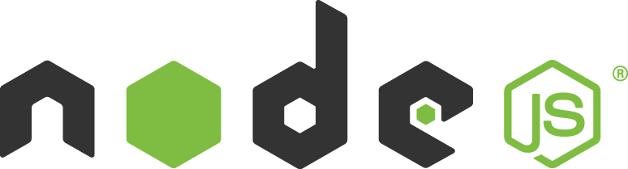
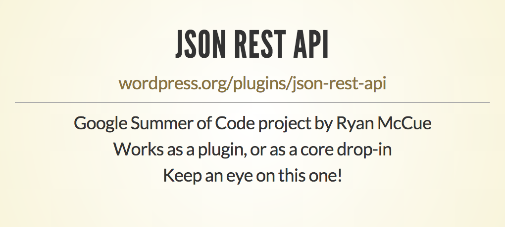
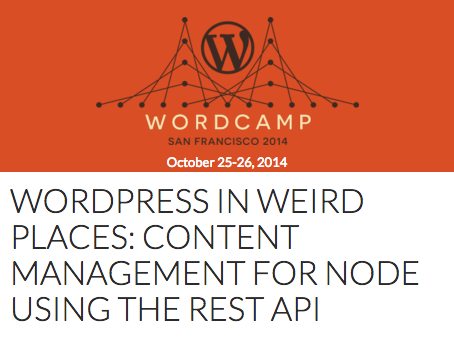

#### Pay no attention to that
# WordPress
### behind your application

<br>

K. Adam White &bull; [@kadamwhite](https://twitter.com/kadamwhite)

??? Intro!

---

[](https://www.bocoup.com)

??? I work at Bocoup. We are

- Tech/Design co, based in Boston/NYC
- We're a JS consultancy
- Everything from audits to full implementations
- honor of working on the official JS test suite
- education/workshops/conferences

I'm here today to share part case study, part call to arms.

---
<!-- .slide: data-background="url('../../2015/mbtawesome-boston-node/images/bliss-windows-xp.jpg')" -->

??? Exactly two years ago I was sitting in a room with my coworkers, planning the tech stack for a green-field project.

---
<!-- .slide: data-background="url('../../2015/mbtawesome-boston-node/images/bliss-windows-xp.jpg')" -->



??? We knew there would be a traditional server-side blog & marketing site, an API-driven front-end SPA, and a whole lot of integration with 3rd-party services.

We settled on using Node for the server, as it was a flexible tool  because it was something we all had some experience with -- historically we try to avoid learning an entire tech stack each project!

---
<!-- .slide: data-background="url('../../2015/mbtawesome-boston-node/images/bliss-windows-xp.jpg')" -->

<br>
## Express.js Server

??? We could build a server in Express that satisfied most of our requirements.

---

## What is the best
# Node CMS?

??? But the editorial control they wanted exceeded the capabilities of any Node.js CMS we could find (this was early 2014). We weren't about to write our own CMS, the scope was big enough as-is.

---

*back in August '13,*

[](http://kadamwhite.github.io/talks/2013/backbone-wordpress/#/67)

*<small>Slide from WordCamp Providence 2013</small>*

??? I've been following the development of the API plugin from just about the beginning, as I was speaking a lot in 2013 about Backbone.

Backbone really loves a Restful interface, and -- tangent, Ryan, I called it, this plugin _was_ a good one to keep an eye on!

---


??? We made a PoC, it worked, and we took a chance on the API -- only at v0.9 when we started -- to use WordPress as our datastore for a WP application.

WP initially ran on a managed host, Pressable, and our AWS infra talked to it through HTTP requests -- the approach I came to recommend was to push images to AWS, so the WP server did not need to be public at all.

---

### Express Routing

```js
function handleRoute( req, res, next ) {
  // Determine what to send back to the user
}

router.get( '/:year/:month/:slug', handleRoute );
```

---

### Express Routing, cont'd

```js
function getSinglePost( req, res, next ) {

  var post = wp.posts().filter({
    monthnum: req.params.month,
    year: req.params.year,
    name: req.params.slug
  }).then(function( posts ) {
    return _.first( posts );
  });

  // ...
}
router.get( '/:year/:month/:slug', getSinglePost );
```

---

At [<abbr title="WordCamp San Francisco">WCSF</abbr> 2014](http://wordpress.tv/2014/11/03/k-adam-white-wordpress-in-weird-places-content-management-for-node-using-rest/),

> **What if** the dashboard was built on top of the WP REST API?

??? These were heady, early days: at WCSF I asked the question,

---
<!-- .slide: data-background="url('images/calypso-site-screenshot.png')" -->

> [Calypso](https://developer.wordpress.com/calypso/) is the new WordPress.com front-end – a beautiful redesign of the WordPress dashboard using a single-page web application, powered by the WordPress.com REST API.

??? Now it's 2016, and we have Calypso: it uses the .com API, but as we saw this morning, this isn't hypothetical anymore.

---



"Weird places" is relative

??? It's still perhaps uncommon to use WordPress with Node, but as we've seen today, it's happening, and it's going well.

---

## Application
## Programming
# Interface

??? The first video game I remember playing was Myst. The game's primary conceit was that a civilization had developed the ability to write books so descriptive that they would actually create a physical portal between your world, and the "age" described in the book.

---

English language is like JS

??? No really

---

> English doesn't borrow from other languages.
> 
> English follows other languages down dark alleys, knocks them over, and rummages through their pockets for loose grammar.
