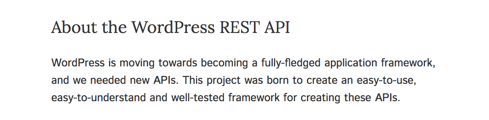

# API Client
# API Design

<br>

K. Adam White &bull; [@kadamwhite](https://twitter.com/kadamwhite) &bull; [Bocoup](https://bocoup.com)

??? My name is K Adam White, I'm a senior engineer at Bocoup.

---

## Application
## Programming
# Interface

???
This has been a conference about APIs, which usually means remote APIs like WordPress's JSON-based HTTP REST API.

---

## Application
## Programming
# <span style="font-family:'Comic Sans MS';">_Interface_</span>

???
We use this term "API" to refer to _any_ publicly consumable coding interface, whether that's a remote REST API or an internal WordPress PHP method.

Every utility, every library, every DOM method, every piece of code is an interface that we have to learn before we can use it.

It may come easier to some than others, but _nobody_ starts with code interface literacy.

---
<!-- .slide: data-background="url('./images/wpapi-stickers.jpg')" data-state="solid-bg" -->

???
I'm here to share how I designed the API for my "wpapi" Node.js WordPress REST API client module.

I work w/ colleagues who created or contributed to Grunt, JSHint, the robotics library Johnny-Five, Backbone Marionette, the venerable jQuery project, and now Webpack

and I am now the design lead for the WP REST API, but this was the first major project I published where I was responsible for the design decisions

---
<!-- .slide: data-background="url('./images/wpapi-stickers.jpg')" data-state="solid-bg" -->

???
And building an interface, and releasing it publicly, is fun -- but brought unexpected challenges.

When I pitched talk I hoped that would provide more info about the structure of the WP REST API, but also share the rationale for the decisions I made to address these challenges


---
<!-- .slide: data-background="url('./images/wp-editor-comparison.png')" data-state="solid-bg" -->

???
As computer users, we are very particular about our interfaces. However much we try to make the perfect interface for everybody, such a thing doesn't exist&mdash;the most we can hope for is that it's acceptable for as many people as possible.

In WordPress we provide different user interfaces for different types of user; or so we tell ourselves. In practice we provide the text editor as a necessary escape hatch for when the visual editor breaks.

---
<!-- .slide: data-background="url('./images/wp-markdown-help-widget.png')" data-state="solid-bg" -->

???
And if we try to "improve" things -- say, by replacing both editors with a Markdown editor, as we do on Bocoup.com -- that disenfranchises our non-technical colleagues who don't know Markdown. So now we add new UI to explain the existing UI.

---
<!-- .slide: data-background="url('./images/sciam-ui-disasters.png')" data-state="solid-bg" -->

???
Because we notice UI most when it is broken -- when it doesn't work the way we expect, or want.

From Mac vs PC to Emacs vs Vim, brand loyalty in software is _UI_ loyalty. When there's friction -- when an app doesn't fix a broken UI, or "fixes" one that wasn't -- we jump ship and find something that suits us better.

Screenshot: https://www.scientificamerican.com/article/pogue-5-of-the-worst-user-interface-disasters/

---
<!-- .slide: class="center" -->


???
This conference exists because the same tension exists within the code interfaces of WordPress. The product is flexible and broadly applicable to many different types of websites, but frustrating to use as a developer.

The REST API doesn't replace those frustrating APIs, but it provides a facade layer over them

to normalize the inconsistencies like jQuery originally did with cross-browser DOM interaction.

---
```js
router.get( '/posts/:slug', function( req, res, next ) {

  wp.posts()
    .slug( req.params.slug )
    // Send the request and interpret the API response
    .then(( posts ) => {
      var post = _.first( posts );
      if ( ! post ) {
        return next(); // 404
      }
      // Render the post into the "single" template
      res.render( 'single', { post: post });
    });

});
```
<!-- .element class="stretch" -->

???
And my work with the API began by taking this one step further, creating a client library that took this new facade layer and provided a fluid query builder that could be consumed from JavaScript.

---

<table>
<tr>
    <th></th>
    <th>[<span style="white-space:nowrap;">node-wpapi</span>](http://wp-api.org/node-wpapi/)</th>
    <th>[wp-rest- <span style="white-space:nowrap;">api-oauth-1</span>](https://www.npmjs.com/package/wordpress-rest-api-oauth-1)</th>
    <th>[Backbone Client](https://developer.wordpress.org/rest-api/using-the-rest-api/backbone-javascript-client/)</th>
    <th>[jQuery](http://jquery.com/)</th>
    <th>[`fetch()`](https://developer.mozilla.org/en-US/docs/Web/API/Fetch_API/Using_Fetch)</th>
</tr>
<tr>
    <td>**Isomorphic Querybuilder**</td>
    <td>X</td>
    <td></td>
    <td></td>
    <td></td>
    <td></td>
</tr>
<tr>
    <td>**OAuth 1.0a Support**</td>
    <td><small style="padding-top:0.5em;">(Soon. I swear.)</small></td>
    <td>X</td>
    <td></td>
    <td></td>
    <td></td>
</tr>
<tr>
    <td>**Backbone Integration**</td>
    <td></td>
    <td></td>
    <td>X</td>
    <td></td>
    <td></td>
</tr>
<tr>
    <td>**On [72.2%](https://w3techs.com/technologies/overview/javascript_library/all) of all websites**</td>
    <td></td>
    <td></td>
    <td></td>
    <td>X</td>
    <td></td>
</tr>
<tr>
    <td>**No library needed!**</td>
    <td></td>
    <td></td>
    <td></td>
    <td></td>
    <td>X</td>
</tr>
</table>

???
But this isn't the only approach to building a client library, and even just looking at widely released JavaScript clients we have several other options, each of which prioritized different capabilities.

---
#### `npm install wpapi`


```js
const apiPromise = require('wpapi')
    .discover('http://my-site.com');

apiPromise.then( api => {
    api.posts().then( posts =>
        api.posts().id( posts[0].id ).update({
            title: 'Updated title'
        })
    ).then( updatedPost => console.log( updatedPost ) );
});
```
<!-- .element class="stretch" -->

???
My client is designed to work in any JS environment, whether browser or server, and provides a fluent chaining API that simplifies building complex requests.

---

#### `npm install wordpress-rest-api-oauth-1`

```js
demoApi.authorize().then( function() {

    demoApi.get( '/wp/v2/posts', { per_page: 5 } )
        .then( posts => console.log( posts ) )
     
    demoApi.post( '/wp/v2/posts', { title: 'Test new post' } } )
        .then( post => console.log( post ) )
     
    demoApi.del( '/wp/v2/posts/1' )
        .then( post => console.log( 'Deleted post.' ) )
})
```
<!-- .element class="stretch" -->

???
On the other hand Joe Hoyle's OAuth 1 client library doesn't do any query string generation for you, requiring all paths and query parameters to be written out by hand -- but it simplifies the dreaded OAuth 1.0a handshake.

---

#### `wp_enqueue_script( 'wp-api' );`
```js
wp.api.loadPromise.done( function() {
    var posts = new wp.api.collections.Posts();
    posts.fetch().done( function() {
        // Do something with the collection.

        var firstPost = posts.at( 0 );
        firstPost.set( 'title', 'The First Post' );
        firstPost.save();
    });
});
```
<!-- .element class="stretch" -->

???
The backbone client was designed from the get-go to run within WordPress themes, plugins and admin screens, so its interface is heavily influenced by Backbone and by the existing WordPress JavaScript environment.

---
#### `wp_enqueue_script( 'jquery' );`
```js
jQuery.get('/wp-json/wp/v2/posts')
  .then(results =>
    results.map(post => post.title.rendered)
  )
  .then(titles => console.log(titles));

```

???
And I'd be remiss not to mention that a dedicated client library is of course not needed at all; if you aren't making complex queries, don't need backbone integration, and don't require OAuth handling, any AJAX library will do.

jQuery is already loaded on the vast majority of WordPress sites, and it's what does Backbone's requests under the hood; so for basic AJAX requests it's more than enough!

---
<!-- .slide: data-background="url('./images/basic-fetch-usage.png')" data-state="solid-bg" -->

???
And as new browser APIs roll out, this will get even easier still;

B/c the Web Hypertext Application Technology Working Group is still trying to make fetch happen

So in browsers like Chrome, we get the point where you get the conciseness of jQuery without

---

<table>
<tr><td colspan="10">Keyboard &amp; Mouse</td></tr>
<tr><td></td><td colspan="9">Application code</td></tr>
<tr><td></td><td></td><td colspan="8">`wpapi`</td></tr>
<tr><td></td><td></td><td></td><td colspan="7">Superagent</td></tr>
<tr><td></td><td></td><td></td><td></td><td colspan="6">Node / Browser</td></tr>
<tr><td></td><td></td><td></td><td></td><td></td><td colspan="5">Nginx</td></tr>
<tr><td></td><td></td><td></td><td></td><td></td><td></td><td colspan="4">WP REST API</td></tr>
<tr><td></td><td></td><td></td><td></td><td></td><td></td><td></td><td colspan="3">WordPress</td></tr>
<tr><td></td><td></td><td></td><td></td><td></td><td></td><td></td><td></td><td colspan="2">PHP</td></tr>
<tr><td></td><td></td><td></td><td></td><td></td><td></td><td></td><td></td><td></td><td>MySQL</td></tr>
</table>

???
I can't predict what makes the most sense for your application.

Because all of these tools are just one part of a long chain of interlocking libraries, environments, and runtimes, working in sync to move data from the WordPress database into your application.

What you need in a client is going to be different than what I need, based on what else you are using already.

---
<!-- .slide: class="center" -->

## Inside
## `node-wpapi`

???
But there may be something about the decisions I made while writing node-wpapi that could inform your choice, or help you understand how all of these clients do what they do.

Because my design decisions were motivated by the twin and at times opposing goals of providing a simple, fluent API, and providing a tool that was flexible to different types of needs

---

## `node-wpapi`
### is a 
## Query Builder &
## HTTP Transport.

???
My environment restricted the original scope.

Because I started in Node, I didn't assume anything about client-side JS frameworks. Because we already had a caching system in our Express app, I didn't build in caching.

It does query building, and sends & receives requests. That's it.

---
<!-- .slide: data-background="url('./images/swiss-army-hammer.jpg')" data-state="solid-bg" -->

???
And I say "that's it," but it turns out that managing scope is critical when releasing a library.

This narrow scope probably saved the project before I even began.

Because Nobody wants to maintain a swiss army hammer.

---

```js
const site = new WPAPI({ endpoint: '...' });
// "WPAPI" constructor; "site instance"

site.posts()...
site.comments()...
site.widgets()...
// Extension of "WPRequest", "request handler"
```

???
So we're going to dive into the way this works, but first I'm going to establish some terms:

There's only two important constructors in this library, WPAPI itself and WPRequest.

The obj that's bound to a specific WP site is a "site client"

When you call a factory method like .posts(), you get an instance of what I call a "request handler."

---

### Site Client Constructor

```js
const WPAPI = require( 'wpapi' );

const site = new WPAPI({
    endpoint: 'http://demo.wp-api.org/wp-json'
});
```

???
The WPAPI module is just a constructor that returns a site client instance.

---

```js
function WPAPI( opts ) {
  this._ns = {}; // Namespace handler dictionary
  this._options = { endpoint: opts.endpoint };

  if ( opts && ( opts.username || opts.nonce ) ) {
    this.auth( opts );
  }

  return this
    // Allow injection of a custom HTTP transport
    .transport( opts.transport )
    // Allow bootstrapped routes override
    .bootstrap( opts && opts.routes );
}
```
<!-- .element class="stretch" -->

???
WPAPI is a basic JavaScript constructor.

It creates two internal dictionaries for options and registered namespaces, then sets auth (if provided)

Then it runs the "transport" and "bootstrap" methods, each of which can take an optional argument

---

## The HTTP Transport

---

```js
WPAPI.prototype.transport = function( transport ) {
  var _options = this._options;
  if ( ! _options.transport ) {
    // Clone default transport
    _options.transport = Object.create( WPAPI.transport );
  }
  // Override defaults with provided transport methods
  ['get','post','put','delete'].forEach(function( key ) {
    if ( transport && transport[ key ] ) {
      _options.transport[ key ] = transport[ key ];
    }
  });
  return this;
};
```
<!-- .element class="stretch" -->

???
The HTTP transport is a set of methods for GET, POST, PUT, HEAD and DELETE, which the library uses to make HTTP requests. We use the Superagent library for http requests, but so long as you create the property wrapper, any AJAX library would work here!

---

## Route Handler Bootstrapping

---

```js
WPAPI.prototype.bootstrap = function( routes ) {
```
1. Load a JSON object of the default /wp-json response
2. Create a route tree representing all possible routes
3. Create route handler factories for each resource tree
4. Add route handlers in "wp/v2" namespace to WPAPI instance

```js
};
```

??? that final method call in the constructor, this.bootstrap(), is the core of the library.

Wanted to build a tool with simple basic case,

and flexibility to custom use cases.

---
<!-- .slide: data-background="url('./images/wp-json-response.png')" data-state="solid-bg" -->


#### 1. Load a JSON object of the /wp-json response
<!-- .element: class="whitebg" -->

???
A client like Joe's, that purely provides request handling, doesn't need this step -- but both the wpapi library and the Backbone client dynamically generate their own APIs by parsing the API's root response and schema.

---

#### 2. Create a route tree

```html
/wp/v2/posts
/wp/v2/posts/(?P<id>[\\d]+)
/wp/v2/posts/(?P<parent>[\\d]+)/revisions
/wp/v2/posts/(?P<parent>[\\d]+)/revisions/(?P<id>[\\d]+)
```

- `posts`
    + `(?P<`**`id`**`>[\\d]+)`
    + `(?P<`**`parent`**`>[\\d]+)`
        * **`revisions`**
            - `(?P<`**`id`**`>[\\d]+)`

???
We walk the route strings from the JSON object and build a hierarchical tree of URL variations; in this library all resources under the `/posts` endpoint are exposed by the `posts()` factory method, so we need a hierarchical representation to be able to generate the output strings. 

---

#### 2. Create a route tree

<table>
<tr><td>`.posts()`</td><td>`.id()`</td><td>`.revisions()`</td><td>`.id()`</td></tr>
<tr><td></td><td>`.parent()`</td><td></td><td></td></tr>
</table>

<br>

- `posts`
    + `(?P<`**`id`**`>[\\d]+)`
    + `(?P<`**`parent`**`>[\\d]+)`
        * **`revisions`**
            - `(?P<`**`id`**`>[\\d]+)`

???
But there's a problem here: we'd like to be able to use the name of each path part as the chaining function to set that value, but there are duplications.

---

#### 2. Create a route tree

<table>
<tr><td>`.posts()`</td><td>`.id( `**postId**` )`</td><td>`.revisions( `**revisionId**`)`</td></tr>
<tr><td></td><td>`.parent( `**postId**` )`</td><td></td></tr>
</table>

<br>

- `posts`
    + `(?P<`**`id`**`>[\\d]+)`
    + `(?P<`**`parent`**`>[\\d]+)`
        * **`revisions`**
            - `(?P<`**`id`**`>[\\d]+)`

???
To handle this, the "highest" instance of a name like "ID" wins, and any intermediate "static" level with a dynamic leaf node is overloaded to permit setting that leaf node too.

For each level, we can also use the regular expressions from our route strings to create validators that run before requests; this catches situations like when you try to pass a slug to an endpoint that accepts an ID.

---
#### 3. Create route handler factories

```js
function WPRequest( options ) {
```
- `this._options` can be customized per-request
- `this._path` dictionary of path part values
- `this._levels` array of path-part validators (like `\\d]+`)

```js
}
```

???
This information is all embedded within a base object called WPRequest, which has internal structure that represents that hierarchy

---

#### 3. Create route handler factories

```js

// Create the constructor function for this endpoint
function PostsEndpointRequest( options ) {
    WPRequest.call( this, options );
}
inherit( PostsEndpointRequest, WPRequest );
// Assign path part setters
PostsEndpointRequest.prototype.id = function( id ) {
    this._path[0] = id;
    return this; // Support chaining
};
```

```js
posts().id( 814 ).revisions( 714 );
```

???
We extend WPRequest for each route tree, and assign prototype methods to the new constructor that set those named path parts we found when building the tree.

---
```js
"/wp/v2/posts": {
    "namespace": "wp/v2",
    "methods": [ "GET", "POST" ],
    "endpoints": [{
        "methods": [ "GET" ],
        "args": {
            "context": { ... },
            "page": { ... },
            "per_page": { ... },
            "search": { ... },
            "after": { ... },
            "author": { ... },
            "author_exclude": { ... },
            "before": { ... },
            "exclude": { ... },
            "include": { ... },
            // ...
```
<!-- .element: class="stretch" -->

???
But if we did all this work just to build out a one or two level string, that'd be a _lot_ of wasted effort.

The whole reason I created this library was to manage all of its query parameters (including the removed "filter")

These are available on the JSON schema object, too, so when we were building the tree we were building a list of the parameters this route tree supports.

---

```js
WPRequest.prototype.param = function( props, value ) {
  if ( typeof props === 'string' ) {
    props = keyValToObj( props, value );
  }

  Object.keys( props ).forEach(function( key ) {
    var value = props[ key ];
    if ( Array.isArray( value ) ) {
      value = _unique( value ).sort( alphaSort );
    }
    this._params[ key ] = value;
  }.bind( this ));

  return this;
};
```
<!-- .element: class="stretch" -->

???
The .param method on WPRequest sets values on one more internal values hash

---

```js
parameterMixins.before = function( date ) {
    return this.param(
        'before',
        new Date( date ).toISOString()
    );
};

parameterMixins.status = paramSetter( 'status' );
```

???
`.param` can be used manually to set any query parameter value, but for convenience we define a list of available mixin methods.

If any of the parameters supported by an endpoint match an existing mixin, we apply that method to the constructor

---

```js
site.posts()
    .status([ 'publish', 'draft', 'future' ])
    .after( '2017-03-09' )
    .order( 'asc' )
    .toString();

// /wp/v2/posts?after=2017-03-09T00%3A00%3A00.000Z
//     &order=asc&status%5B%5D=draft&status%5B%5D=future
//     &status%5B%5D=publish
```

???
This gets us what I originally wanted, which was a fluent chaining syntax for setting not just path parts, but the query parameters too!

And this data structure gets converted into your final request URI in a .toString() method, with the brackets and colons of PHP's array syntax nicely converted to URL entities, too.

---

```js
site.posts()
    .status([ 'publish', 'draft', 'future' ])
    .after( '2017-03-09' )
    .order( 'asc' )
    .get(function( err, posts ) {
        if ( err ) {
            console.error(err);
        }
        console.log( posts );
    });
```

???
And it's possible to use the library just for that -- just for its string builder logic. But we do have that HTTP transport lying around, so we can also send requests to read and update data through the remote API.

This supports both a callback syntax,

---

```js
site.posts()
    .status([ 'publish', 'draft', 'future' ])
    .after( '2017-03-09' )
    .order( 'asc' )
    .get()
        .then( posts => console.log( posts ) )
        .catch( err => console.error( err ) );
```

???
and a promise-based syntax, depending on your preference.

---

```
- `site.namespace( 'wp/v2' ).posts()...`
- `site.namespace( 'wp/v2' ).pages()...`
- `site.namespace( 'wp/v2' ).media()...`
- `site.namespace( 'wp/v2' ).tags()...`
- `site.namespace( 'wp/v2' ).categories()...`
- `site.namespace( 'wp/v2' ).users()...`
- `site.namespace( 'wp/v2' ).types()...`
- `site.namespace( 'wp/v2' ).comments()...`
```

???
At this point we have fully-baked route handler factories for every set of routes within each namespace this site supports.

We can take one final step to clean this up, though:
---

#### 4. Add "wp/v2" handlers to base WPAPI instance

- `site.posts()...`
- `site.pages()...`
- `site.media()...`
- `site.tags()...`
- `site.categories()...`
- `site.users()...`
- `site.types()...`
- `site.comments()...`

???
All of the handler factory methods for native rest endpoints are assigned to the site client instance object, so that the base case of "I want to query a base WordPress site" is as concise as possible.

And that's how we parse the JSON schema into a fluent API.

---

### Handling Custom Routes

```
site.myCustomResource = site
    .registerRoute( 'myplugin/v1', '/author/(?P<id>)' );
site.myCustomResource().id( 17 )...
    // => myplugin/v1/author/17
```

### Autodiscovery

```js
WPAPI.discover('http://demo.wp-api.org').then(api => {
    api.namespace('myplugin/v2').author().id(17)...
    // Or if site has /wp/v2/favorite-albums/(?P<id>):
    api.favoriteAlbums()...
})
```

???
And while the process is abstract, we can use the exact same code to handle registering custom routes from just a string...

or to handle auto-discovery, which just means we pull down that JSON schema from a remote site, rather than using our built-in copy.

But the auto-discovery process will then _also_ automatically detect and register factories for your registered custom post types & routes, which is cool

---

## Establish Boundaries

- Designed to be wrapped by an app-specific service wrapper
- Bring Your Own constructs & collection utilities


---

## Roadmap


~~**Full support for built-in WP endpoints**~~

~~**Endpoint discovery**~~

~~**Full compatibility with browser usage**~~

**OAuth 1.0a support**

???
We've hit a lot of our roadmap goals from last year

---

## Roadmap

- Bring Your Own Transport build
- Bring Your Own JSON schema object build

- Better linking?
- 

???
We tagged v1.0 when WordPress 4.7 shipped, but there's more work we want to do.

The first part is making super-trimmed down builds that don't come with build-in transports or route lists, to make it easier to use the query-builder with a completely custom HTTP layer or with only your own custom routes.

Support for the latest and greatest v2 betas is almost complete, and I'm hoping to improve that at the hack day tomorrow. We're also looking to build in some degree of auto-discovery support; and currently only nonce-based and basic http authentication are supported, so we need to improve that situation.

---
<!-- .slide: class="center" -->

# Be Kind

???
AP **I** digression?

Toxic element in our community of cleverness overruling comprehensibility

---

## *Thank You*

<hr>

Slides: [**talks.kadamwhite.com/ador-boston**](http://talks.kadamwhite.com/ador-boston)

Me: [@kadamwhite](https://twitter.com/kadamwhite)

Us: [bocoup.com](https://bocoup.com)

<hr>

[npmjs.com/package/**wpapi**](https://npmjs.com/package/wpapi)

??? And with that, I thank you for your time.

---
- **interface**, _noun_. <small><em>(plural</em> interfaces<em>)</em></small>
    - The point of **interconnection** between entities.
    - (computing) The point of **interconnection** between systems or subsystems.
      + _The data is sent over the air interface to the remote system._
    - (computing) The **connection** between a user and a machine.
      + _The options are selected via the user interface._
    - (computing, object-oriented programming) The **connection** between parts of software.
      + _This interface is implemented by several Java classes._
    - (computing, object-oriented programming) In object-oriented programming, a piece of code defining a set of **operations** that other code must implement.

---


> **interface,** _noun_. (plural _interfaces)_
>
> A means or place of interaction between two systems, organizations, etc.; a **meeting-point** or **common ground** between two parties, systems, or disciplines; also, interaction, liaison, dialogue.

<small>~ Oxford English Dictionary</small>


---
<!-- .slide: data-background="url('./images/calypso.png')" data-state="solid-bg" -->

???
In WordPress we provide different user interfaces for different types of user; or so we tell ourselves. In practice we provide the text editor as a necessary escape hatch for when the visual editor breaks.

Even the WordPress.com desktop app Calypso, which provides a completely re-designed interface intended to appeal to a wider audience, duplicates this necessary evil of two interfaces.


---

> The etymology of "interface" is a story of playful and professional appropriations. The concept moved from the natural sciences to common vernacular by way of computer science. En route, the word took on whimsical, almost fantastic connotations. It stood for new possibilities to connect previously disconnected spheres of business, commerce, education, matter, space, time, and technology. Interface is a uniquely modern idea. The concept contains within it the hope of healing divisions formed by the break from an agrarian, communal past. An interface is a place of overlap and connection, but it is also a space of in-between, simultaneously a part of two things yet distinct in its own right. Its prefix suggests communion, with "inter-" meaning "between," "shared," "connected." The root word, "face," brings a human aspect to what is often a technical term.

<small>~ [Interface Friction: The Politics of Participation and the Spaces Between Users and New Media](https://books.google.com/books?id=1KflcDfsYGEC), _by Peter Daniel Schaefer_

---

> A means or place of interaction between two systems, organizations, etc.; a meeting-point or common ground between two parties, systems, or disciplines; also, interaction, liaison, dialogue.

<small>~ Oxford English Dictionary, citing McLuhan from _The Gutenberg Galaxy_</small>

---

# API

---

# ~~AP~~I

---

# <span style="font-family: serif;">I</span>


???
But since getting involved with the REST API project I developed a fascination with that word "interface," a remarkably generic catch-all term which one writer describes as having "whimsical, almost fantastic connotations".

Citation: [Interface Friction: The Politics of Participation and the Spaces Between Users and New Media](https://books.google.com/books?id=1KflcDfsYGEC), _by Peter Daniel Schaefer_

---


---

## Interconnection

### _Between Entities_

### _Between Human & Machine_

???
Broadly speaking an interface connects two things, most commonly a human and a machine.
