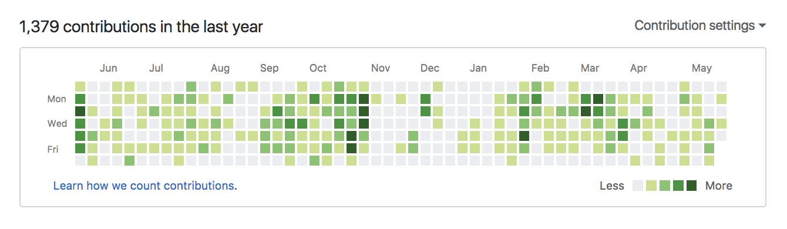

<!-- .slide: class="center" -->

# Data Visualization with the WordPress REST API

<br>

K. Adam White &bull; [@kadamwhite](https://twitter.com/kadamwhite) &bull; [Bocoup](https://bocoup.com)

???

Thank for intro / thank WCEU organizers; last talk, home stretch!

---
<!-- .slide: class="center" -->

# Data Visualization

???

Data Visualization is all around us. Charts, graphs, & interactive graphics bombard us on news websites, analytics dashboards, television programmes, smartphone apps -- "datavis" is everywhere.

We're so immersed in pictures of data that it can be easy to take them for granted, but every chart or graph you see was created by a human to tell a story.

---

(Charles Minard napoleon graphic)

???

Data Visualization itself is a large field with a long history.

It is a particular honor to be giving this talk here in Paris, when so many of the pioneers of visualization are themselves French. I have a few links at the end for any of you who are more curious about the history of this field.

(Can't take time to explain graphic, but it shows temperature, location, and travel over time of Napoleon's army as it invaded Russia in 1812-13) http://patrimoine.enpc.fr/document/ENPC01_Fol_10975?image=54#bibnum

---

(reel of data visualization projects to serve as examples of breadth of field: Lyra, Measurement Lab, Harvard cancer browser)

???

Visualization is one of our specialties at Bocoup, and we've been honored to work on many complex, large-scale data analysis projects. Today I want to share how we can bring the tools and techniques of data visualization to WordPress.

---
(screenshot of Google Analytics and/or Jetpack Analytics)

???

While we may not be aware of data visualization as a specialty of its own, you are probably already familiar with some WordPress-specific applications of datavis, such as the web traffic reports we look at in Jetpack or Google Analytics.

---
(screenshot of Chicago Magazine Obama's Speech emoji visualization? NY Times graphics desk work? https://www.theatlas.com/ (qz.com graphics portal)?)

???

There are also many other news sites that embed interactive graphics into their pieces, such as to explain a news story.

But today we're going to focus on how we can visualize the information already present within our WordPress sites.

---
<!-- .slide: data-background="url('../../2016/wp-as-data-csvconf/images/wp_posts-columns.png')" data-state="solid-bg" -->

???

Because, though we think of WordPress in terms of words, poetry, images, or _content_, that content is of course stored in a database.

And i'd bet that many of us use WordPress for far more than "just blogging," so that database contains a lot of interesting information. Maybe there are things we can learn about even our most "basic" writing by inspecting that content from a different angle.

---
<!-- .slide: class="center" -->

# Content is _Data_

???

Content is data, and data can be visualized.

---

(image of post frequency graphic from Jetpack Analytics -- need a site updated more than my blog is)


???

To see how we can do this ourselves, let's start with another chart you might have seen before: the posting freqency graphic used in Jetpack. it's a variation of the lower graphic, which you may recognize as GitHub's contribution frequency graph.

---

## Getting The Data

(screenshot or text sample of REST API posts endpoint request)

???

Most web data visualization is created using JavaScript, so our first step is to get our data onto the client. Fortunately we have the WordPress REST API to help us.

We're going to get the past year of posts for our site, for all authors. For this example we're going to pull the fields we want from the existing REST API posts endpoint one page at a time, which means we'll be inefficiently transmitting a lot of unnecessary information.

If you are building something like this into your own plugin, I recommend creating a custom endpoint to reveal just the data you need.

(convert to use `rest-filter-response-fields` plugin?)

---

### Page through posts endpoint

(will be replaced by flow diagram)
```js

const now = new Date();
const msInOneYear = 1000 * 60 * 60 * 24 * 365;

function getUpdateAndIterate( request ) {
    request.get().then( ( posts ) => {
        if ( now - new Date( posts.date ) > msInOneYear ) {
            return;
        }
        updateGraphic( posts );
        if ( posts._paging && posts._paging.next ) {
            getAndUpdate( posts._paging.next );
        }
    });
}

getUpdateAndIterate( wp.posts().perPage( 20 ) );
```
<!-- .element class="stretch" -->

???

This isn't a code talk so I'm going to describe what we do rather than show you lines and lines of code, but all the examples we're looking at are up on github and linked from my slides.

We fetch our first page of results -- we'll get 20 posts at a time, which is a good balance between payload transfer size and number of steps.

Each time a page comes back, we'll pass the new data to an update function, then check to see if there's another page of results. If there is, and if we're still within the past year, we'll iterate on to fetch the next page.

---

### Parse the Data

```js
[
    { id: 1178, date: "2017-04-11T20:22:19" },
    { id: 1170, date: "2017-04-02T16:11:42" },
    { id: 1169, date: "2017-04-02T10:41:27" },
    // And so on
]
```
```js
[
    { date: "2017-04-11", count: 1 },
    { date: "2017-04-02", count: 2 },
    // And so on
]
```

???

Using this process we can build up an array of all the posts in the past year. We iterate through that list to create a new array, with only the counts of posts per date.

This is why we'd want to build a new endpoint to get this data -- we've now thrown away almost all of the data the posts endpoints returned to us! But you can use this approach for prototyping on a local install.

---

### Draw the Squares

```html
    <div />
    <div />
    <div />
    <div />

    <!-- ...& 361 more -->
```
Our graphic will be a grid of squares, so we know we'll need to render a square for each day. For this graphic we're just going to use divs, but we'll switch to SVG in the next example.

---

### Our Tools

- [D3.js](https://d3js.org/)

### Resources

- [Bocoup Data Visualization](https://bocoup.com/services/datavis), examples of our work
- [Dashing D3.js](https://www.dashingd3js.com/), tutorials & lessons