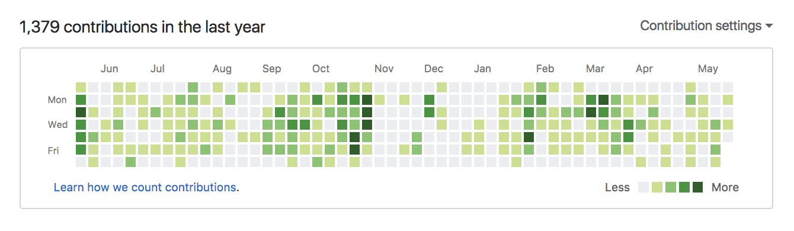

<!-- .slide: class="center" -->

# Data Visualization
### with the WordPress REST API

<br>

K. Adam White &bull; [@kadamwhite](https://twitter.com/kadamwhite)

???

Thank for intro / thank WCEU organizers; last talk, home stretch!

---
<!-- .slide: class="center" data-background="url('./images/wceu-talks-i-want-to-see-joke.png')" data-background-position="canter" data-background-size="cover" -->

???

To kick things off, here's the first data graphic of the talk

As you may or may not know pie charts are the comic sans of datavis, or perhaps the papyrus, but both of those fonts are very approachable, right?

I wanted to make datavis approachable today, so it felt like the most appropriate to represent this dataset.

---
<!-- .slide: class="center" data-background="url('./images/wceu-talks-i-want-to-see-joke-2.png')" data-background-position="canter" data-background-size="cover" -->

???

It's a chart of the talks I've wanted to attend at WCEU, in blue, vs the ones I felt like skipping, in orange

I have never been at a WordCamp with more talks I wanted to attend, the orange slice represents only my own presentation because my only regret today is wish I could also be across the way listening to Michael share his thoughts on design in open source.

Thank you for sticking it out to the end, and thank you for picking this session; so let's talk data!

---
<!-- .slide: class="center" -->

# Data

???

We generally think of WordPress in terms of the things it lets us do -- in terms of publishing, posting, commenting. We think in terms of content. After all, it's a content management system!

We are not usually thinking in terms of data.

---
<!-- .slide: class="center" data-background="url('./images/wp_posts-columns.png')" data-background-position="top" data-background-size="cover" -->

# Data
<!-- .element: class="blackoutline" -->

???

But all that content is of course stored in a database. Today we're going to start with how we get that content out of the database, and in front of our readers.

---
<!-- .slide: class="center full-height" -->

# The Loop

&ldquo;PHP code used by WordPress to display posts.&rdquo;

<div class="attribution"><span>
[codex.wordpress.org/The_Loop](https://codex.wordpress.org/The_Loop)
</span></div>

???

The core of a WordPress theme is The Loop -- that PHP code that lets you iterate through your posts and display them on the page.

But what's actually happening in the loop?

---
<!-- .slide: class="center" -->

`SELECT wp_posts.* FROM wp_posts...`

<div class="center">&darr;&darr;&darr;</div>

`array( $post1, $post2, $post3 );`

<div class="center">&darr;&darr;&darr;</div>

`<div class="post post-1" />`<br>
`<div class="post post-2" />`<br>
`<div class="post post-3" />`

???

We're using WordPress to move our data from a MySQL database into PHP, where we then map it into HTML. This transforms our posts from abstract information to something our readers can read and enjoy.

It's a direct mapping of data to visual representation.

---
<!-- .slide: class="center" -->

## Data-Driven Documents

???

In these terms, most documents on the web are "data-driven": they map some sort of data from a database into some sort of visual representation.

This is usually content: text, words, images; but sometimes we want to communicate information more directly, or convey complex information that would be hard to describe in words or photographs.

---
<!-- .slide: class="center" -->

## Data Visualization

???

Data visualization is the practice of representing complex information visually.

Datavis is all around us: Charts, graphs, and interactive graphics bombard us on news websites, analytics dashboards, television programmes, smartphone apps, and advertisements.

We're so immersed in pictures of data that it can be easy to take them for granted, but every chart or graph you see was created by a human to tell a story.


---
<!-- .slide: class="full-height" data-background="url('./images/minard.png')" data-background-size="contain" data-background-repeat="no-repeat" data-background-position="center center" -->

<div class="attribution"><span>
Charles Joseph Minard, 1869 ([learn more](https://robots.thoughtbot.com/analyzing-minards-visualization-of-napoleons-1812-march))
</span></div>

???

Many different dimensions of information -- such as geographical position, temperature, and so on -- can be embedded into a single graphic.

The field has a long history. It is a particular honor to be giving this talk here in Paris, when many of the pioneers of visualization are themselves French.

(Can't take time to explain graphic, but it shows temperature, location, and travel over time as Napoleon's army invaded Russia in 1812-13) http://patrimoine.enpc.fr/document/ENPC01_Fol_10975?image=54#bibnum

---
<!-- .slide: class="full-height" data-background="url('./images/wpcom-stats-screen.png')" data-background-size="cover" data-background-position="top" -->

<div class="attribution"><span>
WordPress.com Analytics Dashboard, by Automattic
</span></div>

???

We learn to create and read graphs in school, and we reference them daily as we do our jobs. We measure site traffic and sales with one eye on analytics dashboards like those provided by Google or Jetpack.

---
<!-- .slide: class="full-height" data-background-video="./images/bocoup-datavis-syria-settling.mp4" -->

<div class="attribution"><span>
_[This is the life of a Syrian refugee](https://bocoup.com/blog/globalpost-syria-conflict)_, Paul Wood, [GlobalPost, 24 September 2015](https://www.pri.org/stories/2015-09-24/daily-hustle-survive-life-syrian-refugee).<br>
Maps and Graphics by the Bocoup Data Visualization Team.
</span></div>

???

Charts and maps add depth and perspective to articles beyond what can be conveyed in words. They don't tell, they show.

---
<!-- .slide: class="full-height" data-background-video="./images/nytimes-2013-obama-budget-vis.mp4" data-background-size="cover" -->

<div class="attribution"><span>
_[Four Ways to Slice Obama’s 2013 Budget Proposal](http://www.nytimes.com/interactive/2012/02/13/us/politics/2013-budget-proposal-graphic.html)_, Shan Carter, New York Times, February 2012
</span></div>

???

Interactive graphics like those produced by the New York Times and other newspapers and magazines can even become the story themselves.

News interactives like this one let readers explore complex information to understand nuances that might otherwise be missed.

---
<!-- .slide: class="full-height" data-background-video="./images/periscopic-gun-deaths-vis.mp4" data-background-size="contain" -->

<div class="attribution"><span>
_[U.S. Gun Deaths in 2013](http://guns.periscopic.com/?year=2013)_, Periscopic
</span></div>

???

When we read a number like 11,419, we can't picture that in our head. But most of us are used to quantifying information visually.

A good visualization can show us the individuals that make up a statistic.

---
<!-- .slide: class="full-height" data-background-video="./images/bocoup-datavis-hms-lincs.mp4" -->

<div class="attribution"><span>
[LINCS Database Breast Cancer Browser](https://bocoup.com/work/cancer-browser)<br>
Harvard Medical School & Bocoup Data Visualization Team
</span></div>

???

Or in the sciences, where researchers in different groups can produce astronomical amounts of unconnected data, data visualization techniques can be used to build interactive data portals, finding connections in different datasets to improve cancer research

---
<!-- .slide: class="full-height" data-background-video="./images/bocoup-datavis-mlab.mp4" data-background-video-loop="true" -->

<div class="attribution"><span>
[Measurement Lab - Visualizing the Health of the Internet](https://bocoup.com/work/measurement-lab).<br>
M-Lab & Bocoup Data Visualization Team
</span></div>

???

And this scale of data is of course not limited to science. We talk a lot about Big Data, but how can you reason about something you cannot see?

Analytics tools like Tableau can't answer everything; much of the work I did with the Bocoup data visualization team involved building custom interfaces for companies with large-scale data and specific analytics needs.

---

## so, what about
# WordPress?

???

So, WordPress is used for news sites, but news rooms build teams to do this; and enterprise companies hire datavis consultancies like Bocoup. But why are we talking about this at a WordCamp?

Something that really drives me is finding ways to bring the cutting edge of web experiences into WordPress, to make better plugins and products for WordPress developers, authors and users.

So today I want to tell you that it's easy to get started with data visualization and data analysis, and that there is a tremendous opportunity for using these techniques within WordPress.

---
<!-- .slide: data-background="url('./images/wp_posts-columns.png')" data-background-position="top" data-background-size="cover" -->

???

There's a lot of narrative or news-oriented visualizations we could create and embed in our WordPress sites to help tell stories; but since we're sitting on all this data, let's see whether we can make some simple visualizations to better understand our own websites.

And since many of us use WordPress for far more than "just blogging," that database contains a lot of interesting information. Maybe there's opportunities for how we can visualize that, as well.

---

# Content is _Data_

???

Content is data, and data can be visualized.

---

### what data is in
# A Post?

???

To see how we can do this ourselves, let's think about what data is represented by post.

It has a title, some content, an author, categories and taxonomies, and a date.

---
<!-- .slide: class="center" --> 


???

And if we have a date, we already have a numeric value we can start to use.

You may be familiar with the posting frequency graph from Jetpack Analytics, or this GitHub contribution graph. If you have posts by date, you can build visuals to understand how regularly you post.

Regular publishing is important for maintaining a blog or a site, so this type of visual reminder can be very useful.

It's not hard to create a visual like this, but let's start with something simpler.

---
<!-- .slide: data-background="url('./images/demo-post-frequency-by-month.png')" data-background-position="top" data-background-size="contain" data-background-repeat="no-repeat" demo-background-video-loop="true" -->

???

Rather than looking day by day, week by week, let's look at months as a whole. Are we publishing regularly throughout the year?

- Explain Binning
- You could do this in PHP!
- Can just render DOM
- But we're using SVG, scaleable vector graphics

---
<!-- .slide: class="full-height center" data-background-video="./images/demo-post-frequency-animation.mp4" data-background-video-loop="true" data-background-position="top" data-background-size="contain" -->

???

- if you do the rendering with JavaScript instead of PHP, you can animate it
- you can filter the data to see changes
- we can start to compare different years
- This could be expanded into a tool to ensure you maintain an annual rhythm, or to diagnose issues in your calendar. (Jan 2017 gap, for example)
- Could use it as a filter, to begin exploring what you publish in different months -- is that cyclical?

---

# How?

## 1. _Get the Data_
## 2. _Draw the Graphics_

???

There's a lot of power in getting our data into the browser, so that we can work with it in JavaScript.

How do we get the data into JavaScript? The easiest way I know is to use the WordPress REST API.

---

## GET the Data

- GET /wp-json/wp/v2/posts
- GET /wp-json/wp/v2/posts?page=2
- GET /wp-json/wp/v2/posts?page=3
- _&hellip;etcetera?_

???

The easy way to build our dataset is by paging through the posts collection. Step through your posts until you have them all, then bin by date.

We can use jQuery to do this, we can use any AJAX library, we can curl the data and process it locally.

---
<!-- .slide: data-background="url('./images/api-posts-endpoint-full-response.png'" data-background-position="top" data-background-size="cover" -->

### _~50kb <span class="amp">&amp;</span> over 0.5s per page&hellip;?!_
<!-- .element: class="blackoutline" -->

## _We Can Do Better!_
<!-- .element: class="blackoutline" -->

???

But this is SO MUCH INFORMATION we don't need in our graphic. HTTP traffic is expensive. Literally. This JSON is less than a single post's worth of data.

For a WordPress plugin, we cannot assume anything about the internet of the viewer. They could be paying per megabyte. Even in a major US city I've been feeling that phone data plans get less unlimited every year.

Plus it is SLOW to load all of this; you have to wait for many requests to complete.

---

```js
[
    { date: "2017-04-11", count: 1 },
    { date: "2017-04-02", count: 5 },
    { date: "2017-05-21", count: 2 }
    ...
]
```

???

To make a graph like the one I just showed, this is all we actually need. Technically we need even less than this; we just need a count for the month and year. If we send anything extra we're wasting bandwidth, money and time.

---

## Custom Endpoints
### `register_rest_route` _&amp; transients_

???

Writing a custom endpoint to return this data saves almost 2mb and up to 20s per page load.

Most client-side visualizations in WP can and should be driven by custom endpoints.

Use PHP to retrieve and structure your data, then send only what you need to the client.

If the data isn't going to change too quickly, use a transient to cache that value so that the data loads faster.

Using the default endpoints is great for prototyping, but be efficient when you ship something to a production plugin or dashboard.

---

# Drawing the Graphics

???

So we request our custom endpoint. Now we have the data.

How do we draw these graphics?

---
# HTML <span class="amp">&amp;</span> CSS
### _from PHP, React, Vue, you name it&hellip;_

???

Anything that can render HTML can be used to create a visualization, especially one made up of rectangles or lines. CSS can be used to style DOM nodes so that they represent a chart.

And you can use any tool you are comfortable with to render that markup, from the client or the server.

---
# SVG
### _Scaleable Vector Graphics_

???

but for more complex graphics you'll probably need to use SVG.

There's a lot of drawing tools out there, but for data visualization one stands above the rest.

---
<!-- .slide: class="full-height" data-background="url('./images/d3-website.png')" data-background-position="top" data-background-repeat="no-repeat" data-background-size="cover" -->

<div class="attribution"><span>
"Data Driven Documents, or "D3" [d3js.org](https://d3js.org/)
</span></div>

???

The most

---
<!-- .slide: class="full-height" data-background="url('./images/vega-lite-homepage.png')" data-background-size="cover" data-background-repeat="no-repeat"  data-background-position="top" -->

<div class="attribution"><span>
Vega &amp; Vega-Lite, [vega.github.io/vega-lite](https://vega.github.io/vega-lite/)<br>
Arvind Satyanarayan, _[Reactive Building Blocks: Interactive Visualizations with Vega](https://www.youtube.com/watch?v=Y8Fp9z-9DWc)_, OpenVis Conf 2016
</span></div>

???

But of course you don't always have to handle the rendering yourself.

Analysis tools like Tableau or Excel can frequently get you something useful. Writing your own data pipeline and WebGL renderer will only be the best option when you have something big and valuable to analyze.

In the middle, there are an increasing number of tools for
One of them, from a team I've had the pleasure to work with at the University of Washington in the US, is a vizualization grammar called Vega, and its simplified derivative Vega-Lite. These grammars let you build a tool that formats your data into a JSON representation of what a chart should look like -- vega will do the rest.

---
<!-- .slide: class="full-height" data-background="url('./images/vx-gallery.png')" data-background-size="cover" data-background-repeat="no-repeat"  data-background-position="top" -->

<div class="attribution"><span>
REACT + D3 = VX, [vx-demo.now.sh](https://vx-demo.now.sh/)
</span></div>

???

Or for more control, there's many different component libraries for React, Vue or Angular that give you lower-level primitives you can use to draw your charts.

---

### what
## _Other_
### Data is in a Post?

???

Dates, calendars and posting frequency are easy, because they are essentially continuous numeric values.

But there's a lot of other information about our posts that we can visualize.

For one example, a lot of us struggle with how to most effectively use tags and categories. Now that we've heard a little bit about tools like D3, can we visualize those in a useful way?

---
<!-- .slide: class="full-height light-bg" data-background-video="./images/bostock-lesmis-force-directed-graph.mp4" data-background-position="top" data-background-size="cover" -->

### _Networks <span class="amp">&amp;</span> Relationships_
<!-- .element: class="whiteoutline" -->
#### with Force-Directed Graphs
<!-- .element: class="whiteoutline" -->

<div class="attribution"><span>
Mike Bostock, [Force-Directed Graph of Character relationships in _Les Miserables_](https://bl.ocks.org/mbostock/4062045)
</span></div>

???

Network diagrams are great at showing relationships, and D3's force-directed graph layout gives us a tool to simplify computing that kind of layout.

when the network stabilizes, you can usually see interesting groups and relationships... (explain)

The layout itself is a simple physics simulation, where nodes in the graph repel each other while linkages between different nodes attract

---
<!-- .slide: class="full-height" data-background-video="./images/demo-tag-category-force-directed-graph.mp4" data-background-position="top" data-background-size="cover" -->

???

...although it can also show you when you've got a bit of a mess on your hands!

(explain what's going on, and the ways that it is helpful)

Not all visualization options are appropriate for all datasets.

---
<!-- .slide: data-background="url('./images/demo-tag-co-occurrence-matrix.png')" data-background-position="center" data-background-size="contain" data-background-repeat="no-repeat" -->

???

This is the same data, visualized instead with a co-occurrence matrix. Each shaded square represents two tags that coincide on a post, and the darker squares co-occur more often.

Terms with more posts are in the upper right.

More easily than with the network, you can see which topics are broad, like tutorials and web performance articles, and which are more specific.

With the sorting, you can also see which are less common.

---
<!-- .slide: data-background="url('./images/tag-cloud.png')" data-background-position="center" data-background-size="contain" data-background-repeat="no-repeat" -->

???

Finally, I'd be remiss not to talk about one of the very few types of visualization that is actually present in WordPress out of the box: the tag cloud.

---
<!-- .slide: class="full-height" data-background="url('./images/wordcloud-web-applications-count.svg')" data-background-position="center" data-background-size="contain" data-background-repeat="no-repeat" -->

<div class="attribution"><span>
Data courtesy of [Bocoup.com](https://bocoup.com/blog)
</span></div>

???

This word cloud is for the most common web applications category, sized by overall occurrence count

we remove words like "the", "of", and so on -- these are known as "stop words", words that do not have much significance and can be excluded

---
<!-- .slide: class="full-height" data-background="url('./images/wordcloud-web-applications-tf-idf.svg')" data-background-position="center" data-background-size="contain" data-background-repeat="no-repeat" -->

<div class="attribution"><span>
Data courtesy of [Bocoup.com](https://bocoup.com/blog)
</span></div>

???

On the other hand, this word cloud is sized using a text analytics technique called term-frequency-inverse document frequency, or TF-IDF.

---

## _Important Considerations_

???

We're low on time, so I want to leave you with a few things to think about as you begin to explore what data visualization can teach you, or do for your company or product

---
<!-- .slide: class="full-height center light-bg" data-background-video="./images/bocoup-datavis-canvas-performance.mp4" data-background-video-loop="true" data-background-position="top" data-background-size="contain" -->

# Performance
<!-- .element: class="whiteoutline" -->

<div class="attribution"><span>
Yannick Assogba, [Needles, Haystacks, and the Canvas API](https://bocoup.com/blog/2d-picking-in-canvas)
</span></div>


???

DOM and SVG rendering can only get us so far. The browser cannot render thousands of SVG nodes without a little stutter; for smooth animation with thousands of individual datapoints, you need to use the HTML Canvas element for rendering.

---
<!-- .slide: class="full-height center" data-background-video="./images/bocoup-datavis-canvas-animation-dark.mp4" data-background-video-loop="true" data-background-size="cover" -->

## Canvas

<div class="attribution"><span>
Peter Beshai, [Smoothly animate thousands of points with HTML5 Canvas and D3](https://bocoup.com/blog/smoothly-animate-thousands-of-points-with-html5-canvas-and-d3)
</span></div>

???

Canvas is a drawing surface inside the browser. It gives us a lower-level, high performance drawing API that can handle much more complex animations than SVG without breaking a sweat.

For complex charts like large network graphs, or to show thousands of points moving across maps, Canvas is the way to go.

However, things that SVG gives us "for free," like mouse events and selector hierarchy, aren't available -- we get this performance at the expense of simplicity, because actions like selecting a datapoint require more calculations and manual development.

---
<!-- .slide: class="full-height center" data-background-video="./images/pbesh-webgl-animation.mp4" data-background-video-loop="true" data-background-size="cover" -->

## WebGL

<div class="attribution"><span>
Peter Beshai, [Animate Points with WebGL and REGL](http://peterbeshai.com/beautifully-animate-points-with-webgl-and-regl.html)<br>
_see also_ Jim Vallandingham, [An Intro to regl for Data Visualization](http://vallandingham.me/regl_intro.html)<br>
_also see also_ [thebookofshaders.com](https://thebookofshaders.com/)
</span></div>

???

Shaders are complex -- This takes us even further away from the easy-to-read SVG code we saw earlier, but it's the fastest rendering you're going to see in the browser!

[Book of Shaders](https://thebookofshaders.com/) at thebookofshaders.com

Tools like REGL (pronounced "regal"), a REactive WebGL framework, make working with WebGL simpler; Three.js is another popular WebGL library, and I expect we'll continue to see more & more resources pop up to make it easier to get started.

---

# Accessibility

<br>

### Watch: [_Invisible Visualization_](https://www.youtube.com/watch?v=f4P6JsAKrDM)
#### Doug Schepers, OpenVis Conf 2013

???

but Canvas and WebGL are just pictures

Even HTML or SVG visualizations may not contain semantic information

Be mindful of your audience; accessibility is a topic embarrassingly under-discussed in the datavis community, and it's a huge area where we need to improve

(Mention Sonification)

---

# It is Easy
## _to get started_

???

but most importantly, some of the things I've discussed are complex -- but this is a huge field and the basics are simple.

---

### _Learning Resources_

- Blogs: [FlowingData](https://flowingdata.com/), [Dashing D3.js](https://www.dashingd3js.com/), [Bocoup](https://bocoup.com/blog/category/datavis)
- Conferences: [OpenVis Conf](https://openvisconf.com/), [Eyeo Festival](http://eyeofestival.com/), [EuroVis](http://eurovis2017.virvig.es/), [Visualized](http://visualized.com/), [Data Visualization Summit](https://theinnovationenterprise.com/summits/data-visualization-summit-boston-2017), [Strata](https://conferences.oreilly.com/strata), _<span class="amp">&amp;</span> many, many more_
- Tools: [d3js.org](https://d3js.org/), [processing.org](https://processing.org/) <span class="amp">&amp;</span> [p5js.org](https://p5js.org/), [regl.party](http://regl.party/)
- School for Poetic Computation, [sfpc.io](http://sfpc.io/)
- Machine Learning for Artists, [ml4a.github.io](https://ml4a.github.io/)
- (Your blog, by this time next year?)

???

There is a tremendous quantity of good material out there for learning datavis, from blogs like flowingdata, dashingd3, and Bocoup's, to talks & videos from OpenVis conf, eyeo, and other conferences

For the more artistic side of things, check out what people are doing with software art at the school for poetic computation in NY, and similar places around the world -- data art is a real and awesome thing

---
<!-- .slide: class="center" -->

### _WordPress gives us_
# Our Own Data

???

And what better way to start learning than by exploring your own data?

The WordPress REST API matters to me because it is, I believe, the most widespread free and accessible API for accessing your own personal data -- your content, as data -- on the web.

Most of us haven't signed up for a Fitbit developer account or anything like that. It's the first time many of us have had API access to our own data.

---
<!-- .slide: class="center" -->

### _We should_
# Understand It

???

We should be empowering each other to visualize that data, so we can understand it.

You've got to understand that data, understand the process of looking at data and drawing conclusions from it.

Companies are collecting our information constantly every day for their own purposes. This is a rare opportunity we have to gain literacy into how that process works, to increase our own awareness.

Know thyself, and know thy data.

---

<h2 class="has-overlay blackoutline">Thank You WCEU!</h1>

<div class="has-overlay">
Slides: [talks.kadamwhite.com/wceu2017](http://kadamwhite.github.io/talks/2017/wceu)
</div>

<div class="has-overlay">
Code: [github.com/kadamwhite/wceu-datavis](https://github.com/kadamwhite/wceu-datavis)
</div>

<div class="has-overlay">
K. Adam White &bull; [@kadamwhite](https://twitter.com/kadamwhite)
</div>
