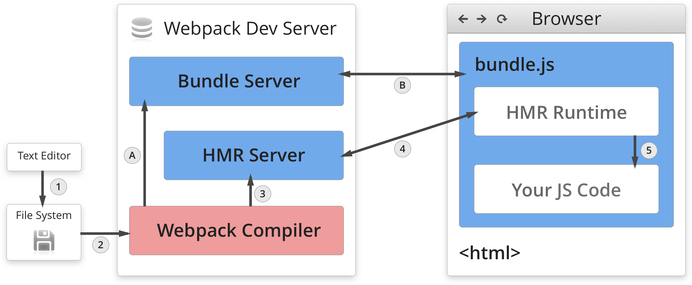

<!-- .slide: class="center" -->

# Better<br>Webpack<br>Builds

<br>

<p>K. Adam White &bull; [@kadamwhite](https://twitter.com/kadamwhite) &bull; [Human Made](http://humanmade.com/)</p>
<!-- .element: class="italic" -->

???

Thank you Tracy, and welcome everybody. I have some stiff competition in this block and I appreciate that you joined me for this session.

---
<!-- .slide: class="full-height" data-background-video="./video/webpack-home-screen-2.mp4" data-background-video-loop="true" data-background-size="contain" -->

???

Why are we still talking about build tools? Really ought to be a solved problem.

Almost the entire front-end dev community supports Webpack in some fashion.

Webpack isn't part of our UI; it isn't a user-facing feature. It's a means to an end, not the end itself. This should be a boring, rote subject.

But we depend on our build systems, and our build systems still take work to maintain.

---
<!-- .slide: class="full-height" data-background="url('./images/grunt.png')" data-background-position="top center" data-background-size="cover" -->

???

We've been through this years ago, with Grunt. Task runners and build tools promise to make our workflows easier, but then we get bogged down in configuration and sink time into tweaking our workflow when we ought to be delivering features.

I had the privilege of working for a number of years with Ben Alman, Grunt's creator, and he often talked about how Grunt was such a time sink that he eventually had to stop working the jQuery packages he'd built Grunt to help him maintain.

We can't let our build tools get the better of us.

---
<!-- .slide: class="full-height light-bg" data-background="url('./images/core-ticket-40894.png')" data-background-position="top center" data-background-size="cover" -->

???

So if we have something that works, we need to be mindful about why we'd want to change. We shouldn't just be adapting Webpack because core has, after this fall's change from Browserify to Webpack.

---
<!-- .slide: class="full-height" data-background="url('./images/browserify.png')" data-background-position="center" data-background-size="cover" -->

???

Browserify is a great tool, after all, and I've seen many WordPress projects that have pretty impressive build systems set up with browserify and gulp. Live reloading, efficient parallelization, we've put a lot of effort into getting things working so that we can get back to the business of making websites.

---
<!-- .slide: class="center" -->

### _We Should_
## Understand<br>Our Tools

???

We should be adopting Webpack for a reason.

This talk is therefore intended to demystify a what webpack is and does, to help give you some concrete reasons to use it in your own projects.

And since it can be hard to make certain parts of Webpack integrate well with themes and plugins, we'll also be sharing ways to leverage Webpack with WordPress specifically.

---
<!-- .slide: class="center" -->

### _`webpack entry.js output.js`_

???

To make the case that Webpack's an improvement on our old build pipelines, let's look at how it works. There are four core concepts described in the webpack documentation, the simplest of which are the _entry_ and the _output_.

Every application has a dependency graph -- we load one module, which loads others, which load still more. An _entry_ is a file Webpack should use as its starting point to build out your code's dependency tree. Webpack understands node-style `require` calls, as well as modern JS imports; it will follow dependencies to find every piece of relevant code.

Once that dependency graph is complete, Webpack then packs the entire set of dependencies into one _output_ file and writes that file to disk.

So far, this is nothing new; we've got a lot of ways to bundle code.

---

_`webpack.config.js`_
```js
module.exports = {
    entry: [ /* One or more files to bundle together */ ],
    
    output: { filename: 'static/js/bundle.js' },
    
    module: {
        rules: [/* loader 1, loader 2, ...etc */],
    },
    plugins: [/* plugin instance 1, plugin instance 2... */],
};
```
<!-- .element: class="stretch" -->

???

But usually you'll be using Webpack with a declarative configuration file, and that config file tells a more interesting story.

The shape of a webpack config object is defined by the complete set of all four of Webpack's core concepts: entry and output of course, but also a list of webpack Loaders to instruct Webpack how to process different types of asset, and a list of Plugins that can customize the build behavior or cause useful build side-effects.

The exported configuration contains different configurations for development and production, a general best practice, but they share this same structure.

---
<!-- .slide: class="full-height" data-background-video="./video/webpack-home-screen-2.mp4" data-background-video-loop="true" data-background-size="contain" -->

???

Loaders and Plugins: that brings us back to that webpack home screen. Look at the dependency tree: assets, scripts, styles, images. More than any bundler before it, Webpack is holistically aware of the entire structure of your application: not just code but styles, even images.

This third core concept of Loaders lets us specify new types of dependencies. Similarly to Browserify's transform system, with loaders we can specify dependencies on CSS, images or templates right within our JavaScript files, and Webpack will know how to process those dependencies to ensure our app works the way we expect.

---
<!-- .slide: class="center" -->

> Loaders enable webpack to process more than just JavaScript files (webpack itself only understands JavaScript). They give you the ability to leverage webpack's bundling capabilities for all kinds of files by converting them to valid modules that webpack can process.

_https://webpack.js.org/concepts/_

???

Loaders are what lets Webpack process modern JS syntax with Babel, precompile templates, or convert preprocessor styles into CSS. They're responsible for inlining small images into your stylesheets, and exporting bigger ones to your build directory.

It took me a while to get my head around this, so let's clarify: when we load something with Webpack what we're doing is not converting everything into JavaScript, per se. We're instead wrapping those assets in a JS shell that tells Webpack how to transform the data, what information about the asset to share with the app, and where to put the asset on disk when we output our code bundle.

---
<!-- .slide: class="center" -->

### _A Webpack Loader's view of_

## `create-react-app`

???

To make this more concrete, let's think like Webpack and try to puzzle through bundling a basic JavaScript file.

We'll use the output of Facebook's Create React App scaffolding tool as our baseline example here; nothing about Webpack is React-specific, but the two tools go together well, and Create React App is widespread enough to serve as a good proxy for a standard configuration.

---

```
├── package.json
├── public
│   ├── favicon.ico
│   ├── index.html
│   └── manifest.json
├── README.md
└── src
    ├── App.css
    ├── App.js
    ├── App.test.js
    ├── index.css
    ├── index.js
    ├── logo.svg
    └── registerServiceWorker.js
```
<!-- .element: class="stretch" -->

???

When we generate a project with Create React App, it uses a webpack config hidden inside the node_modules folder. All we have in our application directory is our sourcecode and package.json. But we can run an "eject" command to bake all that configuration to disk, and this ejected copy is the source of the snippets I'll be sharing as we walk through the app.

---

```js
import React, { Component } from 'react';
import logo from './logo.svg';
import './App.css';

class App extends Component {
  render() {
    return (
      <div className="App">
        <header className="App-header">
          
          <h1 className="App-title">Welcome to React</h1>
        </header>
        <p className="App-intro">
          To get started, edit <code>src/App.js<\/code> and save to reload.
        </p>
      </div>
    );
  }
}

export default App;
```
<!-- .element: class="stretch small" -->

???

Create React App outputs a React project with a single custom component, called App.

---

```js
import React, { Component } from 'react';
import logo from './logo.svg';
import './App.css';

class App extends Component {
    render() {
        return (
            
        );
    }
}

export default App;
```
<!-- .element: class="stretch" -->

???

We can ignore most of the code in this file, since we're going to focus on the imports.

---
<!-- .slide: class="center" -->

#### `import React, { Component } from 'react';`

???

The first line in our App.js is also the easiest for us to imagine: we're used to requiring one JS file from another. The modern JS syntax may be new to some of you, but all we're doing here is requiring the react module and creating local references to React and its Component constructor.

---

```js
    {
        test: /\.(js|jsx|mjs)$/,
        enforce: 'pre',
        use: [
            require.resolve('eslint-loader'),
        ],
        include: paths.appSrc,
    },
```

???

So what loaders in our file are we hitting?

The first loader in our config is an eslint-loader. a loader contains a test rule which lets it match against specific file extensions, since loaders are usually file-type-specific.

the "use" or "loader" parameter links to the loader that should be used for the matched file types.

They also have include and exclude arguments, though; in this case, the eslint loader only includes first-party code. Since React is a third-party dependency, we don't waste time linting it. Only our own files will trigger lint errors.

---

```js
    // Process JS with Babel.
    {
        test: /\.(js|jsx|mjs)$/,
        include: paths.appSrc,
        loader: require.resolve('babel-loader'),
    },
```

???

Similarly, further down the list the only other JS-specific rule is our babel-loader, which lets us use modern JS syntax in our application.

The App.js file we're looking at would match this rule, and App.js is itself processed with Babel. But React is excluded here too, since again we only apply this loader to our own code. So in the end, we don't apply any loaders to React, and webpack loads it as normal.

---
<!-- .slide: class="center" -->

#### `import logo from './logo.svg';`

???

Well, maybe the next import call will be more interesting. Ah, this is unusual: we're importing an SVG file!

---

```js
    // "url" loader works like "file" loader except that it embeds assets
    // smaller than specified limit in bytes as data URLs to avoid requests.
    // A missing `test` is equivalent to a match.
    {
        test: [/\.bmp$/, /\.gif$/, /\.jpe?g$/, /\.png$/],
        loader: require.resolve('url-loader'),
        options: {
            limit: 10000,
            name: 'static/media/[name].[hash:8].[ext]',
        },
    },
```

???

First we check the file against url-loader's rule. `url-loader` is designed to inline small files, for example to bake small image sprites into your CSS as base64 data. This can be a useful technique for decreasing the number of http requests your app requires, and it's supported out of the box in create-react-app projects.

However, since this is an SVG file, it won't match against the url-loader definition -- the test restricts it to raster images.

---

```
    {
        // Exclude `js` files to keep "css" loader working as it injects
        // it's runtime that would otherwise processed through "file" loader.
        // Also exclude `html` and `json` extensions so they get processed
        // by webpacks internal loaders.
        exclude: [/\.js$/, /\.html$/, /\.json$/],
        loader: require.resolve('file-loader'),
        options: {
            name: 'static/media/[name].[hash:8].[ext]',
        },
    },
```

???

next we'll try the SVG against the last loader in the chain, the `file-loader`. This is a fallback designed to catch non-code assets which don't match other loaders: since they are required from our code, they have to be emitted into the output directory, and file-loader makes that happen.

---

```
import logo from './logo.svg';

export default() =>  (
    
);
```

means,

Copy `logo.svg` to `build/static/media/logo.5d5d9eef.svg`
```
export default() =>  (
    
);
```

???

Since file-loader will append a hash to a filename to help with cache-busting, we won't know exactly where that file may end up when writing our code. For that reason Webpack's file loader returns the path to where the file will be found for use in JavaScript.

So saying "import logo" isn't just copying it to our build directory, it's maintaining the link between where that file is on disk and where it is used in the code.

Since it's a code dependency, removing the logo causes a build error!

---
<!-- .slide: class="center" -->

#### `import './App.css';`

???

Finally, we'll look at the last import statement, for App.css.

---

```
{
    test: /\.css$/,
    use: [
        require.resolve('style-loader'),
        {
            loader: require.resolve('css-loader'),
            options: { importLoaders: 1, },
        },
        {
            loader: require.resolve('postcss-loader'),
            options: {
                ident: 'postcss',
                plugins: () => [
                    require('postcss-flexbugs-fixes'),
                    autoprefixer({ /* ... */ }),
                ],
            },
        },
    ],
},
```
<!-- .element: class="small stretch" -->

??? Unlike the other examples above, CSS files are processed by a chain of loaders, applied from bottom to top.

---

```js
{
    loader: require.resolve('postcss-loader'),
    options: {
        ident: 'postcss',
        plugins: () => [
            require('postcss-flexbugs-fixes'),
            autoprefixer({
                browsers: [
                    '>1%', 'last 4 versions', 'not ie < 9'
                ],
                flexbox: 'no-2009',
            }),
        ],
    },
},
```
<!-- .element: class="stretch" -->

???

First, the CSS is passed through postcss-loader, where it receives flexbug fixes and auto-prefixing.

---

```js
{
    loader: require.resolve('css-loader'),
    options: {
        importLoaders: 1,
    },
},
```

???

Then, it's passed to css-loader. We don't have any in this example, but Webpack uses css-loader to scan the stylesheet for any CSS imports or `url` calls to external images, then resolves those references recursively with css-loader, url-loader or file-loader, as appropriate.

---

```js
require.resolve('style-loader'),
```

???

Finally, once Webpack has assembled a string representing the entire, processed CSS stylesheet, Webpack's `style-loader` will be used to inject those styles into our document. In the static build we'd use the ExtractTextWebpackPlugin to peel this out into an external css file, instead.

---
<!-- .slide: class="full-height" data-background="url('./images/webpack-concepts.png')" data-background-position="center" data-background-size="cover" -->

???

To review the major Webpack concepts we've touched on, we have Entry, Output, Loaders -- and, finally, plugins.

---
<!-- .slide: class="full-height light-bg" data-background="url('./images/webpack-plugins.png')" data-background-position="top" data-background-size="cover" -->

???

We won't dig into plugins in the same depth, because we need to move on, but the plugin interface is extremely powerful and there are plugins for minification, optimization, environment variable manipulation, index file generation, you name it.

And it's when you combine loaders and plugins together that Webpack becomes demonstrably more powerful than previous bundling systems.


--

`raw-loader`: A loader for webpack that lets you import files as a string.

```
module.exports = function(content) {
    return 'module.exports = ' + JSON.stringify(content);
};
```

Try writing your own loaders:

- Loader API Documentation, [webpack.js.org/api/loaders](https://webpack.js.org/api/loaders/)
- _A Simple Loader_, [bocoup.com/blog/webpack-a-simple-loader](https://bocoup.com/blog/webpack-a-simple-loader)

???

This hopefully clarifies a bit about how loaders get applied. They're powerful, but they don't have to be complex; a module like raw-loader (which reads a file in as a string) is only a handful of lines of code.

This means that they actually aren't hard to write, if you find yourself looking for a type of transformation or file information that isn't already available; I'd recommend reading both the loader documentation, as well as this article by my friend Z on writing a simple loader to parse Markdown.

---
<!-- .slide: class="full-height light-bg" data-background="url('./images/gutenberg-npm-run-build-output.png')" data-background-position="top" data-background-size="cover" -->

???

It's also important to remember that CSS and images loaded by webpack will never end up in your production JS bundle,

So before we get to the really fun stuff I should warn that it's easy with any module bundler to end up with a huge JS file. There's tricks to speed up rebuilds or break your code apart into chunks, but sometimes our code has dependencies, and our dependencies have dependencies, and suddenly our entire disk is node_modules and our bundles are gargantuan.

If you've worked on a sufficiently large front-end application you've probably noticed that the size of our javascript bundles can get pretty large.

As developers we have a good sense of our own code, but as JS developers in particular we depend pretty heavily on NPM modules. These can be black boxes, and can pretty significantly increase our bundle size.

Fortunately we have some great tools at our disposal to help us understand where the bloat is coming from.

---

## Export Stats

```
webpack --json > stats.json
```

To use any of these tools we first need to take advantage of Webpack's stats module.

---

## Webpack Visualizer

https://chrisbateman.github.io/webpack-visualizer/

_or_

`npm install webpack-visualizer-plugin`

---
<!-- .slide: class="full-height" data-background-video="./video/webpack-visualizer-demo.mp4" data-background-size="contain" -->

???

(say somethign about video)

---

## Webpack Bundle Analyzer

`npm install -g webpack-bundle-analyzer`

---
<!-- .slide: class="full-height" data-background-video="./video/webpack-bundle-analyzer-treemap.mp4" data-background-size="contain" -->

???

Explain the difference between the two.
---
<!-- .slide: class="full-height light-bg" data-background="url('./images/webpack-hmr.png')" data-background-position="top" data-background-size="cover" -->

???

These tools can be used standalone or integrated with Webpack as plugins, but they're not the most exciting thing Webpack can do for us.

Because all of this information Webpack has as it is creating your application bundle enables a powerful technique called Hot Module Reloading.

This lets us dynamically replace our source code the same way single page apps let us load in new content, and we can adjust styles, markup & component code almost as quickly from our editors as we could from the browser dev tools.

---

<small>From [_Understanding Webpack HMR_](https://www.andrewhfarmer.com/understanding-hmr/) by Andrew H Farmer</small>

???

Webpack has a companion library called the webpack-dev-server. This utility runs a Node.js Express server on your computer that is aware of Webpack rebuilds.

The browser receives the code from the dev server when you load your app, but it also makes a websocket connection. Webpack uses this connection to alert the browser that a component has changed; the client can then load in that file's updated source code and swap it out live within your page, or trigger a full reload if it cannot be swapped.

---
<!-- .slide: class="full-height" data-background="url('./images/webpack-into-wp.png')" data-background-position="center" data-background-size="cover" -->

???

This hot reloading is usually cited as Webpack's killer feature.

It's also hard to get it working with WordPress.

In the time we have left, we're going to walk through how we can get hot reloading running in our themes and plugins!

---

```
create-react-app cra-wcus-demo
```
???
We'll again be using `create-react-app` to create our sample theme.

(the npx command lets you execute a package's command-line utility without installing it globally; it will pull down the latest release temporarily just to run the command. This is convenient for boilerplate or scaffolding tools like create-react-app that you won't have to run too often.)

---
  

```md
[master][kadam@wcus:/vm/content/themes/cra-wcus-demo]
[12:35:53] $ npm run eject

> cra-wcus-demo@0.1.0 eject /vm/content/themes/cra-wcus-demo
> react-scripts eject

? Are you sure you want to eject?
This action is permanent. (y/N) _
```

???

Next, in our installed project directory we will run `eject` to write all the configuration to disk, letting us edit our project boilerplate. We have to be able to edit the configuration files directly in order to properly integrate them 

---

_`style.css`_

```css
/*
Theme Name: WCUS Webpack Demo
Description: A barebones example of using Create React App
             in a WordPress theme.
Version: 1.0.0
Text Domain: crademo
*/
/* This CSS file is a stub used to allow theme activation,
and should not be edited directly. */

```

???

We'll add an empty `style.css` in that folder so WP considers it a theme,

---

_`index.php`_
```php
<!doctype html>
<html <?php language_attributes(); ?>>
<head>
    <meta charset="<?php bloginfo( 'charset' ); ?>">
    <?php wp_head(); ?>
</head>
<body <?php body_class(); ?>>
    <!-- React App root element: -->
    <div id="root" class="site-content"></div>
</div>
<?php wp_footer(); ?>
</body>
</html>
```
<!-- .element class="stretch" -->

???
And we'll add an absolute bair-bones `index.php` so that the theme can render.
For now the index will just contain a `<div id="root"></div>` in which to render our React app. Routing and proper server rendering of a React app is another talk. Or conference.

---
<!-- .slide: class="full-height" data-background="url('./images/installed-theme.png')" data-background-position="top left" data-background-size="cover" -->

???

Looks great! 

With our boilerplate set up, let's figue out how to get our app running.

---
<!-- .slide: class="full-height" data-background-video="./video/npm-run-build.mp4" data-background-size="contain" -->

???

We'll cut the dev server out of things to start and just look at the compiled bundle. `npm run build` takes the application and bakes it into a static set of JS and CSS files.

---
<!-- .slide: class="full-height" data-background="url('./images/tree-build.png')" data-background-position="top left" data-background-size="cover" -->

???

We get some expected things, like a main JS and CSS bundle, and sourcemaps, as well as a service worker and its manifest file. But we also get an asset manifest.

---

_`build/asset-manifest.json`_
```json
{
  "main.css": "static/css/main.c17080f1.css",
  "main.css.map": "static/css/main.c17080f1.css.map",
  "main.js": "static/js/main.fd0901f1.js",
  "main.js.map": "static/js/main.fd0901f1.js.map",
  "static/media/logo.svg": "static/media/logo.5d5d9eef.svg"
}
```

???

This asset manifest describes all of the assets emitted by Webpack. This is awesome, because PHP can read and parse JSON files! Instead of hard-coding a path for our script enqueues, we'll look for the asset-manifest in our build folder and load that.

---

_`config/webpack.config.prod.js`_
```js
    // Generate a manifest file which contains a mapping
    // of all asset filenames to their corresponding output
    // file so that tools can pick it up without having to
    // parse `index.html`.
    new ManifestPlugin({
      fileName: 'asset-manifest.json',
    }),
```

???

The manifest is generated by an instance of the ManifestPlugin, specified in the production webpack config. The plugins in that file are also responsible for minification, setting React into production mode, 

---

1. Read & parse JSON file
```php
    $manifest_path = get_stylesheet_directory()             
        . '/build/asset-manifest.json';

    $asset_list = array_values(
        json_decode(
            file_get_contents( $manifest_path ),
            true
        )
    );
```
2. Iterate through list; enqueue any JS and CSS you find!

???

We read & parse the JSON to get a list of the files to enqueue,
then check each one to see if it ends in JS or CSS, and enqueue appropriately.

Now our theme will load, and the script will render! But we could have done that by renaming the files and writing our own enqueue script call.

For the fun part, let's move on to the dev server.

---
<!-- .slide: class="center" -->

## `npm start`

???

If you run `npm start` when using CRA it starts a webpack dev server on an open port, so your application is accessible at e.g. `localhost:3000`.

No files are written to disk; everything is served from memory. This means fast rebuilds, but nothing we can get to from PHP. Thinking back to that asset list, it said in the config that it's designed to let external code get access to the script assets without parsing index.html, but PHP can't even see index.html in this case without making an HTTP request. that'd be too inefficient.

---

_`webpack.dev.config.js`_
```diff
 const paths = require('./paths');
 
 // Webpack uses `publicPath` to determine where the app is being served from.
-// In development, we always serve from the root. This makes config easier.
-const publicPath = '/';
+// In development, we always serve from the root of the dev
+// server. This makes it easy for WordPress to find the files.
+const publicPath = 'http://localhost:3000/';

```

???

We have to find some way for WordPress to know where to look for the scripts. First, we declare a consistent location and port for Webpack to use when serving files. We'll change the `publicPath` from the root `/` to the domain `http://localhost:3000/`, so that the bundle will know to look for its assets and files on the dev server and not on disk when we load it in from WP.

---

_`webpack.dev.config.js`_
```diff
plugins: [
+    new ManifestPlugin({
+        basePath: publicPath,
+        fileName: 'asset-manifest.json',
+        writeToFileEmit: true,
+    }),
     // Makes some environment variables available in index.html.
     new InterpolateHtmlPlugin(env.raw),
     // Generates an `index.html` file with the <script> injected.
     new HtmlWebpackPlugin({
         inject: true,
         template: paths.appHtml,
     }),
```
<!-- .element: class="stretch" -->

???

Since WordPress is going to handle rendering the HTML shell, we can replace the HTMLWebpackPlugin instance with another instance of ManifestPlugin -- which helpfully takes a configuration option to force it to write to disk even when a dev server is running!

We add the basePath option, too, so that we'll see the URL in the output.

---

_Dev server's `asset-manifest.json`_
```json
{
  "http://localhost:3000/main.js":
    "http://localhost:3000/static/js/bundle.js",
  "http://localhost:3000/main.js.map":
    "http://localhost:3000/static/js/bundle.js.map",
  "http://localhost:3000/static/media/logo.svg":
    "http://localhost:3000/static/media/logo.5d5d9eef.svg"
}
```

???

The manfiest that this writes out to disk now has the complete paths to the JS bundle. (Note that there's no CSS file -- this is because the JS bundle handles injecting the CSS in dev mode.)

We can injest this file directly from WordPress by hard-coding an enqueue to add it, if it's present. That'll load our script into WordPress, but we'll get some errors.

---

_Replace `react-dev-utils/webpackHotDevClient`_

```diff
-    // Note: instead of the default WebpackDevServer client, we use a custom one
-    // to bring better experience for Create React App users. You can replace
-    // the line below with these two lines if you prefer the stock client:
-    // require.resolve('webpack-dev-server/client') + '?/',
-    // require.resolve('webpack/hot/dev-server'),
-    require.resolve('react-dev-utils/webpackHotDevClient'),
+    require.resolve('webpack-dev-server/client') +
+        '?http://localhost:3000/',
+    require.resolve('webpack/hot/dev-server'),
     // Finally, this is your app's code:

```

See [facebookincubator/create-react-app#1588](https://github.com/facebookincubator/create-react-app/pull/1588)

???

One of the files you'll see in the Webpack entry array that gets included in our build is a module called `webpackHotDevClient` that's provided by CRA. It's a useful utility but it doesn't support binding the hot reload socket connection on a different domain.

The default Webpack one doesn't have a nice error overlay, but it lets you pass in the desired host and port as a require call query parameter. So we swap that out.

There's an outstanding ticket on the create-react-app repo to support binding to a socket that doesn't match `window.location`.

---

_`config/webpackDevServerConfig.js`_
```diff
diff --git config/webpackDevServer.config.js config/webpackDevServer.config.js
index 9fa49b7..89e9bdf 100644
     https: protocol === 'https',
     host: host,
+    headers: {
+      'Access-Control-Allow-Origin': '*',
+    },
     overlay: false,
     historyApiFallback: {
       // Paths with dots should still use the history fallback.
```

???

Hopefully this gets fixed, but until then we can use this alternative: just remember to also alter the dev server configuration to allow cross-origin requests.

---
_`scripts/start.js`_
```diff
      clearConsole();
    }
    console.log(chalk.cyan('Starting the development server...\n'));
-   openBrowser(urls.localUrlForBrowser);
  });
 
  ['SIGINT', 'SIGTERM'].forEach(function(sig) {
    process.on(sig, function() {
+     // Remove the asset manifest file on server termination
+     fs.unlinkSync( process.cwd() + '/asset-manifest.json' );
      devServer.close();
      process.exit();
    });
```
<!-- .element: class="stretch" -->

???

We're almost good to go, but we wouldn't want our theme to look for the dev server when it isn't running. To avoid that we'll remove the dev server's asset manifest whenever the server quits, so we can error out or fall back to the built files depending on preference.

---
<!-- .slide: class="center" -->

#### _`npm install --save react-hot-loader`_

???

The final step for hot reloading, at least with Webpack's default hot reloading client, is to install the react-hot-loader. This is a good refresher, since it touches most parts of Webpack.

---

```diff
   entry: [
     // We ship a few polyfills by default:
     require.resolve('./polyfills'),
+    // Support react-hot-loader
+    'react-hot-loader/patch',
     // Include an alternative client for WebpackDevServer. A client's job is to

```


???

First, we add 'react-hot-loader/patch' to our entry file array. This means it goes into the main bundle that webpack emits.

---

_`config/webpack.config.dev.js`_
```diff
  module: {
    strictExportPresence: true,
    rules: [
          // Process JS with Babel.
          {
            test: /\.(js|jsx|mjs)$/,
            include: paths.appSrc,
            loader: require.resolve('babel-loader'),
            options: {
               // Caching results for faster rebuilds.
               cacheDirectory: true,
+
+              "plugins": [ 'react-hot-loader/babel' ],
             },
           },
           // "postcss" loader applies autoprefixer to our CSS.
```
<!-- .element: class="stretch" -->

???

We add the react-hot-loader babel plugin to the configuration for our babel loader, so that as Webpack processes ES modules Babel will decorate them with the metadata needed to reload in the browser.

---

```diff
 import React from 'react';
 import ReactDOM from 'react-dom';
+import { AppContainer } from 'react-hot-loader';
 import App from './App';
 
-ReactDOM.render(<App />, document.getElementById('root'));
+const render = Component => ReactDOM.render(
+    <AppContainer><Component /></AppContainer>,
+    document.getElementById('root')
+);
+render(App);
+
+// Webpack Hot Module Replacement API
+if (module.hot) {
+  module.hot.accept('./App', () => { render(App); });
+}
```
<!-- .element: class="stretch" -->

???

And finally, at the root of our app in index.js we need to set up our base React component to accept hot updates. All these setup steps are explained in the react-hot-loader documentation.

---
<!-- .slide: class="full-height" data-background-video="./video/hot-reloading-demo.mp4" data-background-size="contain" -->

???

Whew! That was a lot. But with all that in place, if we start the dev server and load our WP theme, we now have hot reloading in place!

---

### _Surely there's an easier way&hellip;_

???

It's important to know how to go through those steps, because on a complex project you're likely going to want SASS, or code splitting, or any of the other things you can only do with Webpack if you have full control over the configuration.

But tools like create-react-app were designed to achieve that goal I mentioned at the start, of giving us a build layer that just works for basic use-cases, and a dev server we don't have to think about.

---
<!-- .slide: class="full-height" data-background="url('./images/react-wp-scripts.png')" data-background-position="top" data-background-size="cover" -->

???

As we build more and more React projects on top of WordPress, we've been thinking about this goal, and I'm excited to announce that we released a brand-new project earlier this week designed to help.

---
<!-- .slide: class="full-height" data-background-video="./video/react-wp-scripts-demo.mp4" data-background-size="contain" -->

???

`react-wp-scripts` is designed to work with create-react-app without ejecting; it wraps the scripts used within create-react-app projects to do all of these things we've discussed for you.

---
<!-- .slide: class="full-height" data-background="url('./images/react-wp-scripts.png')" data-background-position="top" data-background-size="cover" -->

???

It's an early experiment, but I think there's a lot we as a community can do to support each other as we find ways to integrate these tools into our workflows.

WordPress isn't getting any less-JavaScript heavy, and tools like Webpack -- once we get them set up right -- will make it much easier for us to iterate, experiment, and build the applications that will keep WordPress relevant for a new generation of writers and readers.

---
<!-- .slide: class="center" -->

## Thank You WCUS!

Slides: [talks.kadamwhite.com/wcus2017](http://kadamwhite.github.io/talks/2017/wcus)

~

[github.com/humanmade/**react-wp-scripts**](https://github.com/humanmade/react-wp-scripts)

[github.com/kadamwhite/**wcus-webpack-theme**](https://github.com/kadamwhite/wcus-webpack-theme)
</div>

~

<p>K. Adam White &bull; [@kadamwhite](https://twitter.com/kadamwhite) &bull; [Human Made](http://humanmade.com/)</p>
<!-- .element: class="italic" -->

---

need chapters -- need the opportunity to take things in
it's technical, give people the ability to feel like they're able to follow along, even if you 
cut from the beginning

build up to the goal of "how do I do this in WP" more; the intro should be a ski jump

Time yourself to treat the start as a lightning talk

With the code examples, when doing the video, record the video at half-screen size

websocket explanation is not clear -- need diagrams
use --save, not -S

When you finish writing, just leave it on the screen for a bit, so people can read
-- hold for a second or two before pressing 

Two talks in one -- if people aren't native to webpack, what is happening in it, and why should they care. And the other talk is, now you know it, how do we make it easy to use.
Pick which one matters the most, and spend the most time there -- and have the other be bonus.