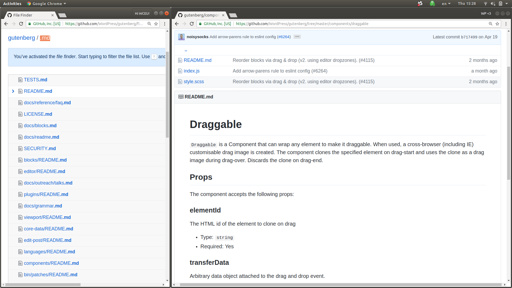

# <small>What We</small> Forget To Test

 

K. Adam White &bull; <a href="https://twitter.com/kadamwhite">@kadamwhite</a> &bull; 

<!-- .element: class="italic" -->

???

Thank you!

OK. "What we forget to test."

---

_Rejected Alternative Titles:_

### Write Your Process Down

### How To Raise Your Markdown Files

### Docs-Driven Development

### README (Or Else)

???

That's probably not the best title, in retrospect; we forget to test a lot of things.

This talk has evolved somewhat since I proposed it, but in short, I'm here to argue that we spend too much time talking about code.

---

## Programming <small>Is Not The Hard Part</small>

???

Coding is fun, but it's not the hard part of software developent.

It's not easy, sure!

But we have the best tools for programming that have ever existed in the history of the web.

---

### Team Communication
### Context Switching
### Project Handoff
### Documentation
### Code Review
### Bug Reports
### Onboarding

???

No, the hard part's everything we do _in between_ the small periods when we're writing code. These other challenges we face on every project.

There's no unit tests for team communication; no linting for pull request discussions or onboarding instructions.

But what we CAN do is look at the documentation we leave ourselves to help with these processes.

And that's what I'm going to talk about today.

---
<!-- .slide: data-background="images/example-bad-pr.png" data-background-position="center top" -->

## <small>What Makes A</small> Good PR?
<!-- .element: class="align-right blackoutline" -->

???

This talk occurred to me when I was asked to review a Pull Request.

The code was great. But I was frustrated, because the PR description was only useful to the developer who opened it.

I'm glad the code tested, and that it passes lint. But as a reviewer I could have answered both questions by looking at the code and CI results.

Without any description, it doesn't tell me what's being addressed.

It doesn't tell me what to test or how to test it.

---

### A &ldquo;Good&rdquo; PR Description should

- Summarize the issue being addressed
- Link to the acceptance criteria or requirements
- Contain screenshots of before/after changes, or gifs showing interaction
- Explain any unusual design decisions
- List specific testing instructions as needed

???

If we don't know what the code is intended to do, we have to read it twice: once to figure out what it's trying to do, and once to determine if the solution is good.

A written explanation lets us skip that first pass and dive into the code better prepared. Better team communication saves everybody time; leaving things out just introduces back and forth, which can take days in a team distributed across time zones.

Fleshing out PR's this much may feel like it's a waste of your time, but you're asking your colleagues to do the harder part: to stop what they are doing, and try to understand your code.

---

## Context Switching <small>Humans Are Not Good At It</small>

_Leave instructions to help your team pick up where you left off!_
<!-- .element: class="fragment" -->

???

If you're doing code review, you're stepping into somebody else's thought process. It's a context switch.

Context switching and multitasking are things we as humans are not good at. I myself am extremely bad at multi-tasking. I get really distracted when I try to switch tasks.

(advance!) Take an extra five minutes when you're opening a PR to give your teammates as much help as possible, and it'll be easier for them to dig in quickly. That means switching takes less time, and we can get back to coding faster.

---
<!-- .slide: data-background="images/gutenberg-pr-template.png" data-background-position="center bottom" -->

???

How do we ensure we actually do this? We leave ourselves instructions, right in the PR description window.

We can use GitHub's PR templates to document our process and remind us of the communication quality standards that we have for ourselves and our teammates.

By putting markdown files in a `.github` folder at the top of our project, we can control what our collaborators see when we open pull requests or issues, and include project-specific instructions.

---
<!-- .slide: data-background-position="center top" data-background-image="images/gutenberg-issue-template.png" -->

???

This is Gutenberg's issue template, which reminds bug reporters to include what they expected to happen, specifics about what went wrong, and steps to reproduce a bug.

Issue and pull request templates also let you use HTML comments which are hidden in the final output, but which help ensure that the ticket is thorough.

---

## Don't Make Your Colleagues Guess

_(It will help you, too)_

???

Without templates we often get vague issues, because even with best of intentions we're usually in a hurry and don't want to take the time to go into detail.

But if I write a vague issue and come back to it after three sprints or so, I'm toast. Where do I start? I have to reassemble everything I knew about the problem before I can get back to where I was when I opened the ticket. Why not just write it down in the first place?

I'm a firm believer in putting as much detail and supporting material into tickets as possible. Putting in the time to write a good issue leaves me an on-ramp I can use to get back up to speed.

---
<!-- .slide: data-background-position="center top" data-background-image="images/gutenberg-pr-template-detail.png" -->

???

_Especially_ with open source projects, more detail is better. Your potential collaborators won't know how best to help you unless you tell them. And look at projects like Gutenberg — it works!

---

### Write Your Process Down

???

Documented process makes a healthy team. Writing things down doesn't mean you lose flexibility -- These templates don't mean you have to fill out every section for every ticket.

What it DOES is reduce ambiguity.

Documented processes remind us to respect our colleagues' time as we would our own, by being specific and direct. They let us hold our team process to a common standard.

---

## Colocated Documentation

???

Templates have a visible impact on team behavior because they're right there. they're inescapable.

The proximity of the _documentation_ to the _task_ is important. You may know the saying, "out of sight, out of mind" -- if it takes too long to look up how to do something or how something works, that documentation is worthless.

This is why I'm such a fan of markdown files, not because they're the best encapsulation for documentation but because they fit well into our existing code repositories.

---

# README.md

- What Is This For?
- How Do You Use It?
- How Can I Run It Locally?
- Where Are The Docs?

???

The humble README is a great example. This is an incredibly important document within your repository. A README is your project's landing page and cover letter.

A good readme has the responsibility to

- Tell you what a project is and is for, concisely and clearly;
- Tell you in brief how use the project;
- Provide or link to directions for running the project locally; and
- Provide or link to more comprehensive documentation.

---
<!-- .slide: data-background-position="center top" data-background="images/redux-readme.png" -->

### What Is This For?
<!-- .element: class="align-right blackoutline" -->

???

I like README's like Redux's, which contain everything but the kitchen sink: not just a brief blurb on what Redux is and why you should use it,

---
<!-- .slide: data-background-position="center top" data-background="images/redux-readme-philosophy.png" -->

### Project Philosophy
<!-- .element: class="align-right blackoutline" -->

???

but also a philosophy statement,

---
<!-- .slide: data-background-position="center top" data-background="images/redux-readme-the-gist.png" -->

### Usage Overview
<!-- .element: class="align-right blackoutline" -->

???

a "the gist" quick-start guide,

---
<!-- .slide: data-background-position="center top" data-background="images/redux-readme-tutorials-docs.png" -->

### Learning Resources & Comprehensive Docs
<!-- .element: class="align-right blackoutline" -->

???

links to comprehensive documentation and a _copious_ set of examples and tutorials, including blog posts, video guides, and sample apps,

---
<!-- .slide: data-background-position="center top" data-background="images/redux-readme-before-proceeding.png" -->

### When Should I   _Not_ Use This?
<!-- .element: class="align-right blackoutline" -->

???

and (my favorite), a prominant section about when Redux might NOT be the best choice for a project!

---

## Tailor To The Task

???

That's obviously a lot of different types of content, but it's appropriate to a project like Redux that defines an architectural pattern you'd be using throughout your codebase. A JS module will require different types of documentation than a feature plugin or a client site.

---
<!-- .slide: data-background-position="center top" data-background="images/hm-website-setup.png" -->

???

The READMEs for our projects at Human Made will focus on defining team roles & responsibilities and how to set up the project for local development. It's the first point of entry if we need to hand the project off within our company, or onboard a new contributor from a client's team.

Within Human Made we actually have a README generator tool to ensure a new client project kicks off with all the baseline documentation already in place.

---
<!-- .slide: data-background-video="images/gutenberg-readme-overview.webm" -->

???

Gutenberg's readme, by contrast, emphasizes the project's goals, philosophy and roadmap. These make for an equally good introduction, given the different intent of the project.

The README doesn't have to do everything: setup and development workflow steps are shifted into some specific other files.

---

## CONTRIBUTING.md: <small>What Do I Need To Know?</small>

- Code of Conduct
- Community & Behavioural Expectactions
- Development Dependencies
- Workflows & Guidelines
- Chain of Command
- Release Process

???

One of these is CONTRIBUTING.md, a standard file name where you can put everything that a developer will need in order to dive into the project.

This includes technical information like local development environment setup instructions, but also information about project management, team roles and leadership hierarchies, workflows, and behavioral expectations.

---
<!-- .slide: data-background-position="right center" data-background="images/gutenberg-contributing-callout.png" -->

???

CONTRIBUTING.md can be supplemented with a CODE_OF_CONDUCT.md, and if either is present in your repository then GitHub will direct people to it when they open an issue or a PR.

Just like with issue templates, this puts a link to the documentation right where it will be of most use to the person who needs it -- GitHub does a great job with this, in my opinion.

---

### Encourage Contributions!
<!-- .element: class="align-center" -->

> <small>Thank you for thinking about contributing to WordPress' Gutenberg project! If you're unsure of anything, know that you're <strong>100%</strong> welcome to submit an issue or pull request on any topic. The worst that can happen is that you'll be politely directed to the best location to ask your question, or to change something in your pull request. We appreciate any sort of contribution, and don't want a wall of rules to get in the way of that.</small>

???

I think one nice thing the Gutenberg team does here is that they open their CONTRIBUTING file with a welcoming message that encourages participation. It's important to remember that contributing to open source can feel really hard or intimidating, so do what you can to make people feel comfortable asking questions.

And please, please be nice when you close off-topic issues!

---

## Local Markdown Documentation

???

All of these files we've discussed are project-level, but we're not limited to just those files for which GitHub has special handling.

The WordPress REST API, Redux, Gutenberg, all of these projects don't just use markdown files for repository workflow guides; the user-facing documentation content itself is authored as markdown files, often right there in the same repository alongside the code.

---

???

In a modular project, you can also scatter READMEs and other files throughout your repository tree to explain how each module works!

This is something else that Gutenberg does to good effect.

When nested within individual module folders in your codebase not only will the README text be picked up when you browse to that folder in Github, but it can also be integrated in tools like React Styleguidist and Storybook.

---

## Documentation-Driven Development

???

If your docs are kept next to your code in the same repository, you can easily update the docs when you update the code — or you can go even further, and write the docs first.

My fellow core contributor and colleague at Human Made Joe McGill has described how he has seen features begin as a text file in an empty directory. 

That file contains architectural notes on the challenges and how the team expects to approach them, and it lives as part of the project while they write the code around it.

In the end, that markdown file becomes the readme for the new functionality.

---

## <small>You Don't Need To Use</small> Markdown Files

Wikis can be OK, too! Just write things down _somewhere_.

???

Nothing we've discussed today is GitHub specific or Markdown specific.

If you want to encourage contribution from team members without write access or if you need to coordinate one set of docs across multiple repositories, a wiki may be a better choice.

Or you can write your docs in a CMS, like we do with the WordPress handbooks -- although I will note the Gutenberg and REST API handbooks are now sync'd from Markdown files, which makes managing contributions easier IMO.

---

## Take The Time <small style="font-style: italic;">to write things down</small>
<!-- .element: class="align-center" -->

## Take The Time <small style="font-style: italic;">to keep docs updated</small>
<!-- .element: class="align-center" -->

???

Documentation doesn't happen unless you make time for it. What we've discussed today is the tip of the iceberg of the benefits of writing and maintaining granular design and workflow documentation right alongside your code

I hope you will give it a try, and that together we'll continue to find new best practices to build into our tools and share with each other.

---

# Thank You, <small style="font-size: 0.55em">WordCamp Europe!</small>
<!-- .element: class="align-center" -->

Slides: [talks.kadamwhite.com/wceu2018](http://kadamwhite.github.io/talks/2018/wceu)

<!-- .element: class="align-center" -->

K. Adam White &bull; [@kadamwhite](https://twitter.com/kadamwhite)

<!-- .element: class="align-center" -->

<!-- .element: class="align-center" -->