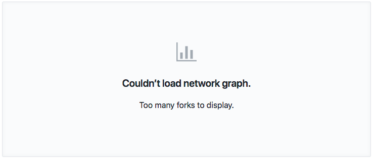

# WordPress is JavaScript
<!-- .element: class="montserrat" -->

<hr>

K. Adam White &bull; [@KAdamWhite](https://twitter.com/kadamwhite)


???

Thank you `____`, and thank you Empire for having me today. As `____` said, my name is K Adam White, you can call me KAdam.

---


???

[Demographics]

To start, I think it's important to acknowledge that the title of my talk is a lie. It's clickbait at best.

---

### WordPress isn&rsquo;t JavaScript&hellip;

???

WordPress is a 15-year-old PHP blogging application.

---

|                     |                 |
| ------------------- | --------------- |
| Internet Explorer 7 | October 2006    |
| jQuery              | August 2006     |
| YUI Library         | February 2006   |
| Ruby on Rails       | December 2005   |
| Acid2 Test          | April 2005      |
| dōjō toolkit        | March 2005      |
| prototype.js        | February 2005   |
| Gmail               | April 2004      |
| _**WordPress**_ <!-- .element: class="baskerville" -->     | _**May 2003**_ <!-- .element: class="baskerville" --> |

???

This makes sense, because WordPress dates from a time before the modern concept of a JavaScript web app even existed. All of the libraries Kelly mentioned in the presentation before this had yet to be created.

---


???

What WordPress _is_ is an application (and community of developers and writers surrounding it) that has grown and evolved alongside the web platform.

Grew to almost a third of all websites

Like the web, gradual evolution: no major rewrite. There is still pre-WP code.
Nothing stays the same

--

### WordPress[.org]

> <small>Community-lead free <span class="amp">&amp;</span> open-source content management system created by Matt Mullenweg & Mike Little in 2003 by forking b2/cafelog, **which you may download, install <span class="amp">&amp;</span> run on any server**.</small>

### WordPress.com

> <small>A free (with optional paid upgrades) WordPress website hosting service run by Automattic, the company founded and run by Matt Mullenweg.</small>

???

I'm going to say WordPress a lot over the next 25 minutes, so let's clear up some definitions.

--

### WordPress Foundation

> <small>A charitable organization founded to further the mission of the WordPress open source project: to **democratize publishing** through Open Source, GPL software, and to ensure WordPress remains a **stable platform for web publishing for generations to come**.</small>

---

# <small>The History of</small> JavaScript in WordPress

???

What I will share with you today is the history of how WordPress has weaved its way in and out of the JS community. There's been JS in WP since day one, and despite the overall reputation WordPress has for being old, from a JS standpoint we've done a better job of staying current than people often realize.

---

### jQuery 


Since January 2007

???

WordPress's inclusion of jQuery in early 2007 exposed a whole generation of web developers to the beginnings of modern JavaScript, myself included.

---

### Backbone


Since August 2012

???

---
<!-- .slide: class="full-height" data-background-video="images/customizer-theme-preview_hd.mp4" data-background-size="contain" -->

???

A live-preview theme Customizer was introduced in 2012 as part of WordPress 3.4 "Grant Green"

See http://confreaks.tv/videos/jqcon2012-frame-juggling-building-a-live-preview

---
<!-- .slide: class="full-height" data-background="images/wordpress-3-5-media-library.png" data-background-size="contain" -->

???

Also written by Daryl Koopersmith, a new Backbone-driven Media Library front-end was added to WordPress in version 3.5 "Elvin Jones", released December 2012

---

### admin-ajax.php

```js
// since 2.8 window.ajaxurl points to admin-ajax.php
jQuery.post( ajaxurl, {
    'action': 'my_action',
}, ( response ) => {
    alert( 'Got this from the server: ' + response );
} );
```

???

The interesting thing...

---

## &ldquo;The WordPress Way&rdquo;

???

First-to-market issues

Used to a particular facade over a black box

---
<!-- .slide: data-state="solid-bg light-bg" -->


---
<!-- .slide: data-background="url('../../2016/wp-node-feelingrestful/images/2014-project-wp-data-flow.svg')" data-background-size="cover" data-background-position="center center" data-background-repeat="no-repeat" data-state="solid-bg light-bg" -->

???

We did some stuff

---
<!-- .slide: data-background="url('../../2016/wp-node-feelingrestful/images/2014-project-architecture.svg')" data-background-size="cover" data-background-position="center center" data-background-repeat="no-repeat" data-state="solid-bg light-bg" -->

???

We did some stuff

---

# <small>What does the</small> WordPress<br><span style="font-size: 0.6em;">of the</span> Future <small>look like?</small>

---


<!-- .element: style="width: 40%;" -->

[wordpress.org/gutenberg](https://wordpress.org/gutenberg/)

---
<!-- .slide: data-background="url('images/gutenberg.png')" data-background-size="cover" data-background-position="center top" data-background-repeat="no-repeat" -->

---

### WordPress&hellip; is not just about websites. It’s about freedom, about possibility, and about carving out your own livelihood

<br>

<small>_~ Matt Mullenweg, [We Called It Gutenberg For A Reason](https://ma.tt/2017/08/we-called-it-gutenberg-for-a-reason/)_</small>

???

Gutenberg is technically complex, but ideologically it is about going back to basics: what are we trying to build with WordPress? what is the goal?

---

## <small>&ldquo;Users will be able to build</small> the sites they see in their imaginations&rdquo;

<br>

<small>_~ Matt Mullenweg, [We Called It Gutenberg For A Reason](https://ma.tt/2017/08/we-called-it-gutenberg-for-a-reason/)_</small>

---
<!-- .slide: data-background="images/gutenberg-insert-block-2-1.gif" data-background-position="center top" data-background-size="contain" -->

---

## &ldquo;make writing rich<br>&nbsp;&nbsp;&nbsp;posts effortless&rdquo;

<br>

<small>_~ Matias Ventura, [New Editor Technical Overview](https://make.wordpress.org/core/2017/01/17/editor-technical-overview/)_</small>

---

### &ldquo;standard, portable&hellip;<br>modern technologies&hellip;<br>a common set of<br>code <span class="amp">&amp;</span> concepts&rdquo;

<br>

<small>_~ Matt Mullenweg, [We Called It Gutenberg For A Reason](https://ma.tt/2017/08/we-called-it-gutenberg-for-a-reason/)_</small>

???

That meant JS. And that was a big change.

---

### What Defines a
# WordPress &nbsp;Developer?

???

For all this advancement, for all that the community was beginning to get excited about the possibilities of these new APIs and JavaScript frameworks, the average WordPress developer was (and is) still somebody primarily confident in HTML, CSS, maybe jQuery.

---

# &ldquo;Learn&nbsp;&nbsp;<br>JavaScript<br>&nbsp;&nbsp;Deeply&rdquo;

<br>

<small>_~ Matt Mullenweg, ["State of the Word"](https://www.youtube.com/watch?v=KrZx4IY1IgU), December 2015_</small>

---

# WordPress <small>_is for_</small> Learners

---

<!-- .element: class="inline-logo" -->
<!-- .element: class="inline-logo" -->
<!-- .element: class="inline-logo" -->

???

Every new technology we add to something like WP makes it harder to learn how to develop for the platform, and they also set the tone for what will be used afterwards.

---


???

We do all this by being mindful of the effect our decisions have. In WP 4.4 we added responsive image handling with `srcset` to WP core. The percentages on the Y axes may be small, but you can see the day that version was released in this Chrome Platform graph of how many pages use `srcset`

---
<!-- .slide: data-background="../../2016/wp-node-feelingrestful/images/calypso-site-screenshot.png" data-background-position="center top" data-background-size="contain" -->

???

React was already in heavy use within Automattic, and they were using it on WordPress.com, in their Jetpack plugin, and in their standalone Electron-app editor called Calypso.

Human Made, 10up and the other major WP client services companies were using React heavily. It was a de facto standard.

---

<!-- .element: class="inline-logo" -->

???

But it had that patent clause issue.

---

**September 14, 2017**


_~ Matt Mullenweg, [On React and WordPress](https://ma.tt/2017/09/on-react-and-wordpress/)_

???

Apache foundation announced they couldn't accept it

A year ago this week, Matt announced WordPress could not either

---

**September 22, 2017**


A year ago _this_ week, React announced they were re-licensing, and WordPress adopted it

The sentiment in the community was one of relief. As much as I'd liked to have been able to explore Vue personally, React brings major benefits

---

## Democratize Publishing

???

---

### _We Have Created_
## Abstractions

---

## <small>How Do You</small> Define a Block?

---

```js
import './style.scss';

const { createElement } = wp.element;
const { registerBlockType } = wp.blocks;
const { __ } = wp.i18n;

registerBlockType( 'empirejs/welcome', {
    title: __('Hello Banner'),

    description: __('Display a banner message.'),

    icon: 'media-text',

    category: 'layout',

    save() {
        return (
            <div className="hello-banner">
                <h2 class="hello-banner__message">
                    Hello, EmpireJS!
                </h2>
            </div>
        );
    },
} );
```
<!-- .element: class="stretch" -->

---
<!-- .slide: data-background="images/block-demo-render-only.png" data-background-position="center top" data-background-size="cover" -->"

---

```js
    attributes: {
        content: {
            source: 'children',
            selector: '.hello-banner__message',
        },
    },

    edit( { attributes, setAttributes } ) {
        return (
            <div className="hello-banner">
                <RichText
                    className="hello-banner__message"
                    tagName="h2"
                    value={ attributes.content }
                    onChange={ content => setAttributes( { content } ) }
                    placeholder={ __( 'Message...', 'artefact' ) }
                    keepPlaceholderOnFocus={ true }
                />
            </div>
        );
    },

    save( { attributes } ) {
        return (
            <div className="hello-banner">
                <RichText.Content
                    className="hello-banner__content"
                    tagName="h2"
                    value={ attributes.content }
                />
                <p>Learn more at <a href="http://empirejs.org">empirejs.org</a></p>
            </div>
        );
    },
```
<!-- .element: class="stretch" -->

---
<!-- .slide: data-background="images/block-demo-richtext.png" data-background-position="center top" data-background-size="cover" -->"

---
<!-- .slide: data-background="images/block-demo-frontend.png" data-background-position="center top" data-background-size="cover" -->"

---

# <small style="font-size: 0.6em;">_Under the Hood:_</small> Defensive Abstraction

---

```js
save() {
    return (
        <p>Learn more at <a href="http://empirejs.org">empirejs.org</a></p>
    );
},
```
&darr; &darr; &darr;
```js
const el = wp.element.createElement;

save() {
    return el( 'p', null,
        'Learn more at ',
        el( 'a ', { href: "http://empirejs.org" }, 'empirejs.org' )
    );
},
```

---

### npm install @wordpress/data
```js
import { withSelect } from '@wordpress/data';

export default withSelect( ( select ) => ( {
    date:     select( 'core/editor' )
                .getEditedPostAttribute( 'date' ),

    modified: select( 'core/editor' )
                .getEditedPostAttribute( 'modified' ),

    status:   select( 'core/editor' )
                .getEditedPostAttribute( 'status' ),

} )( PostScheduleLabel );
```
<!-- .element: class="stretch" -->

???

https://www.npmjs.com/package/@wordpress/data#comparison-with-redux

---

## Not-Invented-Here <small>_vs_</small> Mindful Abstraction

???

Cannot control the environment, and need to solve different problems react and redux don't usually face

How do you coordinate dozens of plugins which all want to share the same store?

---


<!-- .element: style="width: 40%;" -->

[wordpress.org/gutenberg](https://wordpress.org/gutenberg/)

???

So that's Gutenberg.

---

## More To Be Done

- Docs! So, so many more docs pages must be written
- Community Standards <span class="amp">&amp;</span> Boilerplates
- Hot-reloading quick-start kits <span class="amp">&amp;</span> other dev tools

???

We have a nascent WP-specific JS ecosystem
More to be done

---

## Will It Be Successful?

???

We have no idea. there's been pushback. But I'm not concerned

---



---

### WordPress cannot stay in its bubble.<br>It must rub against other bubbles, vigorously.

<br>

<small>_~ John Maeda, Global Head, Computational Design and Inclusion at Automattic_</small>

???

As John Maeda, a leading designer who serves as the the Global Head of Computational Design and Inclusion at Automattic, put it, creativity comes from juxtapositions.

We have deeply ingrained ways of thinking about WordPress. We need outside input to keep us objective, and to make sure we make the best decisions we can.

---
<!-- .slide: data-background="images/wordcamp-central.png" data-background-position="center top" data-background-size="cover" -->

## Come Join Us!&nbsp;
<!-- .element: class="whitebg" -->

---

#### `community.addEventListener( 'clique' )`

???

The JS community is wonderful. But even -- perhaps especially -- in a city as diverse as NYC, it can be really cliquey and feel like an in-crowd. We need to self-police

Imposter syndrome

---

## Some Things Have Gone Very Well

---

<!-- .element: class="inline-logo" -->
<!-- .element: class="inline-logo" -->
<!-- .element: class="inline-logo" -->

---

### _Educators Have_
## Stepped Up

---

# Backwards Compatibility

<hr>

#### Move Fast, _Don&rsquo;t_ Break Things

???

Backbone and jQuery endure to this day because they're not moving targets.

There's a time and a place for going fast and breaking things. But if you don't, people have time to learn how things work, and your market share grows. Don't pull the rug out from under somebody for no reason.

---

# Documentation

<hr>

#### Write <em>Much</em> More Than You Think You Need

#### Write It Imagining Your Past Self

#### Link To It From Everywhere

---

# <small style="font-size: 0.4em;">&ldquo;The Divide between the<br>WP <span class="amp">&amp;</span> JS Communities is</small> Completely Manufactured

<small>~ _Mika Epstein, WordPress Plugins Team_</small>

???

Our community is not a programming language. our community is the web, and the people on it, with all their goals, hopes, dreams and ambitions.

---

## <small>_Global Perspectives on_</small> Internationalization, Accessibility, Diversity, Usability&hellip;

---

## _&ldquo;We / You&rdquo;_ &rarr; &ldquo;Us&rdquo;

???

And I could not be more excited to figure this out together.

(democratize software)

---

# <span class="montserrat">Thank You,</span> <small style="font-size: 0.55em">EmpireJS!</small>

<hr>

[wordpress.org/gutenberg](https://wordpress.org/gutenberg) &bull; [chat.wordpress.org](https://chat.wordpress.org)

Slides: [talks.kadamwhite.com/wp-is-js](http://kadamwhite.github.io/talks/2018/wp-is-js)


K. Adam White &bull; [@kadamwhite](https://twitter.com/kadamwhite)


???

Thank you for having me, Empire!
