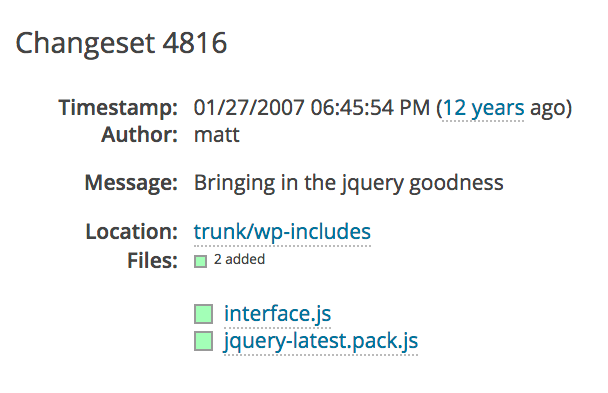
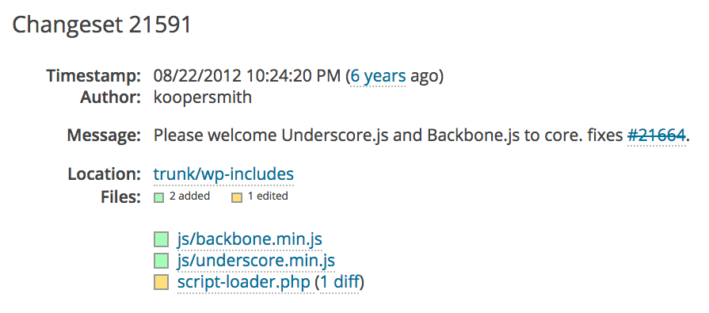
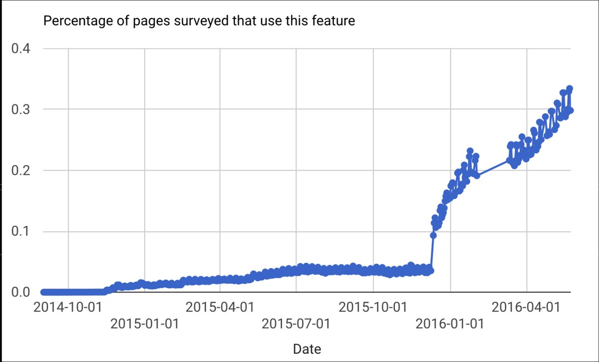
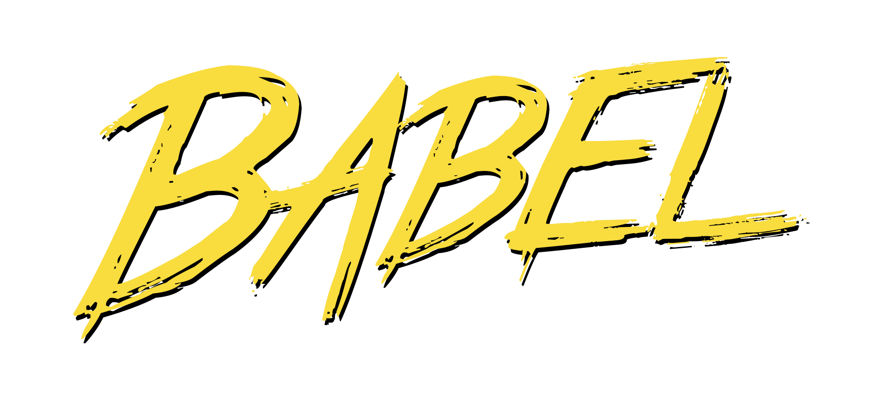
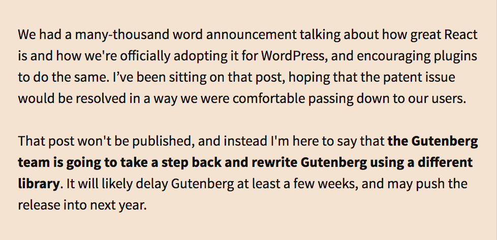
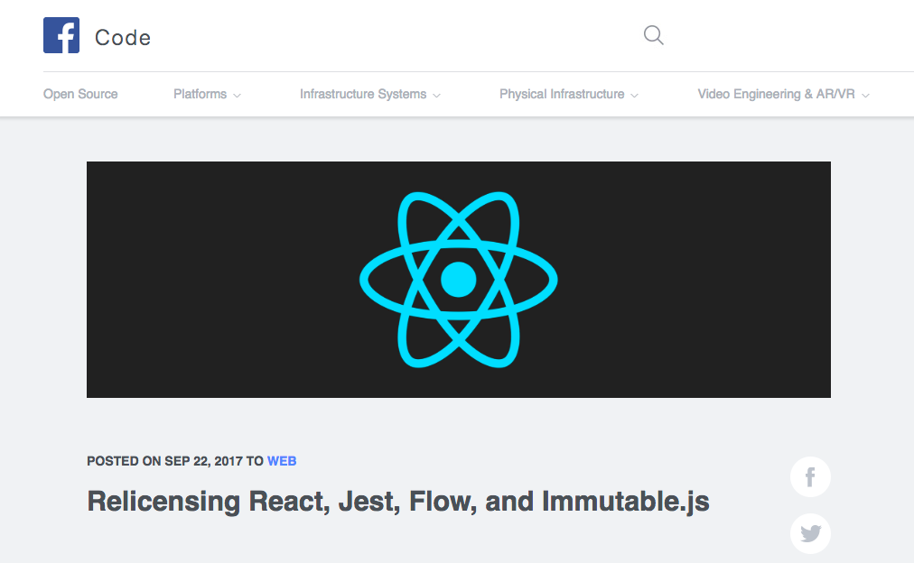

# WordPress is JavaScript
<!-- .element: class="montserrat" -->

<hr>

K. Adam White &bull; [@KAdamWhite](https://twitter.com/kadamwhite)


???

Thank you `____`, and thank you Empire for having me today. As `____` said, my name is K Adam White, you can call me KAdam.

To start, I think it's important to acknowledge that the title of my talk is a lie. It's clickbait at best.

---

### WordPress isn&rsquo;t JavaScript&hellip;

???

WordPress is a 15-year-old PHP blogging application.

---

|                     |                 |
| ------------------- | --------------- |
| Internet Explorer 7 | October 2006    |
| jQuery              | August 2006     |
| YUI Library         | February 2006   |
| Ruby on Rails       | December 2005   |
| Acid2 Test          | April 2005      |
| dōjō toolkit        | March 2005      |
| prototype.js        | February 2005   |
| Gmail               | April 2004      |
| _**WordPress**_ <!-- .element: class="baskerville" -->     | _**May 2003**_ <!-- .element: class="baskerville" --> |

???

This makes sense, because WordPress dates from a time before the modern concept of a JavaScript web app even existed. All of the libraries Kelly mentioned in the presentation before this had yet to be created.

---


???

What WordPress _is_ is an application (and community of developers and writers surrounding it) that has grown and evolved alongside the web platform.

Grew to almost a third of all websites
Nothing stays the same
No major rewrite

---

### jQuery 



Since January 2007

---

### Backbone



Since August 2012

???

---

### admin-ajax.php

```js
// since 2.8 window.ajaxurl points to admin-ajax.php
jQuery.post( ajaxurl, {
    'action': 'my_action',
}, ( response ) => {
    alert( 'Got this from the server: ' + response );
} );
```

--

```php
<?php

add_action( 'wp_ajax_', function() {
    echo JSON

    wp_die(); // this is required to terminate immediately and return a proper response
}
```

---
<!-- .slide: data-state="solid-bg light-bg" -->


---
<!-- .slide: data-background="url('../../2016/wp-node-feelingrestful/images/2014-project-wp-data-flow.svg')" data-background-size="cover" data-background-position="center center" data-background-repeat="no-repeat" data-state="solid-bg light-bg" -->

???

We did some stuff

---
<!-- .slide: data-background="url('../../2016/wp-node-feelingrestful/images/2014-project-architecture.svg')" data-background-size="cover" data-background-position="center center" data-background-repeat="no-repeat" data-state="solid-bg light-bg" -->

???

We did some stuff

---

### What Defines a
# WordPress &nbsp;Developer?

???

But for all this advancement, for all that the community was beginning to get excited about the possibilities of these new APIs and JavaScript frameworks, the average WordPress developer was (and is) still somebody primarily confident in HTML, CSS, maybe jQuery.

---

# <small>What does the</small> WordPress<br><span style="font-size: 0.6em;">of the</span> Future <small>look like?</small>

---

## <small>&ldquo;Users will be able to build</small> the sites they see in their imaginations&rdquo;

<br>

<small>_~ Matt Mullenweg, [We Called It Gutenberg For A Reason](https://ma.tt/2017/08/we-called-it-gutenberg-for-a-reason/)_</small>

---

## &ldquo;make writing rich<br>&nbsp;&nbsp;&nbsp;posts effortless&rdquo;

<br>

<small>_~ Matias Ventura, [New Editor Technical Overview](https://make.wordpress.org/core/2017/01/17/editor-technical-overview/)_</small>

---

### &ldquo;standard, portable&hellip;<br>modern technologies&hellip;<br>use a common set of<br>code <span class="amp">&amp;</span> concepts&rdquo;

<br>

<small>_~ Matt Mullenweg, [We Called It Gutenberg For A Reason](https://ma.tt/2017/08/we-called-it-gutenberg-for-a-reason/)_</small>

---

# &ldquo;Learn&nbsp;&nbsp;<br>JavaScript<br>&nbsp;&nbsp;Deeply&rdquo;

<br>

<small>_~ Matt Mullenweg, ["State of the Word"](https://www.youtube.com/watch?v=KrZx4IY1IgU), December 2015_</small>

---



???

We do all this by being mindful of the effect our decisions have. In WP 4.4 we added responsive image handling with `srcset` to WP core. The percentages on the Y axes may be small, but you can see the day that version was released in this Chrome Platform graph of how many pages use `srcset`

---

<!-- .element: class="inline-logo" -->
<!-- .element: class="inline-logo" -->
<!-- .element: class="inline-logo" -->

???

Every new technology we add to something like WP makes it harder to learn how to develop for the platform, and they also set the tone for what will be used afterwards.

---
<!-- .slide: data-background="../../2016/wp-node-feelingrestful/images/calypso-site-screenshot.png" data-background-position="center top" data-background-size="contain" -->

???

React was already in heavy use within Automattic, and they were using it on WordPress.com, in their Jetpack plugin, and in their standalone Electron-app editor called Calypso.

Human Made, 10up and the other major WP client services companies were using React heavily. It was a de facto standard.

---

<!-- .element: class="inline-logo" -->

???

But it had that patent clause issue.

---

**September 14, 2017**



_~ Matt Mullenweg, [On React and WordPress](https://ma.tt/2017/09/on-react-and-wordpress/)_

???

Apache foundation announced they couldn't accept it

A year ago this week, Matt announced WordPress could not either

---

**September 22, 2017**


A year ago _this_ week, WordPress adopted it

---

> React has the biggest open source JavaScript ecosystem and support behind it. It has the job market, it has the most components, most active maintainers&hellip;
>
> A WordPress developer who wants to stay up to date and learn new things can now start learning React.

~ _Ahmad Awais_

???

The sentiment in the community was one of relief. As much as I'd liked to have been able to explore Vue personally, React brings major benefits

---

# Gutenberg

[wordpress.org/gutenberg](https://wordpress.org/gutenberg/)

---

### WordPress has always been about websites, but it’s not just about websites. It’s about freedom, about possibility, and about carving out your own livelihood

<br>

<small>_~ Matt Mullenweg, [We Called It Gutenberg For A Reason](https://ma.tt/2017/08/we-called-it-gutenberg-for-a-reason/)_</small>

???

Gutenberg is technically complex, but ideologically it is about going back to basics: what are we trying to build with WordPress? what is the goal?

---

## Democratize Publishing

---

### WordPress cannot stay in its bubble.<br>It must rub against other bubbles, vigorously.

<br>

<small>_~ John Maeda, Global Head, Computational Design and Inclusion at Automattic_</small>

???

As John Maeda, a leading designer who serves as the the Global Head of Computational Design and Inclusion at Automattic, put it, creativity comes from juxtapositions.

We have deeply ingrained ways of thinking about WordPress. We need outside input to keep us objective, and to make sure we make the best decisions we can.

---

Gutenberg demo

---

## What Has Worked?

---

### _Educators Have_
## Stepped Up

---

# Backwards Compatibility

<hr>

#### Move Fast, _Don&rsquo;t_ Break Things

---

### @wordpress/data
```js
import { withSelect } from '@wordpress/data';

export default withSelect( ( select ) => ( {
    date:     select( 'core/editor' )
                .getEditedPostAttribute( 'date' ),

    modified: select( 'core/editor' )
                .getEditedPostAttribute( 'modified' ),

    status:   select( 'core/editor' )
                .getEditedPostAttribute( 'status' ),

} )( PostScheduleLabel );
```
<!-- .element: class="stretch" -->

---

# Documentation

<hr>

#### Write <em>Much</em> More Than You Think You Need

#### Write It Imagining Your Past Self

#### Link To It From Your README _and Homepage!_

---

## Will It Be Successful?

---


---

# Thank You, <small style="font-size: 0.55em">EmpireJS!</small>
<!-- .element: class="montserrat" -->

<hr>

Slides: [talks.kadamwhite.com/wp-is-js](http://kadamwhite.github.io/talks/2018/wp-is-js)


K. Adam White &bull; [@kadamwhite](https://twitter.com/kadamwhite)


???

Thank you for having me, Empire!
