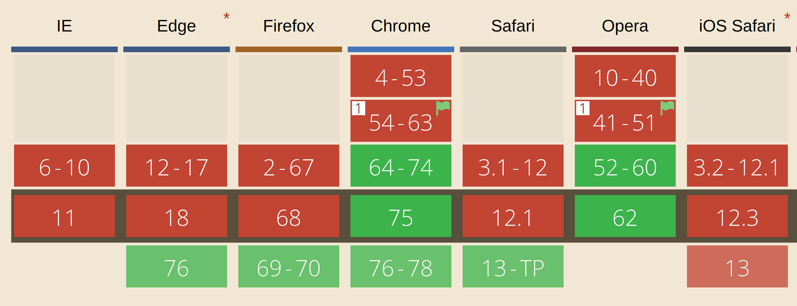

# Responsive Blocks
<!-- .element: class="montserrat" -->

<hr>

K. Adam White &bull; [@KAdamWhite](https://twitter.com/kadamwhite)


???

(If intro'd, thank you)
(else,) I'm K Adam White -- you can call me KAdam. I'm a senior engineer and team lead at Human Made, an enterprise WordPress digital experience consultancy. I came up from New York this weekend to get away from the heat, and I'm really excited to share some fun responsive design techniques with you all this morning.

---

# Thank You, WordCamp Boston

???

Before we get into it, a round of applause for WordCamp Boston -- 10 years!

I lived in Somerville until last year, and I owe my career to the Boston WordPress community. I started attending the local meetup right after moving here, and it's an incredibly welcoming group. I gave my first talk on this same stage at WCBos 2011, and I never expected to still be here eight years later, speaking to you as a senior engineer and core committer -- it's a wonderful event and a fantastic community, and I'm extremely grateful to everybody in this room and everybody who makes this event happen.

So, I challenge you all. What do you have to share? Everybody in the room knows a topic well enough to present at a meetup or WordCamp. It can be an amazing opportunity to meet people and maybe even make something of a name for yoruself. There's no pressure to speak if you don't want to, but if you do, and don't know how to start, try applying to WordCamp next year. I look forward to learning from you all.

---

### _let's talk_
# Responsive Design

???

So what's this talk about? At its core, it's about responsive design. We're all likely familiar with RD but let's think back to its beginnings, to Ethan Marcotte's pivotal article 

---

### 🎊

### _`@media( min-width: 40em ) {}`_

### 🎉

???

No web technology evolves in just one place, but if Boston has one major claim to internet fame I think it's how this city's programmers and designers popularized responsive design. From the high-profile launch of the new Boston Globe site, to the community resources and tools from Filament Group and others, and more recently the work by other locals such as Mat Marquis around responsive images, we began to advocate for the web we wanted to use.

Responsive design as we usually understand it is about adapting our experiences to the window or device we're using to browse. We can use the size and orientation of the viewport to present different layouts to our visitors, because what's usable on a widescreen desktop isn't as useful crammed onto a tiny phone screen. (Even if phones are huge now)

The media query is an amazing invention, and the way we've used it to move towards mobile-first responsive design has made the web a better, more usable and beautiful place.

---
<!-- .slide: class="full-height" data-background="images/latest-posts-block.png" data-background-size="cover" -->

???

but the media query doesn't solve everything. Our designs these days are component- or block-based; we create a site by arranging discrete units of content. If we take a list of recent posts, media queries let us style it to break out to a wider layout at larger screen sizes. This works great for a full-screen component, but what if we want this recent posts list to live in a sidebar, or within a columns block?

---
<!-- .slide: class="full-height" data-background="images/narrow-column.png" data-background-size="cover" -->

???

We need to style our blocks not just to accommodate the screen, but also their surrounding context on the page. If you're viewing a site on a HiDPI wide-screen monitor, a block in the sidebar may still be displaying at a width we'd normally associate with mobile.

We'd ideally want to drop the layout to single- or at least two-column,

---

### Content Hierarchy
### Visual Weight
### Typography
### Layout

<br>

<small>_Ethan Marcotte, [A Bit More on Container Queries](https://ethanmarcotte.com/wrote/a-bit-more-on-container-queries/)_, 2017</small>

???

And layout's only the start: depending on where a component occurs on your page, there's a whole host of design changes you might want to apply. Ethan Marcotte outlines a few of these in one of his excellent articles on this topic.

It's not impossible to work around this. Core blocks like this latest posts block give you controls to alter their layout, so if I knew this was going to be displaying in a sidebar I'd likely have chosen a different layout.

---

### Styling for Context
```css
    .my-block {
        /* mobile-first base styles */
    }

    @media ( min-width: 40em ) {
        .my-block {
            /* widescreen styles */
        }

        .wp-block-column .my-block {
            /* reinstate base styles */
        }
    }
```
<!-- .element: class="stretch" -->

???

For blocks that don't have so many controls, we can still style around this by including parent classes to alter the layout when we know it occurs within a certain context. When we release a plugin that registers blocks and widgets, we can ship it with styles to account for the core columns block, sidebars, and other known contexts. We have to manage these known core bloc scenarios individually, but it's doable.

But how do we account for the fact that an author could choose to use our block anywhere on a page, and we can't know where? We can support every known core context, but as soon as an author installs a new theme or puts our block within another custom container, all our assumptions could be out the window.

---

### _dreaming of_
## Element Queries

???

It's this complexity and uncertainty that lead web developers to propose _element queries_.

---

```css
        .my-block {
            /* mobile- or "narrow-first" layout */
        }
        .my-block:media( min-width: 20em ) {
            /* wide layout (hypothetical syntax) */
        }
        .sidebar .my-block {
            /* contextual design changes */
        }
```

???

What if we could tag our styles with a media rule that says, "only apply these styles if the element is this big?" Then we'd be able to handle all possible sizing contexts with a few elegant rules. We could focus our energy on writing styles for those special cases where we want to alter the feel or impact of the content, rather than laboriously handling every possible layout scenario.

---


???

There's two quotes that we're contractually obligated to include in any presentation on element queries, and one of them is Chris Coyier's assertion that most of the time we're writing a media query, we really want a container query.

We want to be able to write our components in a truly modular way, without constantly having to check against containers and contexts. In practice I think this number would be significantly above 50%.

---

#### “Tell us what you want! We’re listening. We want to know which features to prioritise based on real-world feedback from developers like you.”

#### “How about container quer—”

### “Not that.”

<br> 
<small>_Jeremy Keith, [Container queries](https://adactio.com/journal/12585)_, 2017</small>

???

These queries would solve a clear need. This proposal's been floating around for roughly half a decade now. Why aren't we all using this? The other required slide I have to include is this quote from Jeremy Keith about how it sometimes feels like browsers have been deliberately ignoring web developers.

---

## <span style="font-size: 0.6em;">💥</span> &infin; <span style="font-size: 0.6em;">💥</span>

```css
    .my-element:media(min-width: 500px) {
        width: 499px;
    }
```

<br>

<small>_Mat Marquis, [Container Queries: Once More Unto the Breach](https://alistapart.com/article/container-queries-once-more-unto-the-breach/), 2015_</small>

???

There's no conspiracy, and the browsers haven't betrayed us. It turns out that we don't have element queries yet because they're impossible.

For one, it's trivially easy to write a style rule that would trigger an infinite loop of style recomputation.

Even without infinite loops, having layout feed back into the computation of the style tree and CSS cascade would significantly impact rendering performance. However much this feature would help us, browsers don't really win points with users by making the web slower and more expensive to render.

---
<!-- .slide: class="full-height" data-background="images/css-containment.png" data-background-size="cover" -->

???

Chrome has implemented an experimental feature called CSS Containment which would let you instruct a browser that one part of a document's layout should not impact the rest, but that's not enough on its own.

---

### Container Queries

## Not A Thing

???

Even by re-casting the discussion to be about _container queries_ -- only styling elements based on the size of their parents -- we can't change the CSS equation sufficiently to allow this feature to exist.

---

### have you considered
## JavaScript?

???

So a CSS-only solution's out, for now. Maybe we can find a JavaScript solution, like we did with the picture element while responsive images were being designed.

---
<!-- .slide: class="full-height" data-background="images/eqcss.png" data-background-size="cover" -->

???

And indeed you will find several JavaScript prollyfills, ponyfills and bronyfills implementing a handful of syntax options for container and/or element queries.

---

## we will be ignoring these

???

I have not led you astray, and JavaScript is indeed to the rescue! But we won't be using any of these proposed container query syntaxes or libraries.

An excellent talk by Philip Walton at CSSConf last year convinced me that our focus on container query syntax is putting our pursuit of a specific solution ahead of the problem.

---

### remember the
## Original Problem

???

We're therefore going to take a step back and return to that original problem we wanted to solve. How do we style a component based not on the page, but on its container?

---

## _`.container-md {}`_

???

In CSS we normally scope styles to a container using classes. How about we write JavaScript to listen for browser viewport changes, and apply classes to our containers to indicate their size?

Unfortunately this is slow, and won't catch layout changes that aren't triggered by viewport size events.

---

# _`new ResizeObserver`_

???

The solution we're going to use is a new JavaScript interface called ResizeObserver. As the name suggests, ResizeObserver lets us efficiently react to element size changes.

---

```
const breakpoints = {
    'container-sm': 420,
    'container-md': 640,
    'container-lg': 960,
    'container-xl': 1280,
};
```

???

If we observe a container with ResizeObserver, we can then conditionally apply different classes to it based on how wide it appears in the viewport.

---

Apply classes at specific widths

---

Style to those widths

---

Permit customizing breakpoints per-container

---

How about doing this in WordPress?

---

Show how to render out breakpoints in PHP for widget or block

---

But I don't want to write that code!

---

Plugin reveal / Demo of plugin

---

How to use it in your theme or plugin

---



---

Conceptual closing

---

Thank you